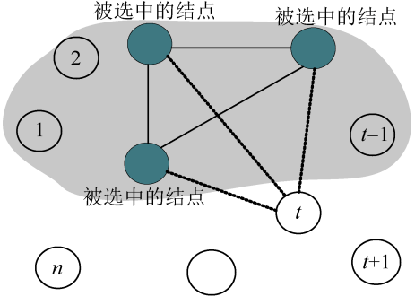

### 5.3.4　伪代码详解

（1）约束函数

因为国王护卫队中任何两个人都不是仇敌，也就是说被选中的结点相互均有连线。要判断第t个结点是否可以加入护卫队，第t个结点与前t−1个结点中被选中的结点是否均有边相连。如果有一个不成立，则第t个结点不可以加入护卫队，如图5-39所示。

```c
bool Place(int t) //判断是否可以把结点t加入团中
{  
     bool ok=true;
     for(int j=1;j<t; j++)  //结点t与前t-1个结点中被选中的结点是否均相连
     {
          if(x[j]&&a[t][j]==0) //x[j]表示j是被选中的结点,a[t][j]==0表示t和j没边相连
          {
               ok = false;
               break;
          }
     }
     return ok;
}
```


<center class="my_markdown"><b class="my_markdown">图5-39　约束函数判断</b></center>

（2）按约束条件和限界条件搜索求解

t表示当前扩展结点在第t层，cn表示当前已加入护卫队的人数。

如果t>n，表示已经到达叶子结点，记录最优值和最优解，返回。否则，判断是否满足约束条件，满足则搜索左子树。因为左子树表示该结点可以加入护卫队，所以令x[t]=1，cn++，表示当前已加入护卫队的人数增加1。Backtrack(t+1)表示递推，深度优先搜索第t+1层。回归时，即向上回溯时，要把增加的值减去，cn−−。

判断是否满足限界条件，满足则搜索右子树。因为右子树表示该结点不可以加入护卫队，所以令x[t]=0，当前加入护卫队的人数不变。Backtrack(t+1)表示递推，深度优先搜索第t+1层。

```c
void Backtrack(int t) 
{
     if(t>n) //到达叶结点
     {
          for(int i=1; i<=n; i++)
               bestx[i]=x[i];
          bestn=cn;
          return ;
     }
     if(Place(t)) //满足约束条件，进入左子树，即把结点t加入团中
     {
          x[t]=1;
          cn++;
          Backtrack(t+1);
          cn--;
     }
     if(cn+n-t>bestn) //满足限界条件，进入右子树
     {
          x[t] = 0;
          Backtrack(t + 1);
     }
}
```

