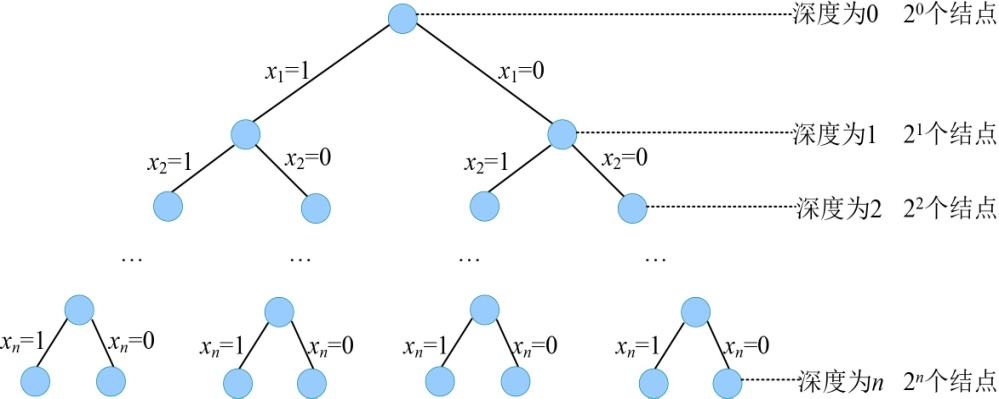

### 5.3.6　算法解析及优化拓展

#### 1．算法复杂度分析

（1）时间复杂度

约束函数时间复杂度为O(n)，限界函数时间复杂度为O(1)。最坏情况下有O(2n)个左孩子结点调用约束函数，有O(2n)个右孩子结点需要调用限界函数，故国王护卫队问题回溯法求解的时间复杂度为O(n*2n+1*2n)= O(n*2n)，如图5-40所示。

<b class="my_markdown">图5-40　解空间树</b>

（2）空间复杂度

回溯法的另一个重要特性就是在搜索执行的同时产生解空间。在所搜过程中的任何时刻，仅保留从开始结点到当前扩展结点的路径，从开始结点起最长的路径为n。程序中我们使用bestp[]数组记录该最长路径作为最优解，所以该算法的空间复杂度为O(n)。

#### 2．算法优化拓展

因为解空间的子集树规模是确定的，我们改进优化只能从约束函数和限界函数着手，通过这两个函数提高剪枝的效率。在上述算法中，限界函数时间复杂度为O(1)，已经没有改进的余地。而约束函数时间复杂度为O(n)，是否可以改进呢？

