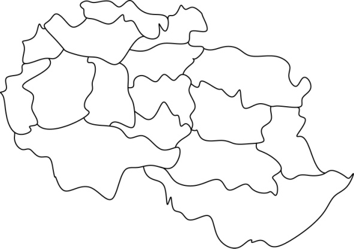

### 5.4　地图调色板——地图着色

我买了一个世界地图挂在家里。

孩子说：“花花绿绿的挺好看呢！”

“你看看颜色有什么不同吗？”

“相邻的国家颜色不同！”

“是啊，如果把两个相邻的国家涂成相同的颜色，可能会引起严正抗议，甚至战争！”。

在地图着色中，为了区分边界，相邻区域是不能有相同颜色的。

如果我们有一张没涂色的地图和m种颜色，怎么涂色才能使相邻区域是不同的颜色呢？

<b class="my_markdown">图5-41　地图着色</b>

