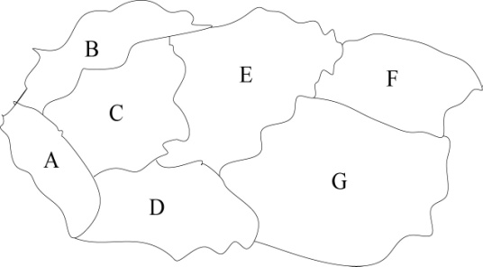
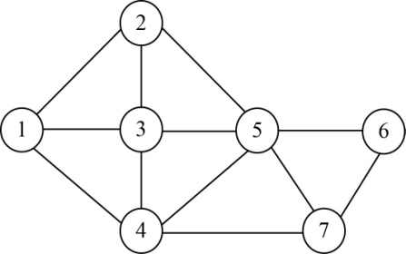

### 5.4.1　问题分析

如果我们把地图上的每一个区域退化成一个点，相邻的区域用连线连接起来，那么地图就变成了一个无向连通图，我们给地图着色就相当于给该无向连通图的每个点着色，要求有连线的点不能有相同颜色。这就是经典的图的m着色问题。给定无向连通图**G**和m种颜色，找出所有不同的着色方案，使相邻的区域有不同的颜色。

下面以图5-42为例，该地图一共有7个区域，分别是A、B、C、D、E、F、G，我们现在按上面顺序进行编号1～7，每个区域用一个结点表示，相邻的区域有连线。那么地图就转化成了一个无向连通图，如图5-43所示。

<b class="my_markdown">图5-42　区域地图</b>

<b class="my_markdown">图5-43　无向连通图</b>

如果用3种颜色给该地图着色，那么该问题中每个结点所着的颜色均有3种选择，7个结点所着的颜色号组合是一个可能解，例如：{1，2，3，2，1，2，3}。

每个结点有m种选择，即解空间树中每个结点有m个分支，称为m叉树。

