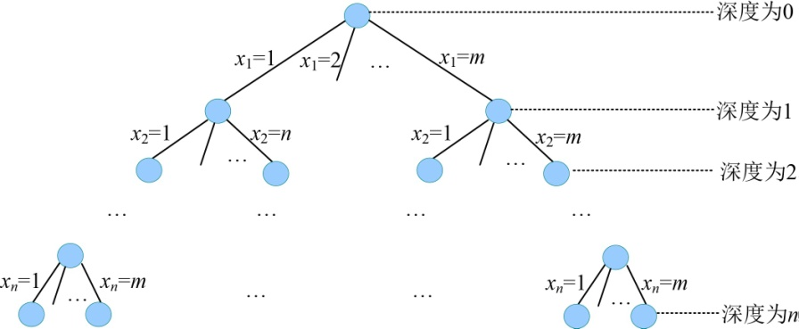
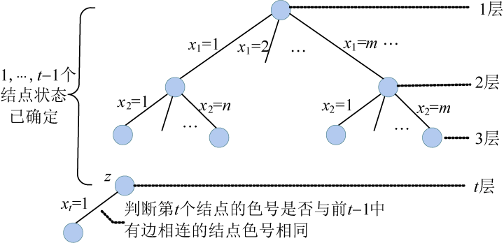
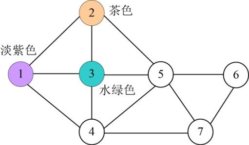

### 5.4.2　算法设计

（1）定义问题的解空间

定义问题的解空间及其组织结构式很容易的。图的m着色问题的解空间形式为n元组{x1，x2，…，xi，…，xn}，每一个分量的取值为1，2，…，m，即问题的解是一个n元向量。由此可得，问题的解空间为{x1，x2，…，xi，…，xn}，其中显约束xi = 1，2，…，m（i=1，2，3，…，n）。

xi =2表示图**G**中第i个结点着色为2号色。

（2）确定解空间的组织结构

问题的解空间组织结构是一棵满m叉树，树的深度为n，如图5-44所示。

<b class="my_markdown">图5-44　解空间树（m叉树）</b>

（3）搜索解空间

+ 约束条件

假设当前扩展节点处于解空间树的第t层，那么从第1个结点到第t−1个结点的状态（着色的色号）已经确定。接下来沿着扩展结点的第一个分支进行扩展，此时需要判断第t个结点的着色情况。第t个结点的颜色号要与前t−1个结点中与其有边相连的结点颜色不同，如果有颜色相同的，则第t个结点不能用这个色号，换下一个色号尝试，如图5-45所示。

<b class="my_markdown">图5-45　解空间树（约束条件判断）</b>

例如：假设当前扩展结点z是在第4层，说明前3个结点的状态（色号）已经确定，如图5-46所示。

<b class="my_markdown">图5-46　约束条件判断</b>

在前3个已着色的结点中，4号结点和1号、3号结点有边相连，那么4号结点的色号不可以和1号、3号结点的色号相同。

+ 限界条件

因为只是找可行解就可以了，不是求最优解，因此不需要限界条件。

+ 搜索过程

扩展节点沿着第一个分支扩展，判断约束条件，如果满足，则进入深一层继续搜索；如果不满足，则扩展生成的节点被剪掉，换下一个色号尝试。如果所有的色号都尝试完毕，该结点变成死结点，向上回溯到离其最近的活结点，继续搜索。搜索到叶子节点时，找到一种着色方案，搜索过程直到全部活结点变成死结点为止。

