### 5.4.3　完美图解

地图的7个区域转化成的无向连通图，如图5-47所示。

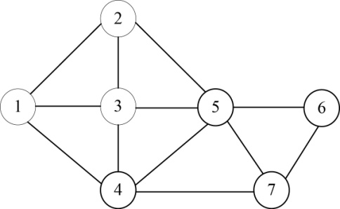

<b class="my_markdown">图5-47　无向连通图</b>

如果现在用3种颜色（淡紫，茶色，水绿色）给该地图着色，那么该问题中每个结点所着的颜色均有3种选择（m=3），7个结点所着的颜色组合是一个可能解。

（1）开始搜索第1层（t=1）

扩展A结点第一个分支，首先判断是否满足约束条件，因为之前还未着色任何结点，满足约束条件。扩展该分支，令1号结点着1号色（淡紫），即x[1]=1，生成B。搜索过程和着色方案如图5-48和图5-49所示。

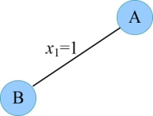

<b class="my_markdown">图5-48　搜索过程</b>

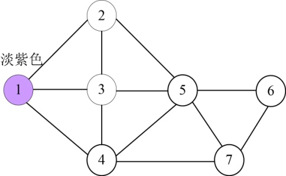

<b class="my_markdown">图5-49　着色方案</b>

（2）扩展B结点（t=2）

扩展第一个分支x[2]=1，首先判断2号结点是否和前面已确定色号的结点（1号）有边相连且色号相同，不满足约束条件，剪掉该分支。然后沿着x[2]=2扩展，2号结点和前面已确定色号的结点（1号）有边相连，但色号不相同，满足约束条件，扩展该分支，令2号结点着2号色（茶色），即x[2]=2，生成C。搜索过程和着色方案如图5-50和图5-51所示。

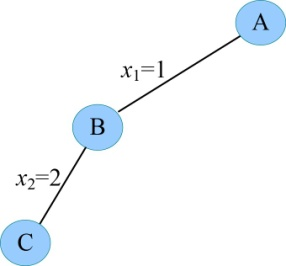

<b class="my_markdown">图5-50　搜索过程</b>

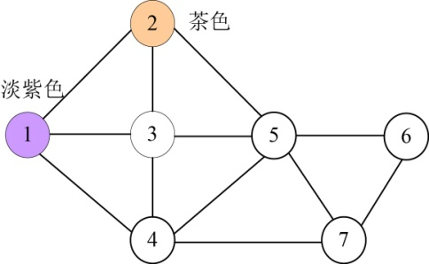

<b class="my_markdown">图5-51　着色方案</b>

（3）扩展C结点（t=3）

扩展第一个分支x[3]=1，首先判断3号结点是否和前面已确定的结点（1、2号）有边相连且色号相同，3号结点和1结点有边相连且色号相同，不满足约束条件，剪掉该分支。然后沿着x[3]=2扩展，3号结点和前面已确定色号的结点（2号）有边相连且色号相同，不满足约束条件，剪掉该分支。然后沿着x[3]=3扩展，3号结点和前面已确定色号的结点（1、2号）有边相连且色号均不相同，满足约束条件，扩展该分支，令3号结点着3号色（水绿色），即令x[3]=3，生成D。搜索过程和着色方案如图5-52和图5-53所示。

<b class="my_markdown">图5-52　搜索过程</b>

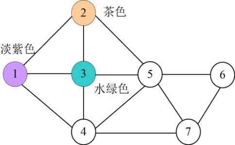

<b class="my_markdown">图5-53　着色方案</b>

（4）扩展D结点（t=4）

扩展第一个分支x[4]=1，首先判断4号结点是否和前面已确定的结点（1、2、3号）有边相连且色号相同，4号结点和1结点有边相连且色号相同，不满足约束条件，剪掉该分支。然后沿着x[4]=2扩展，4号结点和前面已确定色号的结点（1、3号）有边相连，但色号均不同，满足约束条件，扩展该分支，令4号结点着2号色（茶色），令x[4]=2，生成E。搜索过程和着色方案如图5-54和图5-55所示。

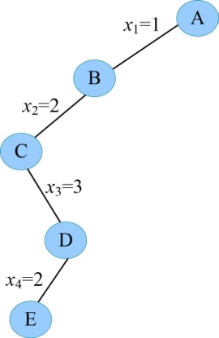

<b class="my_markdown">图5-54　搜索过程</b>

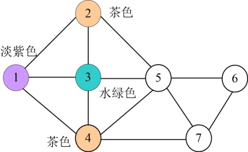

<b class="my_markdown">图5-55　着色方案</b>

（5）扩展E结点（t=5）

扩展第一个分支x[5]=1，首先判断5号结点是否和前面已确定的结点（1、2、3、4号）有边相连且色号相同，5号结点和前面已确定色号的结点（2、3、4号）有边相连，但色号均不同，满足约束条件，扩展该分支，令5号结点着1号色（淡紫色），令x[5]=1，生成F。搜索过程和着色方案如图5-56和图5-57所示。

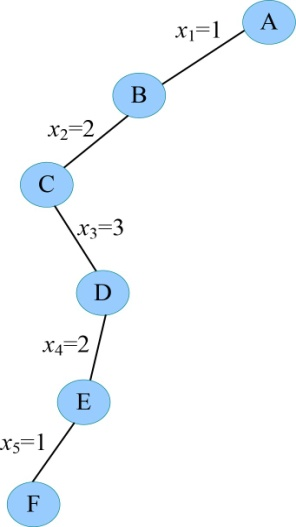

<b class="my_markdown">图5-56　搜索过程</b>

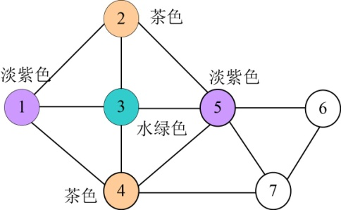

<b class="my_markdown">图5-57　着色方案</b>

（6）扩展F结点（t=6）

扩展第一个分支x[6]=1，首先判断6号结点是否和前面已确定的结点（1、2、3、4、5号）有边相连且色号相同，6号结点和前面已确定色号的结点（5号）有边相连，且色号相同，不满足约束条件，剪掉该分支。然后沿着x[6]=2扩展，6号结点和前面已确定色号的结点（5号）有边相连，但色号不同，满足约束条件，扩展该分支，令6号结点着2号色（茶色），令x[6]=2，生成G。搜索过程和着色方案如图5-58和图5-59所示。

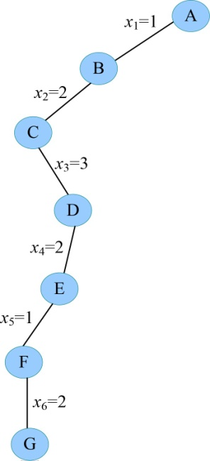

<b class="my_markdown">图5-58　搜索过程</b>

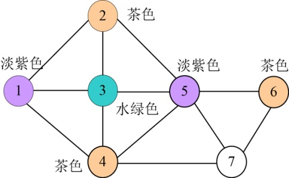

<b class="my_markdown">图5-59　着色方案</b>

（7）扩展G结点（t=7）

扩展第一个分支x[7]=1，首先判断7号结点是否和前面已确定的结点（1、2、3、4、5、6号）有边相连且色号相同，7号结点和前面已确定色号的结点（5号）有边相连，且色号相同，不满足约束条件，剪掉该分支。然后沿着x[7]=2扩展，7号结点和前面已确定色号的结点（4、6号）有边相连，且色号相同，不满足约束条件，剪掉该分支。然后沿着x[7]=3扩展，7号结点和前面已确定色号的结点（4、5、6号）有边相连，但色号不同，满足约束条件，扩展该分支，令7号结点着3号色（水绿色），令x[7]=3，生成H。搜索过程和着色方案如图5-60和图5-61所示。

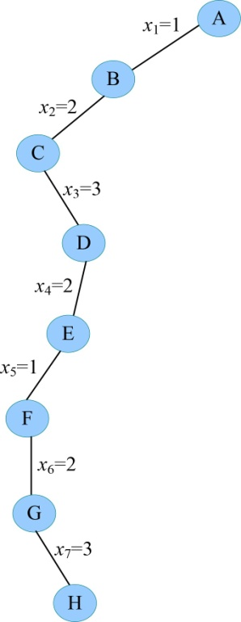

<b class="my_markdown">图5-60　搜索过程</b>

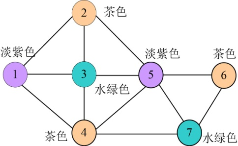

<b class="my_markdown">图5-61　着色方案</b>

（8）扩展H结点（t=8）。t>n，找到一个可行解，输出该可行解{1，2，3，2，1，2，3}，回溯到最近的活结点G。

（9）重新扩展G结点（t=7）。G的m（m=3）个孩子均已考查完毕，成为死结点，回溯到最近的活结点F。

（10）继续搜索，又找到第二种着色方案，输出该可行解{1，3，2，3，1，3，2}。搜索过程和着色方案如图5-62和图5-63所示。

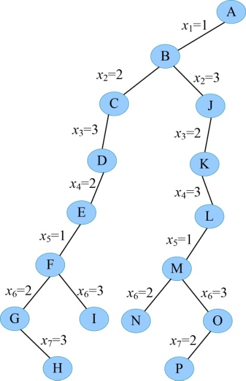

<b class="my_markdown">图5-62　搜索过程</b>

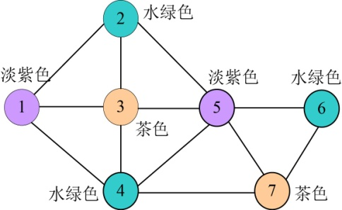

<b class="my_markdown">图5-63　着色方案</b>

（11）继续搜索，又找到4个可行解，分别是{2，1，3，1，2，1，3}、{2，3，1，3，2，3，1}、{3，1，2，1，3，1，2}、{3，2，1，2，3，2，1}。

