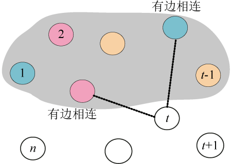

### 5.4.4　伪代码详解

（1）约束函数

假设当前扩展节点处于解空间树的第t层，那么从第一个结点到第t−1个结点的状态（着色的色号）已经确定。接下来沿着扩展结点的第一个分支进行扩展，此时需要判断第t个结点的着色情况。第t个结点的颜色号要与前t−1个结点中与其有边相连的结点颜色不同，如果有一个颜色相同的，则第t个结点不能用这个色号，换下一个色号尝试，如图5-64所示。

```c
//约束条件
bool OK(int t)
{
     for(int j=1;j<t;j++) //依次判断前t-1个结点(已确定色号)
     {
          if(map[t][j])  //如果t与j邻接(有边相连)
          {
               if(x[j]==x[t]) //判断t与j的着色号是否相同
                    return false; //有相同色号，立即
          }
     }
     return true; //与前t-1个结点中与其有边相连的结点颜色均不同，返回true
}
```


<center class="my_markdown"><b class="my_markdown">图5-64　约束条件判断</b></center>

（2）按约束条件搜索求解

t表示当前扩展结点在第t层。如果t>n，表示已经到达叶子结点，sum累计第几个着色方案，输出可行解。否则，扩展节点沿着第一个分支扩展，判断是否满足约束条件，如果满足，则进入深一层继续搜索；如果不满足，则扩展生成的节点被剪掉，换下一个色号尝试。如果所有的色号都尝试完毕，该结点变成死结点，向上回溯到离其最近的活结点，继续搜索。搜索到叶子节点时，找到一种着色方案。搜索过程直到全部活结点变成死结点为止。

```c
//搜索函数
void Backtrack(int t)
{
     if(t>n) //到达叶子,找到一个着色方案
     {
          sum++;
          cout<<"第"<<sum<<"种方案：";
          for(int i=1;i<=n;i++) //输出该着色方案
               cout<<x[i]<<" ";
          cout<<endl;
     }
     else
{
          for(int i=1;i<=m;i++) //每个结点尝试m种颜色
          {
               x[t]=i;
               if(OK(t))
                    Backtrack(t+1);
          }
     }
}
```

