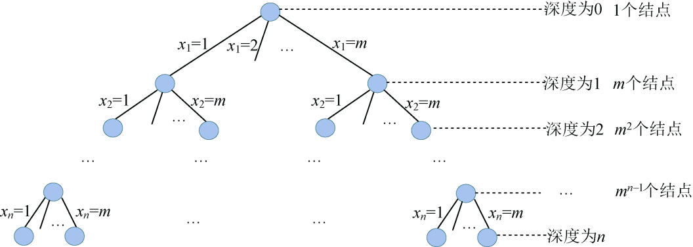

### 5.4.6　算法解析及优化拓展

#### 1．算法复杂度分析

（1）时间复杂度

最坏情况下，除了最后一层外，有1+m+m2 +…+mn−1=(mn−1)/(m−1)≈mn−1个结点需要扩展，而这些结点每个都要扩展m个分支，总的分支个数为mn，每个分支都判断约束函数，判断约束条件需要O(n)的时间，因此耗时O(nmn)。在叶子结点处输出可行解需要耗时O(n)，在最坏情况下回搜索到每一个叶子结点，叶子个数为mn，故耗时为O(nmn)。因此，时间复杂度为O(nmn)，如图5-65所示。

<b class="my_markdown">图5-65　解空间树（m叉树）</b>

（2）空间复杂度

回溯法的另一个重要特性就是在搜索执行的同时产生解空间。在所搜过程中的任何时刻，仅保留从开始结点到当前扩展结点的路径，从开始结点起最长的路径为n。程序中我们使用x[]数组记录该最长路径作为可行解，所以该算法的空间复杂度为O(n)。

#### 2．算法优化拓展

在上面的求解过程中，我们的解空间m叉树的规模是确定的，我们改进优化只能从约束函数和限界函数着手，通过这两个函数提高剪枝的效率。在上述算法中，没有限界函数，而约束函数时间复杂度为O(n)，是否可以改进呢？

读者可以分析一下：在处理第t个结点时，要依次判断前t−1个结点是否有邻接且色号相同，如果采用邻接表存储又会如何呢？是不是只需要判断t结点邻接表中序号小于t的结点色号是否相同呢？时间复杂度是否有减少？

