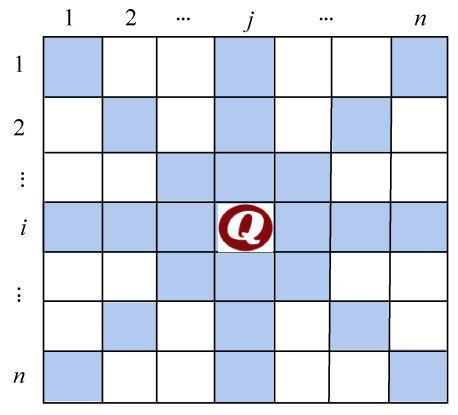

### 5.5.1　问题分析

在n×n的棋盘上放置彼此不受攻击的n个皇后。按照国际象棋的规则，皇后可以攻击与之在同一行、同一列、同一斜线上的棋子。现在在n×n的棋盘上放置n个皇后，使彼此不受攻击。

如果棋盘如图5-67所示，我们在第i行第j列放置一个皇后，那么第i行的其他位置（同行），那么第j列的其他位置（同列），同一斜线上的其他位置，都不能再放置皇后。

<b class="my_markdown">图5-67　n皇后问题</b>

条件是这样要求的，但是我们不可能杂乱无章地尝试每个位置，要有求解策略。我们可以 **以行为主导** ：

+ 在第1行第1列放置第1个皇后。
+ 在第2行放置第2个皇后。第2个皇后的位置不能和第1个皇后同列、同斜线，不用再判断是否同行了，因为我们每行只放置一个，本来就已经不同行。
+ 在第3行放置第3个皇后，第3个皇后的位置不能和前2个皇后同列、同斜线。

……

+ 在第t行放置第t个皇后，第t个皇后的位置不能和前t−1个皇后同列、同斜线。

……

+ 在第n行放置第n个皇后，第n个皇后的位置不能和前n−1个皇后同列、同斜线。

