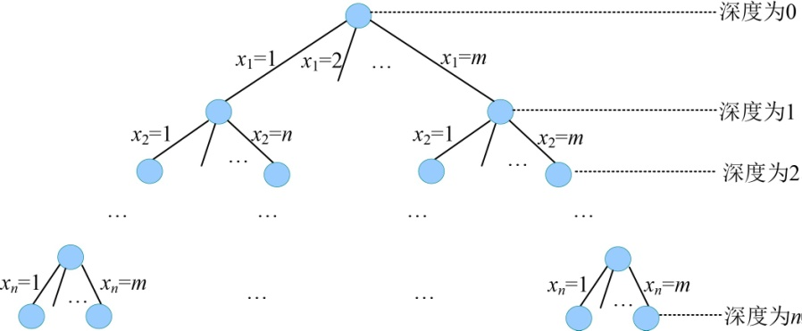

### 5.5.2　算法设计

（1）定义问题的解空间

n皇后问题解的形式为n元组：{x1，x2，…，xi，…，xn}，分量xi表示第i个皇后放置在第i行第xi列，xi的取值为1，2，…，n。例如x2=5，表示第2个皇后放置在第2行第5列。显约束为不同行。

（2）解空间的组织结构

n皇后问题的解空间是一棵m（m=n）叉树，树的深度为n，如图5-68所示。

<b class="my_markdown">图5-68　解空间树（m叉树）</b>

（3）搜索解空间

+ 约束条件

在第t行放置第t个皇后时，第t个皇后的位置不能和前t−1个皇后同列、同斜线。第i个皇后和第j个皇后不同列，即xi!=xj，并且不同斜线|i−j| != |xi−xj|。

+ 限界条件

该问题不存在放置方案好坏的情况，所以不需要设置限界条件。

+ 搜索过程

从根开始，以深度优先搜索的方式进行搜索。根结点是活结点，并且是当前的扩展结点。在搜索过程中，当前的扩展结点沿纵深方向移向一个新结点，判断该新结点是否满足隐约束。如果满足，则新结点成为活结点，并且成为当前的扩展结点，继续深一层的搜索；如果不满足，则换到该新结点的兄弟结点继续搜索；如果新结点没有兄弟结点，或其兄弟结点已全部搜索完毕，则扩展结点成为死结点，搜索回溯到其父结点处继续进行。搜索过程直到找到问题的根结点变成死结点为止。

