### 5.5.3　完美图解

在n×n的棋盘上放置彼此不受攻击的n个皇后。按照国际象棋的规则，皇后可以攻击与之在同一行、同一列、同一斜线上的棋子。为了简单明了，我们在4×4的棋盘上放置4个皇后，使其彼此不受攻击，如图5-69所示。

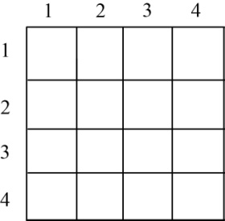

<b class="my_markdown">图5-69　4皇后问题</b>

（1）开始搜索第1层（t=1）

扩展1号结点，首先判断x1=1是否满足约束条件，因为之前还未选中任何结点，满足约束条件。令x[1]=1，生成2号结点，如图5-70所示。

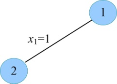
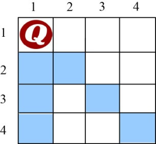

<b class="my_markdown">图5-70　搜索过程和放置方案</b>

（2）扩展2号结点（t=2）

首先判断x2=1不满足约束条件，因为和之前放置的第1个皇后同列；考查x2=2也不满足约束条件，因为和之前放置的第1个皇后同斜线；考查x2=3满足约束条件，和之前放置的皇后不同列、不同斜线，令x[2]=3，生成3号结点，如图5-71所示。

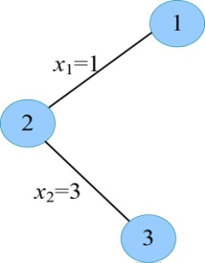
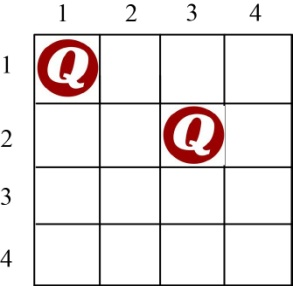

<b class="my_markdown">图5-71　搜索过程和放置方案</b>

（3）扩展3号结点（t=3）

首先判断x3=1不满足约束条件，因为和之前放置的第1个皇后同列；考查x3=2也不满足约束条件，因为和之前放置的第2个皇后同斜线；考查x2=3不满足约束条件，因为和之前放置的第2个皇后同列；考查x3=4也不满足约束条件，因为和之前放置的第2个皇后同斜线；3号结点的所有孩子均已考查完毕，3号结点成为死结点。向上回溯到2号结点，如图5-72所示。

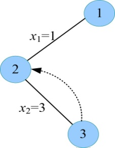
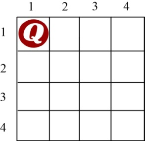

<b class="my_markdown">图5-72　搜索过程和放置方案</b>

（4）重新扩展2号结点（t=2）

判断x2=4满足约束条件，因为和之前放置的第1个皇后不同列、不同斜线，令x[2]=4，生成4号结点，如图5-73所示。

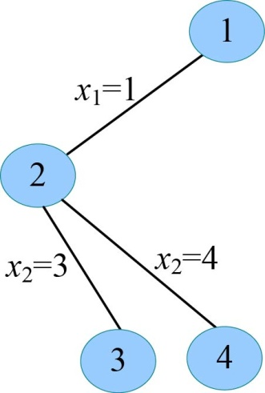
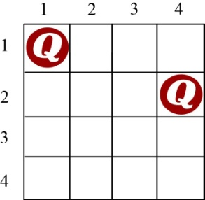

<b class="my_markdown">图5-73　搜索过程和放置方案</b>

（5）扩展4号结点（t=3）

首先判断x3=1不满足约束条件，因为和之前放置的第1个皇后同列；考查x3=2满足约束条件，因为和之前放置的第1、2个皇后不同列、不同斜线，令x[3]=2，生成5号结点，如图5-74所示。

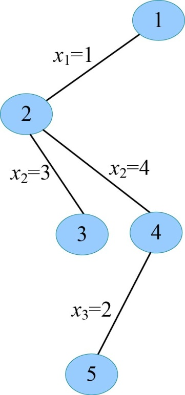
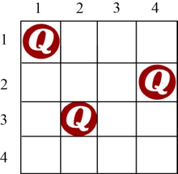

<b class="my_markdown">图5-74　搜索过程和放置方案</b>

（6）扩展5号结点（t=4）

首先判断x4=1不满足约束条件，因为和之前放置的第1个皇后同列；考查x4=2也不满足约束条件，因为和之前放置的第3个皇后同列；考查x4=3不满足约束条件，因为和之前放置的第3个皇后同斜线；考查x4=4也不满足约束条件，因为和之前放置的第2个皇后同列；5号结点的所有孩子均已考查完毕，5号结点成为死结点。向上回溯到4号结点，如图5-75所示。

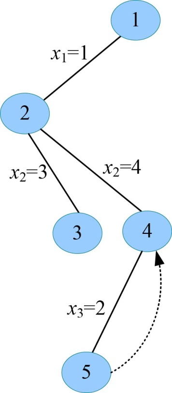

<b class="my_markdown">图5-75　搜索过程和放置方案</b>

（7）继续扩展4号结点（t=3）

判断x3=3不满足约束条件，因为和之前放置的第2个皇后同斜线；考查x3=4也不满足约束条件，因为和之前放置的第2个皇后同列；4号结点的所有孩子均已考查完毕，4号结点成为死结点。向上回溯到2号结点。2号结点的所有孩子均已考查完毕，2号结点成为死结点。向上回溯到1号结点，如图5-76所示。

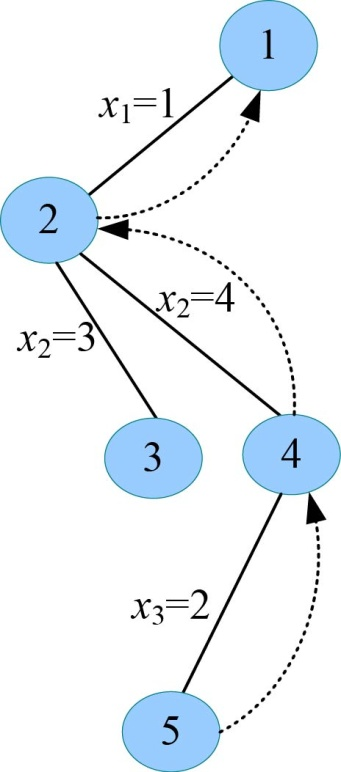
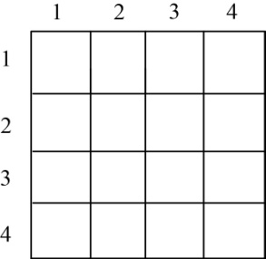

<b class="my_markdown">图5-76　搜索过程和放置方案</b>

（8）继续扩展1号结点（t=1）

判断x1=2是否满足约束条件，因为之前还未选中任何结点，满足约束条件。令x[1]=2，生成6号结点，如图5-77所示。

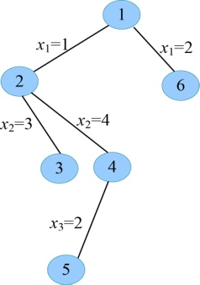
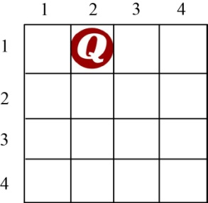

<b class="my_markdown">图5-77　搜索过程和放置方案</b>

（9）扩展6号结点（t=2）

判断x2=1不满足约束条件，因为和之前放置的第1个皇后同斜线；考查x2=2也不满足约束条件，因为和之前放置的第1个皇后同列；考查x2=3不满足约束条件，因为和之前放置的第1个皇后同斜线；考查x2=4满足约束条件，因为和之前放置的第1个皇后不同列、不同斜线，令x[2]=4，生成7号结点，如图5-78所示。

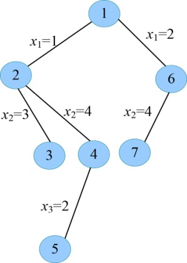
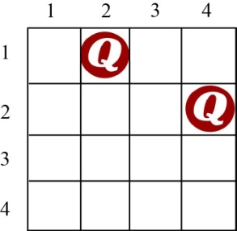

<b class="my_markdown">图5-78　搜索过程和放置方案</b>

（10）扩展7号结点（t=3）

判断x3=1满足约束条件，因为和之前放置的第1、2个皇后不同列、不同斜线，令x[3]=1，生成8号结点，如图5-79所示。

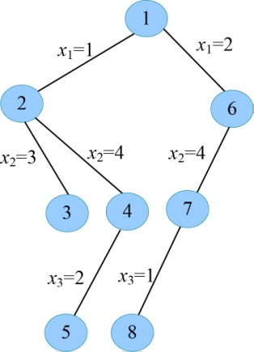
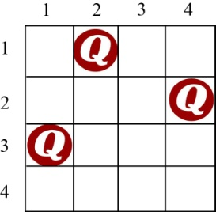

<b class="my_markdown">图5-79　搜索过程和放置方案</b>

（11）扩展8号结点（t=4）

判断x4=1不满足约束条件，因为和之前放置的第3个皇后同列；考查x4=2也不满足约束条件，因为和之前放置的第1个皇后同列；考查x4=3满足约束条件，因为和之前放置的第1、2、3个皇后不同列、不同斜线，令x[4]=3，生成9号结点，如图5-80所示。

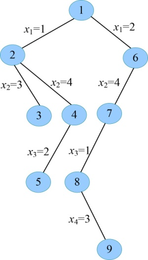
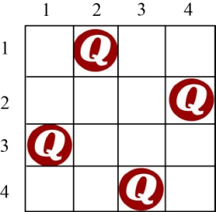

<b class="my_markdown">图5-80　搜索过程和放置方案</b>

（12）扩展9号结点（t=5）

t>n，找到一个可行解，用bestx[]保存当前可行解{2，4，1，3}。9号结点成为死结点。向上回溯到8号结点。

（13）继续扩展8号结点（t=4）

判断x4=4不满足约束条件，因为和之前放置的第2个皇后同列；8号结点的所有孩子均已考查完毕成为死结点。向上回溯到7号结点。

（14）继续扩展7号结点（t=3）

判断x3=2不满足约束条件，因为和之前放置的第1个皇后同列；判断x3=3不满足约束条件，因为和之前放置的第2个皇后同斜线；判断x3=4不满足约束条件，因为和之前放置的第2个皇后同列；7号结点的所有孩子均已考查完毕成为死结点。向上回溯到6号结点。6号结点的所有孩子均已考查完毕，成为死结点。向上回溯到1号结点，如图5-81所示。

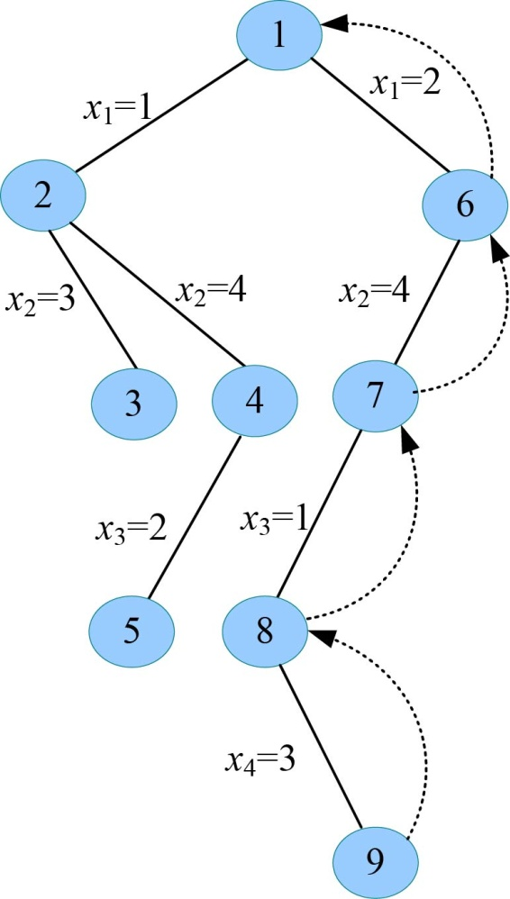

<b class="my_markdown">图5-81　搜索过程和放置方案</b>

（15）继续扩展1号结点（t=1）

判断x1=3是否满足约束条件，因为之前还未选中任何结点，满足约束条件。令x[1]=3，生成10号结点，如图5-82所示。

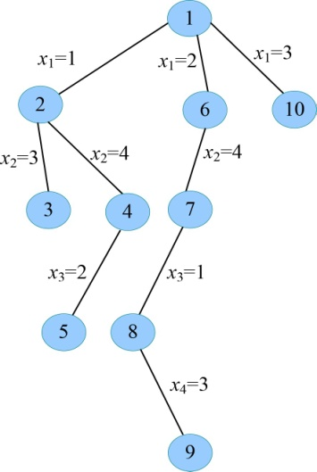
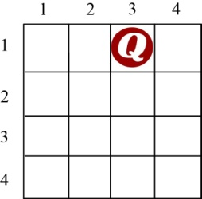

<b class="my_markdown">图5-82　搜索过程和放置方案</b>

（16）扩展10号结点（t=2）

首先判断x2=1满足约束条件，因为和之前放置的第1个皇后不同列、不同斜线，令x[2]=1，生成11号结点，如图5-83所示。

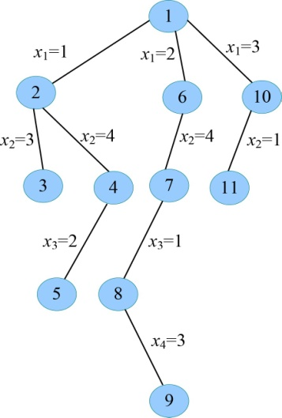
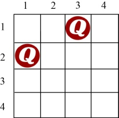

<b class="my_markdown">图5-83　搜索过程和放置方案</b>

（17）扩展11号结点（t=3）

判断x3=1不满足约束条件，因为和之前放置的第2个皇后同列；考查x3=2也不满足约束条件，因为和之前放置的第2个皇后同斜线；考查x3=3不满足约束条件，因为和之前放置的第1个皇后同列；考查x3=4满足约束条件，因为和之前放置的第1、2个皇后不同列、不同斜线，令x[3]=4，生成12号结点，如图5-84所示。

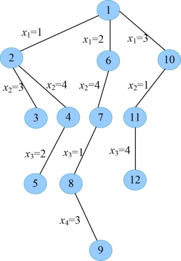
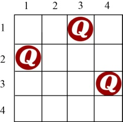

<b class="my_markdown">图5-84　搜索过程和放置方案</b>

（18）扩展12号结点（t=4）

判断x4=1不满足约束条件，因为和之前放置的第2个皇后同列；考查x4=2满足约束条件，因为和之前放置的第1、2、3个皇后不同列、不同斜线，令x[4]=2，生成13号结点，如图5-85所示。

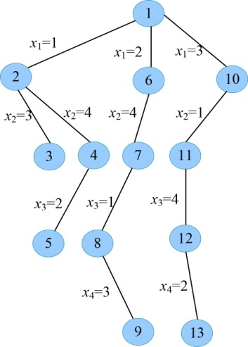
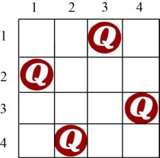

<b class="my_markdown">图5-85　搜索过程和放置方案</b>

（19）扩展13号结点（t=5）

t>n，找到一个可行解，用bestx[]保存当前可行解{3，1，4，2}。13号结点成为死结点。向上回溯到12号结点。

（20）继续扩展12号结点（t=4）

判断x4=3不满足约束条件，因为和之前放置的第1个皇后同列；判断x4=4不满足约束条件，因为和之前放置的第3个皇后同列；12号结点的所有孩子均已考查完毕成为死结点。向上回溯到11号结点。11号结点的所有孩子均已考查完毕，成为死结点。向上回溯到10号结点。

（21）继续扩展10号结点（t=2）

判断x2=2不满足约束条件，因为和之前放置的第1个皇后同斜线；判断x2=3不满足约束条件，因为和之前放置的第1个皇后同列；判断x2=4不满足约束条件，因为和之前放置的第1个皇后同斜线；10号结点的所有孩子均已考查完毕，成为死结点。向上回溯到1号结点，如图5-86所示。

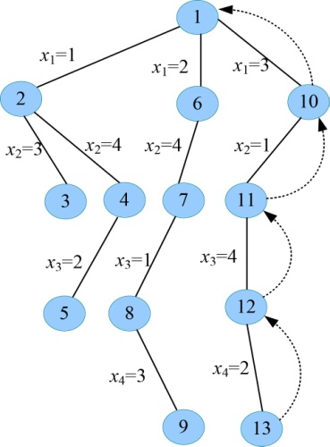
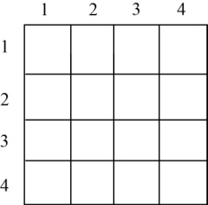

<b class="my_markdown">图5-86　搜索过程和放置方案</b>

（22）继续扩展1号结点（t=1）

判断x1=4是否满足约束条件，因为之前还未选中任何结点，满足约束条件。令x[1]=4，生成14号结点，如图5-87所示。

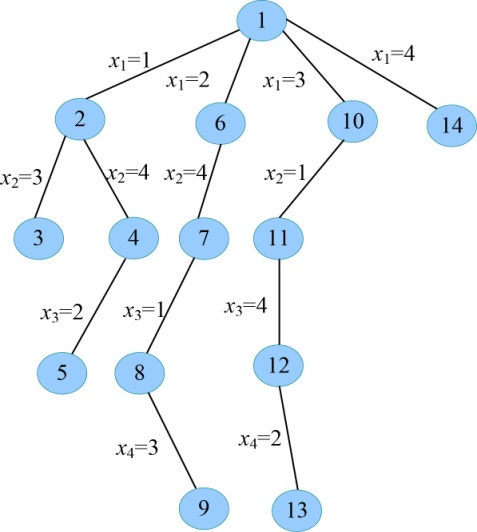
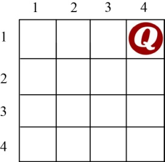

<b class="my_markdown">图5-87　搜索过程和放置方案</b>

（23）扩展14号结点（t=2）

首先判断x2=1满足约束条件，因为和之前放置的第1个皇后不同列、不同斜线，令x[2]=1，生成15号结点，如图5-88所示。

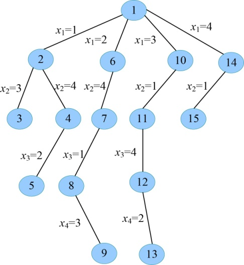
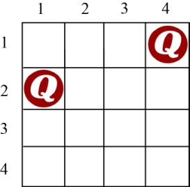

<b class="my_markdown">图5-88　搜索过程和放置方案</b>

（24）扩展15号结点（t=3）

判断x3=1不满足约束条件，因为和之前放置的第2个皇后同列；考查x3=2也不满足约束条件，因为和之前放置的第2个皇后同斜线；考查x3=3满足约束条件，因为和之前放置的第1、2个皇后不同列、不同斜线，令x[3]=3，生成16号结点，如图5-89所示。

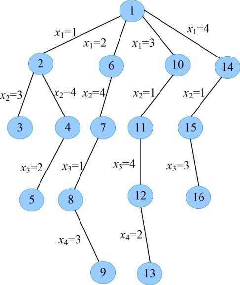
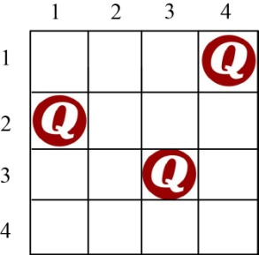

<b class="my_markdown">图5-89　搜索过程和放置方案</b>

（25）扩展16号结点（t=4）

首先判断x4=1不满足约束条件，因为和之前放置的第2个皇后同列；考查x4=2也不满足约束条件，因为和之前放置的第3个皇后同斜线；考查x4=3不满足约束条件，因为和之前放置的第3个皇后同列；考查x4=4也不满足约束条件，因为和之前放置的第1个皇后同列；16号结点的所有孩子均已考查完毕成为死结点。向上回溯到15号结点。

（26）继续扩展15号结点（t=3）

判断x3=4不满足约束条件，因为和之前放置的第1个皇后同列；15号结点的所有孩子均已考查完毕成为死结点。向上回溯到14号结点。

（27）继续扩展14号结点（t=2）

判断x2=2满足约束条件，因为和之前放置的第1个皇后不同列、不同斜线，令x[2]=2，生成17号结点，如图5-90所示。

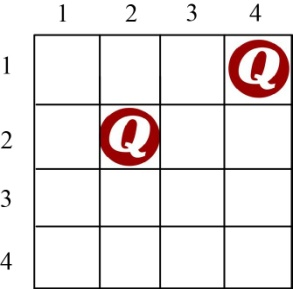

<b class="my_markdown">图5-90　搜索过程和放置方案</b>

（28）扩展17号结点（t=3）

首先判断x3=1不满足约束条件，因为和之前放置的第2个皇后同斜线；考查x3=2也不满足约束条件，因为和之前放置的第2个皇后同列；考查x3=3不满足约束条件，因为和之前放置的第2个皇后同斜线；考查x3=4也不满足约束条件，因为和之前放置的第1个皇后同列；17号结点的所有孩子均已考查完毕成为死结点。向上回溯到14号结点。

（29）继续扩展14号结点（t=2）

判断x3=3不满足约束条件，因为和之前放置的第2个皇后同斜线；判断x3=4不满足约束条件，因为和之前放置的第1个皇后同列；14号结点的所有孩子均已考查完毕成为死结点。向上回溯到1号结点。

（30）1号结点的所有孩子均已考查完毕成为死结点。算法结束，如图5-91所示。

<b class="my_markdown">图5-91　搜索过程和放置方案</b>

