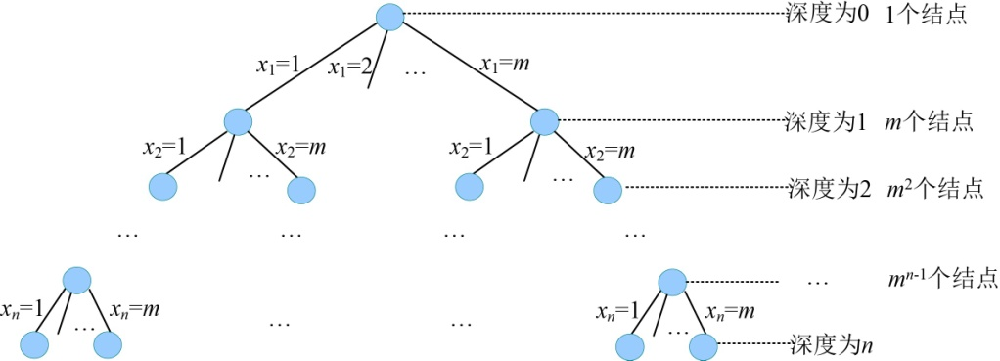
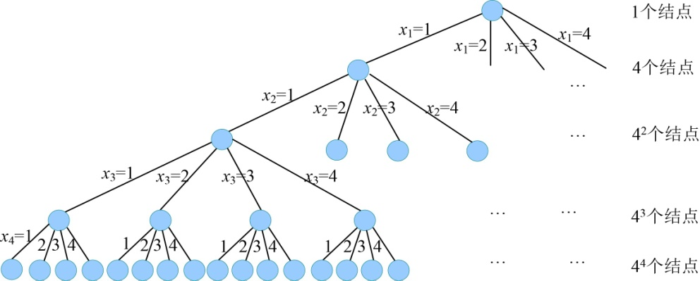
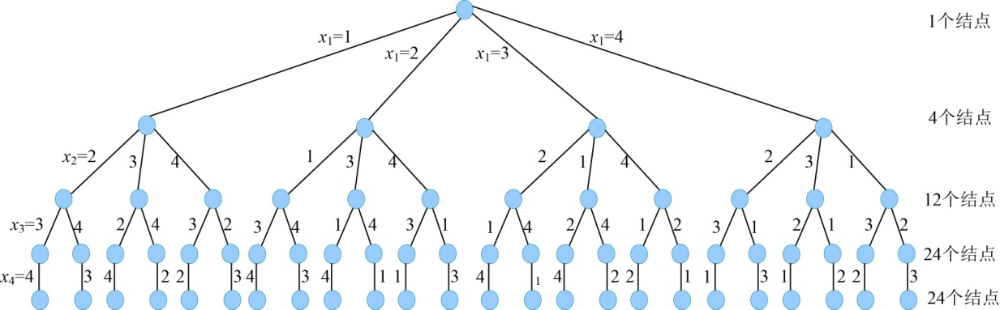

### 5.5.6　算法解析及优化拓展

#### 1．算法复杂度分析

（1）时间复杂度

n皇后问题的解空间是一棵m（m=n）叉树，树的深度为n。最坏情况下，解空间树如图5-92所示。除了最后一层外，有1+n+n2 +…+nn−1= (nn−1)/(n−1)≈nn−1个结点需要扩展，而这些结点每个都要扩展n个分支，总的分支个数为nn，每个分支都判断约束函数，判断约束条件需要O(n)的时间，因此耗时O(nn+1)。在叶子结点处输出当前最优解需要耗时O(n)，在最坏情况下回搜索到每一个叶子结点，叶子个数为nn，故耗时为O(nn+1)。因此，时间复杂度为O(nn+1)。

<b class="my_markdown">图5-92　解空间树（m叉树）</b>

（2）空间复杂度

回溯法的另一个重要特性就是在搜索执行的同时产生解空间。在所搜过程中的任何时刻，仅保留从开始结点到当前扩展结点的路径，从开始结点起最长的路径为n。程序中我们使用x[]数组记录该最长路径作为可行解，所以该算法的空间复杂度为O(n)。

#### 2．算法优化拓展

在上面的求解过程中，我们的解空间过于庞大，所以时间复杂度很高，算法效率当然会降低。解空间越小，算法效率越高。因为解空间是我们要搜索解的范围，就像大海捞针，难度很大，在一个水盆里捞针，难度就小了，如果在一个碗里捞针，就更容易了。

那么我们能不能把解空间缩小呢？

n皇后问题要求每一个皇后不同行、不同列、不同斜线。图5-92的解空间我们使用了不同行作为显约束。隐约束为不同列、不同斜线。4皇后问题，显约束为不同行的解空间树如图5-93所示。

<b class="my_markdown">图5-93　显约束为不同行的解空间树（m=4）</b>

显约束可以控制解空间大小，隐约束是在搜索解空间过程中判定可行解或最优解的。如果我们把显约束定为不同行、不同列，隐约束不同斜线，那解空间是怎样的呢？

例如x1=1的分支，x2就不能再等于1，因为这样就同列了。如果x1=1、x2=2，x3就不能再等于1、2，也就是说xt的值不能与前t−1个解的取值相同。每层结点产生的孩子数比上一层少一个。4皇后问题，显约束为不同行、不同列的解空间树如图5-94所示。

<b class="my_markdown">图5-94　显约束为不同行、不同列的解空间树</b>

我们可以清楚地看到解空间变小了好多，仔细观察你就会发现，在图5-94中，从根到叶子的每一个可能解其实是一个排列：

1 2 3 4，1 2 4 3，1 3 2 4，1 3 4 2，1 4 3 2，1 4 2 3

2 1 3 4，2 1 4 3，2 3 1 4，2 3 4 1，2 4 3 1，2 4 1 3

3 2 1 4，3 2 4 1，3 1 2 4，3 1 4 2，3 4 1 2，3 4 2 1

4 2 3 1，4 2 1 3，4 3 2 1，4 3 1 2，4 1 3 2，4 1 2 3

那么如何用程序来实现呢？且看下回分解。

