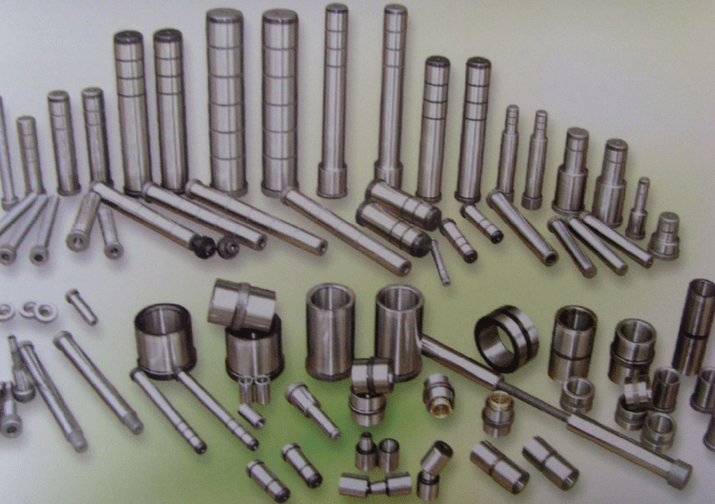

### 5.6　机器零件加工——最优加工顺序

有n个机器零件{J1，J2，…，Jn}，每个零件必须先由机器1处理，再由机器2处理。零件Ji需要机器1、机器2的处理时间为t1、t2<em>i</em>。如何安排零件加工顺序，使第一个零件从机器1上加工开始到最后一个零件在机器2上加工完成，所需的总加工时间最短？

<b class="my_markdown">图5-95　机器零件加工</b>

