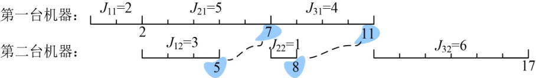
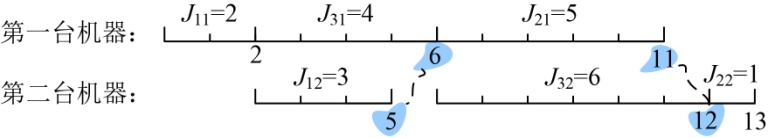
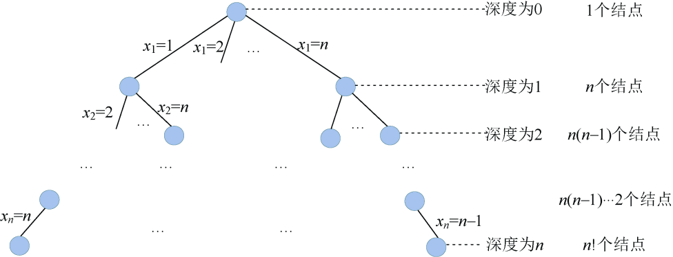
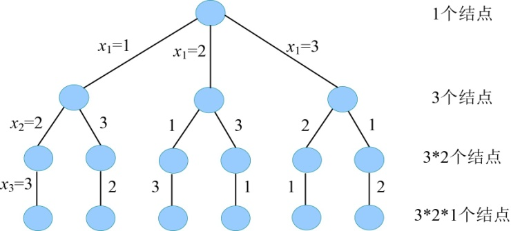

### 5.6.1　问题分析

根据问题的描述，不同的加工顺序，加工完所有零件所需的时间不同。

例如：现在有3个机器零件{J1，J2，J3}，在第一台机器上的加工时间分别为2、5、4，在第二台机器上的加工时间分别为3、1、6。

（1）如果按照{J1，J2，J3}的顺序加工，如图5-96所示。

<b class="my_markdown">图5-96　机器零件加工顺序1</b>

J11、J21、J31分别表示第1、2、3个零件在第一台机器上的加工时间。J12、J22、J32分别表示第1、2、3个零件在第二台机器上的加工时间。

第一台机器先加工第1个零件，需要加工时间为J11=2，t=2时结束，交给第二台机器加工，此时第二台机器处于空闲状态，需要加工时间为J12=3，t=5时结束；这时第二台机器处于空闲状态，等待第2个零件在第一台机器上下线。

第一台机器接着加工第2个零件，需要J21=5，t=7时结束，交给第二台机器加工，此时第二台机器处于空闲状态，需要加工时间为J22=1，t=8时结束；这时第二台机器处于空闲状态，等待第3个零件在第一台机器上下线。

第一台机器接着加工第3个零件，需要J31=4，t=11时结束，交给第二台机器加工，此时第二台机器处于空闲状态，需要加工时间为J32=6，t=17时结束。

（2）如果按照{J1，J3，J2}的顺序加工，如图5-97所示。

<b class="my_markdown">图5-97　机器零件加工顺序2</b>

第一台机器先加工第1个零件，需要加工时间为J11=2，t=2时结束，交给第二台机器加工，此时第二台机器处于空闲状态，需要加工时间为J12=3，t=5时结束；此时第二台机器处于空闲状态，等待第3个零件在第一台机器上下线。

第一台机器接着加工第3个零件，需要J31=4，t=6时结束，交给第二台机器加工，此时第二台机器处于空闲状态，需要加工时间为J32=6，t=12时结束；

第一台机器接着加工第2个零件，需要J21=5，t=11时结束，交给第二台机器加工，此时第二台机器处于繁忙状态，需要等待其空闲下来，t=12时才能加工；加工时间为J22=1，t=13时结束。

我们可以看出一个有趣的现象：第一台机器可以连续加工，而第二台机器开始加工的时间是 **当前第一台机器的下线时间** 和 **第二台机器下线时间** 的 **最大值** 。就是图中连线的两个数值中的最大值。

3个机器零件有多少种加工顺序呢？即3个机器零件的全排列，共有6种：

1 2 3

1 3 2

2 1 3

2 3 1

3 2 1

3 1 2

我们要找的就是其中一个加工顺序，使第一个零件从机器1上加工开始到最后一个零件在机器2上加工完成所需的总加工时间最短。

实际上就是找到n个机器零件{J1，J2，…，Jn}的一个排列，使总的加工时间最短。那么n个机器零件{J1，J2，…，Jn}一共有多少个排列呢？有n!种排列顺序，每一个排列都是一个可行解。解空间是一棵排列树，如图5-98所示。

<b class="my_markdown">图5-98　解空间树（排列树）</b>

例如3个机器零件的解空间树，如图5-99所示。

<b class="my_markdown">图5-99　3个机器零件的解空间树</b>

从根到叶子的路径就是机器零件的一个加工顺序，例如最右侧路径（3，1，2），表示先加工3号零件，再加工1号零件，最后加工2号零件。

那么是如何得到这n个机器零件的排列呢？（见附录G）。

现在已经知道了这个解空间是一个排列树，排列树中从根到叶子的每一个排列都是一个可行解，而不一定是最优解，如何得到最优解呢？这就需要我们在搜索排列树的时候，定义限界函数得到最优解。

