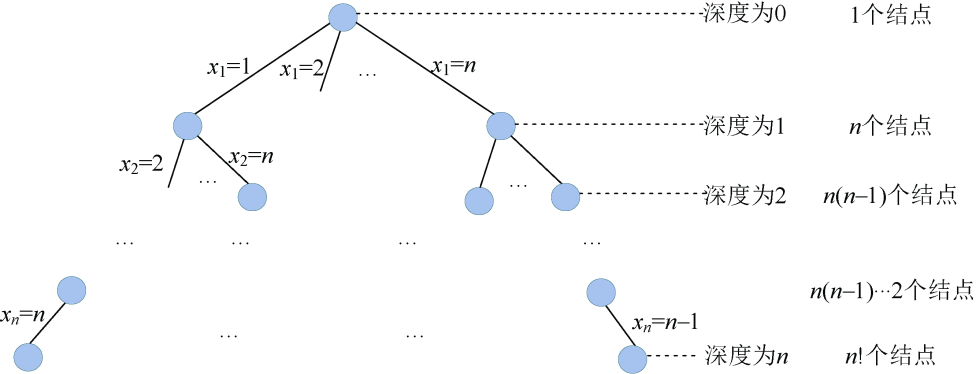

### 5.6.2　算法设计

（1）定义问题的解空间

机器零件加工问题解的形式为n元组：{x1，x2，…，xi，…，xn}。分量xi表示第i个加工的零件号，n个零件组成的集合为S={1，2，…，n}，xi的取值为S−{x1，x2，…，xi−1}，i=1，2，…，n。

（2）解空间的组织结构

机器零件加工问题解空间是一棵排列树，树的深度为n，如图5-100所示。

<b class="my_markdown">图5-100　解空间树（排列树）</b>

（3）搜索解空间

+ 约束条件

由于任何一种零件加工次序不存在无法调度的情况，均是合法的。因此，任何一个排列都表示问题的一个可行解，故不需要约束条件。

+ 限界条件

用f2表示当前已完成的零件在第二台机器加工结束所用的时间，用bestf 表示当前找到的最优加工方案的完成时间。显然，继续向深处搜索时，f2不会减少，只会增加。因此，当f2bestf时，没有继续向深处搜索的必要。限界条件可描述为：f2<bestf，f2的初值为0，bestf的初值为无穷大。

+ 搜索过程

扩展结点沿着某个分支扩展时需要判断限界条件，如果满足，则进入深一层继续搜索；如果不满足，则剪掉该分支。搜索到叶子结点时，即找到当前最优解。搜索直到全部的活结点变成死结点为止。

