### 5.6.3　完美图解

现在有3个机器零件{J1，J2，J3}，在第一台机器上的加工时间分别为2，5，4，在第二台机器上的加工时间分别为3，1，6。f1表示当前第一台机器上加工的完成时间，f2表示当前第二台机器上加工的完成时间。

3个机器零件的解空间树如图5-101所示。

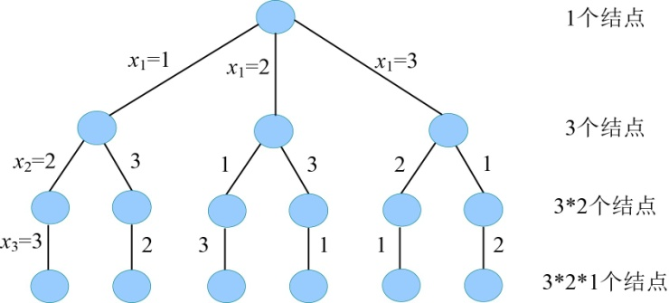

<b class="my_markdown">图5-101　3个机器零件的解空间树</b>

（1）开始搜索第1层（t=1）

扩展A结点的分支x1=1，f2=5，bestf的初值为无穷大，f2<bestf，满足限界条件，令x[1]=1，生成B结点，如图5-102所示。

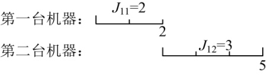

<b class="my_markdown">图5-102　搜索过程和加工顺序</b>

（2）扩展B结点（t=2）

扩展B结点的分支x2=2，f2=8，bestf的初值为无穷大，f2<bestf，满足限界条件，令x[2]=2，生成C结点，如图5-103所示。

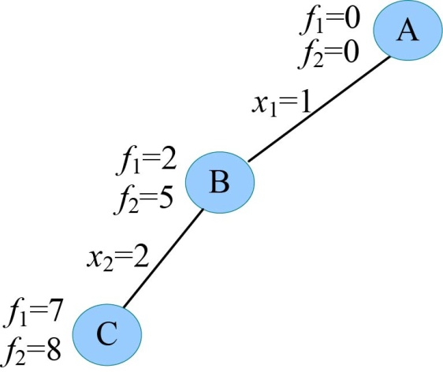
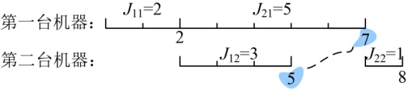

<b class="my_markdown">图5-103　搜索过程和加工顺序</b>

（3）扩展C结点（t=3）

扩展C结点的分支x3=3，f2=17，bestf的初值为无穷大，f2<bestf，满足限界条件，令x[3]=3，生成D结点，如图5-104所示。

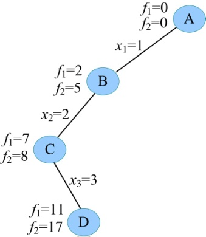
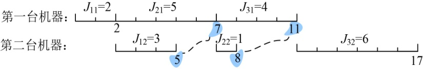

<b class="my_markdown">图5-104　搜索过程和加工顺序</b>

（4）扩展D结点（t=4）

t>n，找到一个当前最优解，记录最优值bestf=f2=17，用bestx[]保存当前最优解{1，2，3}。回溯到最近结点C。

（5）重新扩展C结点（t=3）

C结点的孩子已生成完，成为死结点，回溯到最近的活结点B。

（6）重新扩展B结点（t=2）

扩展B结点的分支x2=3，f2=12，bestf=17，f2<bestf，满足限界条件，令x[2]=3，生成E结点，如图5-105所示。

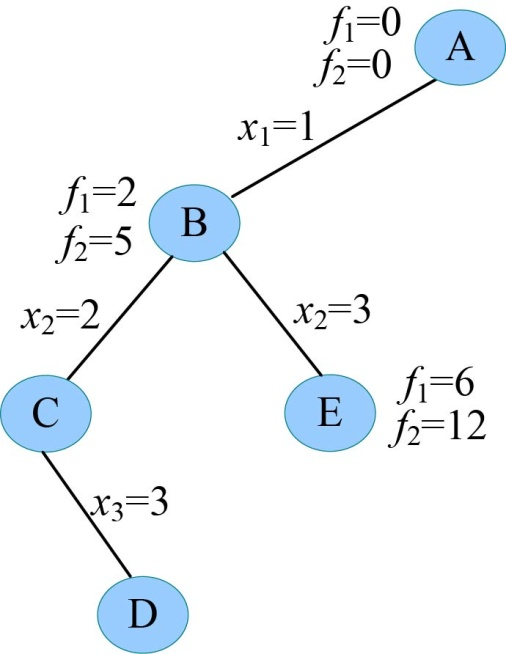
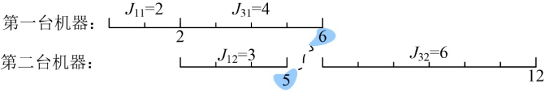

<b class="my_markdown">图5-105　搜索过程和加工顺序</b>

（7）扩展E结点（t=3）

扩展E结点的分支x3=2，f2=13，bestf=17，f2<bestf，满足限界条件，令x[3]=2，生成F结点，如图5-106所示。

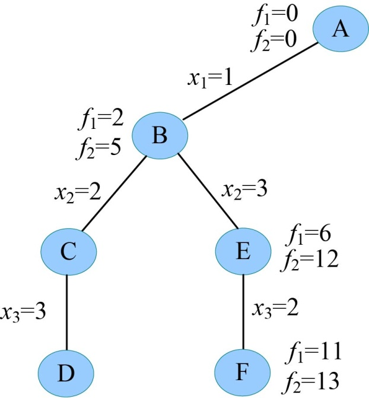
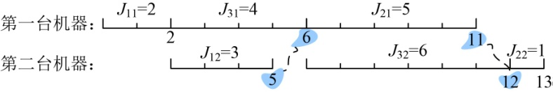

<b class="my_markdown">图5-106　搜索过程和加工顺序</b>

（8）扩展F结点（t=4）

t>n，找到一个当前最优解，记录最优值bestf=f2=13，用bestx[]保存当前最优解{1，3，2}。回溯到最近结点E。

（9）扩展E结点（t=3）

E结点的孩子已生成，成为死结点，回溯到最近的结点B。E结点的孩子已生成完，成为死结点，回溯到最近的活结点A。

（10）重新扩展A结点（t=1）

扩展A结点的分支x1=2，f2=6，bestf=13，f2<bestf，满足限界条件，令x[1]=2，生成G结点，如图5-107所示。

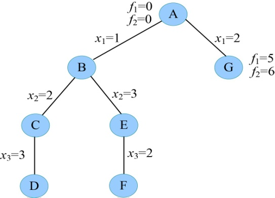
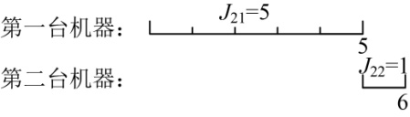

<b class="my_markdown">图5-107　搜索过程和加工顺序</b>

（11）扩展G结点（t=2）

扩展G结点的分支x2=1，f2=10，bestf=13，f2<bestf，满足限界条件，令x[2]=1，生成H结点，如图5-108所示。

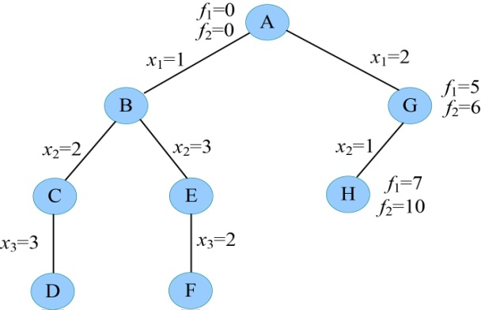
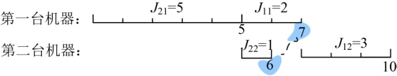

<b class="my_markdown">图5-108　搜索过程和加工顺序</b>

（12）扩展H结点（t=3）

扩展H结点的分支x3=3，f2=17，bestf=13，f2>bestf，不满足限界条件，剪掉该分支。H结点没有其他可扩展分支，成为死结点。回溯到G结点。

（13）重新扩展G结点（t=2）

扩展G结点的分支x2=3，f2=15，bestf=13，f2>bestf，不满足限界条件，剪掉该分支。G结点没有其他可扩展分支，成为死结点。回溯到A结点。

（14）重新扩展A结点（t=1）

扩展A结点的分支x1=3，f2=10，bestf=13，f2<bestf，满足限界条件，令x[1]=3，生成I结点，如图5-109所示。

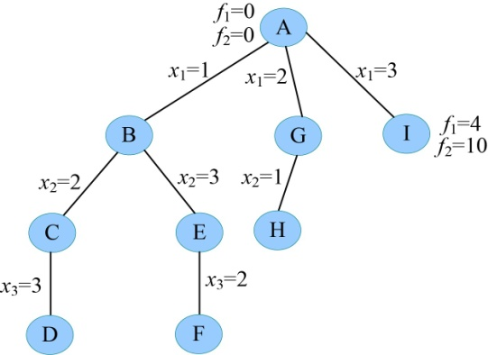
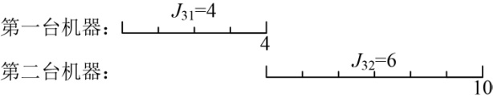

<b class="my_markdown">图5-109　搜索过程和加工顺序</b>

（15）扩展I结点（t=2）

扩展I结点的分支x2=2，f2=11，bestf=13，f2<bestf，满足限界条件，令x[2]=2，生成J结点，如图5-110所示。

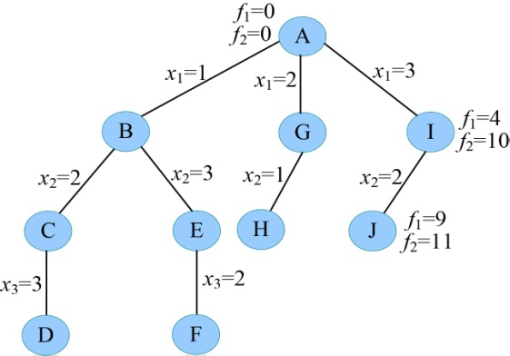
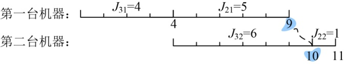

<b class="my_markdown">图5-110　搜索过程和加工顺序</b>

（16）扩展J结点（t=3）

扩展J结点的分支x3=1，f2=14，bestf=13，f2>bestf，不满足限界条件，剪掉该分支。J结点没有其他可扩展分支，成为死结点。回溯到I结点。

（17）重新扩展I结点（t=2）

扩展I结点的分支x2=1，f2=13，bestf=13，f2=bestf，不满足限界条件，剪掉该分支。I结点没有其他可扩展分支，成为死结点。回溯到A结点。A结点没有其他可扩展分支，成为死结点，算法结束。

