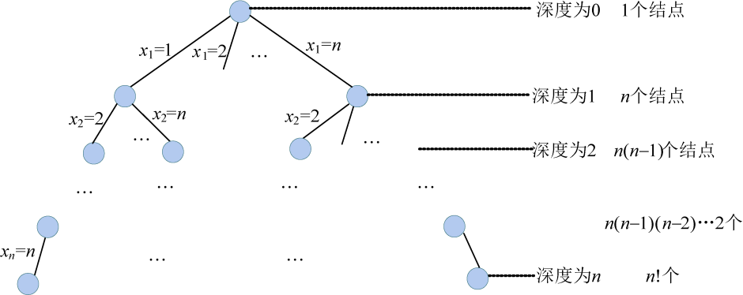

### 5.6.6　算法解析

（1）时间复杂度

最坏情况下，如图5-111所示。除了最后一层外，有1+n+n(n−1) +…+n(n−1)(n−2)…2nn!个结点需要判断限界函数，判断限界函数需要O(1)的时间，因此耗时O(nn!)。在叶子结点处记录当前最优解需要耗时O(n)，在最坏情况下回搜索到每一个叶子结点，叶子个数为n！，故耗时为O(nn!)。因此，时间复杂度为O(nn!)≈O( (n+1)!)。

<b class="my_markdown">图5-111　解空间树（排列树）</b>

（2）空间复杂度

回溯法的另一个重要特性就是在搜索执行的同时产生解空间。在所搜过程中的任何时刻，仅保留从开始结点到当前扩展结点的路径，从开始结点起最长的路径为n。程序中我们使用x[]数组记录该最长路径作为可行解，所以该算法的空间复杂度为O(n)。

