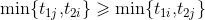
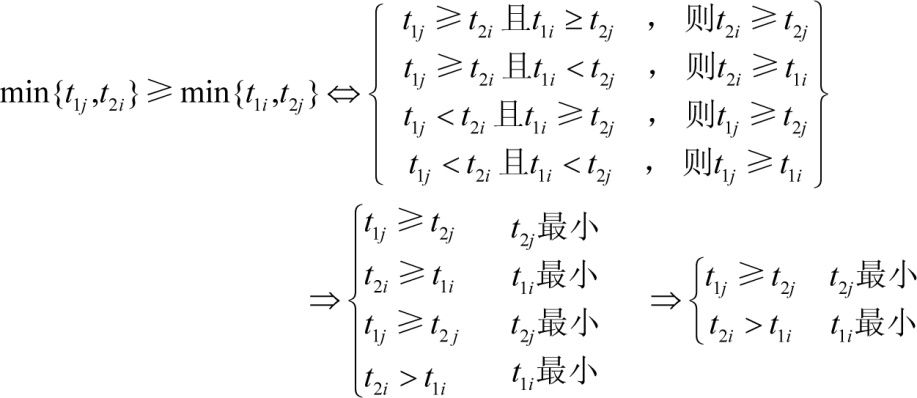
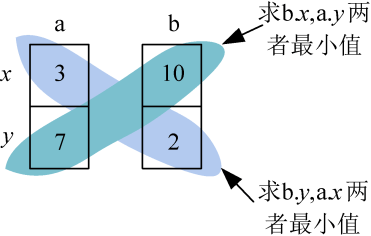

### 5.6.7　算法优化拓展

使用贝尔曼规则（见附录H）进行优化，算法时间复杂度提高到O(nlogn)。

假设在集合S的n!种加工顺序中，最优加工方案为以下两种方案之一。

+ 先加工S中的i号工件，再加工j号工件，其他工件的加工顺序为最优顺序。
+ 先加工S中的j号工件，再加工i号工件，其他工件的加工顺序为最优顺序。

根据贝尔曼的推导公式，方案1不比方案2坏的充分必要条件是：


继续分析：


由此可得贝尔曼规则:

+ 第一台机器上加工时间越短的工件越先加工。
+ 第二台机器上加工时间越短的工件越后加工。
+ 第一个机器上加工时间小于第二台机器上加工时间的先加工。
+ 第一个机器上加工时间大于等于第二台机器上加工时间的后加工。

#### 1．算法设计一

（1）根据贝尔曼规则可以把零件分成两个集合：N<sub class="my_markdown">1</sub>={i|t<sub>1i</sub><t<sub>2i</sub>}，即第一个机器上加工时间小于第二台机器上加工时间；N<sub>2</sub>={i|t<sub>1i</sub>t<sub>2i</sub>}，即第一个机器上加工时间大于等于第二台机器上加工时间。

（2）将N<sub class="my_markdown">1</sub>中工件按t<sub>1<em>i</em></sub>非递减排序；将N<sub>2</sub>中工件按t<sub>2<em>i</em></sub>非递增排序。

（3）N<sub class="my_markdown">1</sub>中工件接N<sub>2</sub>中工件，即N<sub class="my_markdown">1</sub>N<sub>2</sub>就是所求的满足贝尔曼规则的最优加工顺序。

#### 2．算法设计二

因为C++中可以自定义排序函数的优先级，因此也可以定义一个优先级cmp，然后调用系统排序函数sort即可。这样要简单得多！

```c
bool cmp(node a ,node b)
{
     return min(b.x ,a.y) > =min(b.y ,a.x) ;
 }
sort(T ,T+n ,cmp) ;   //按照贝尔曼规则排序
```

这个优先级是什么意思呢？

例如a、b两个零件，在第一台机器的加工时间x和第二台机器的加工时间y，如图5-112所示。


<center class="my_markdown"><b class="my_markdown">图5-112　贝尔曼规则</b></center>

min(b.x ,a.y)= min(10 ,7)=7；

min(b.y ,a.x) = min(2 ,3)=2；

min(b.x ,a.y) min(b.y ,a.x)，则a排在b的前面。

排序后的机器零件序号就是最优的机器零件加工顺序，如果还想得到最优的加工时间，则需要写for语句计算总加工时间。

```c
for(int i=0;i<n;i++)  //计算总时间
      {
          f1+=T[i].x;
          f2=max(f1,f2)+T[i].y;
      }
```

#### 3．伪代码详解

```c
//program 5-5-2
#include<iostream>
#include<algorithm>
using namespace std ;
const int MX=10000+5 ;
int n;
struct node
{
     int id;
     int x,y;
}T[MX] ;
bool cmp(node a,node b)
{
     return min(b.x,a.y)>=min(b.y,a.x);//按照贝尔曼规则排序
}
int main()
{
     cout<<"请输入机器零件的个数n：";
     cin>>n;
     cout<<"请依次输入每个机器零件在第一台机器上的加工时间x和第二台机器上的加工时间y：";
     for(int i=0;i<n;i++)
     {
          cin>>T[i].x>>T[i].y;
          T[i].id=i+1;
     }
     sort(T,T+n,cmp);      //排序
     int f1=0,f2=0;
     for(int i=0;i<n;i++)  //计算总时间
     {
          f1+=T[i].x;
          f2=max(f1,f2)+T[i].y;
      }
     cout<<"最优的机器零件加工顺序为：";
      for(int i=0;i<n;i++) //输出最优加工顺序
        cout<<T[i].id<<" ";
     cout<<endl;
     cout<<"最优的机器零件加工的时间为：";
     cout<<f2<<endl;
     return 0 ;
}
```

**算法实现和测试**

（1）运行环境

Code::Blocks

（2）输入

```c
请输入机器零件的个数n：7
请依次输入每个机器零件在第一台机器上的加工时间x和第二台机器上的加工时间y：
3 7
8 2
10 6
12 18
6 3
9 10
15 4
```

（3）输出

```c
最优的机器零件加工顺序为：1 6 4 3 7 5 2
最优的机器零件加工的时间为：65
```

#### 4．算法复杂度分析

（1）时间复杂度：排序的时间复杂度是O(nlogn)，最后计算加工时间和输出最优解的时间复杂度是O(n)，所以总的时间复杂度为O(nlogn)。

（2）空间复杂度：使用了结构体数组T，规模为n，因此空间复杂度为O(n)。

