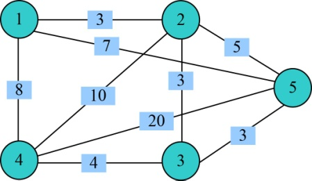

### 5.7.1　问题分析

现在我们从景点A出发，要去B、C、D、E共4个景点，按上面顺序给景点编号1～5，每个景点用一个结点表示，可以直接到达的景点有连线，连线上的数字代表两个景点之间的路程（时间）。那么要去的景点地图就转化成了一个无向带权图，如图5-114所示。

<b class="my_markdown">图5-114　无向带权图</b>

在无向带权图**G**=（V，E）中，结点代表景点，连线上的数字代表景点之间的路径长度。我们从1号结点出发，先走哪些景点，后走哪些景点呢？只要是可以直接到达的，即有边相连的，都是可以走的。问题就是要找出从出发地开始的一个景点排列，按照这个顺序旅行，不重复地走遍所有景点回到出发地，所经过的路径长度是最短的。

因此，问题的解空间是一棵排列树。显然，对于任意给定的一个无向带权图，存在某两个景点之间没有直接路径的情况。也就是说，并不是任何一个景点排列都是一条可行路径（问题的可行解），因此需要设置约束条件，判断排列中相邻的两个景点之间是否有边相连，有边的则可以走通；反之，不是可行路径。另外，在所有的可行路径中，要求找出一条最短路径，因此需要设置限界条件。

