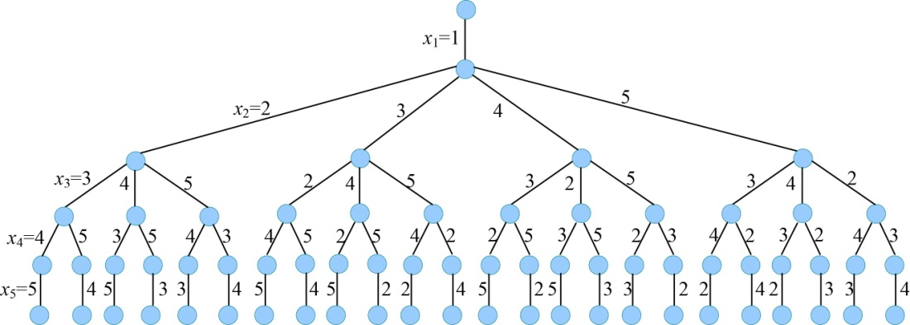

### 5.7.2　算法设计

（1）定义问题的解空间

奇妙之旅问题解的形式为n元组：{x1，x2，…，xi，…，xn}，分量xi表示第i个要去的旅游景点编号，景点的集合为S={1，2，…，n}。因为景点不可重复走，因此在确定xi时，前面走过的景点{x1，x2，…，xi-1}不可以再走，xi的取值为S−{x1，x2，…，xi-1}，i=1，2，…，n。

（2）解空间的组织结构

问题解空间是一棵排列树，树的深度为n=5，如图5-115所示。

<b class="my_markdown">图5-115　解空间树（排列树）</b>

除了开始结点1之外，其他的结点排列有24种：

2 3 4 5　2 3 5 4　2 4 3 5　2 4 5 3　2 5 4 3　2 5 3 4

3 2 4 5　3 2 5 4　3 4 2 5　3 4 5 2　3 5 4 2　3 5 2 4

4 3 2 5　4 3 5 2　4 2 3 5　4 2 5 3　4 5 2 3　4 5 3 2

5 3 4 2　5 3 2 4　5 4 3 2　5 4 2 3　5 2 4 3　5 2 3 4

（3）搜索解空间

+ 约束条件

用二维数组**g**[][]存储无向带权图的邻接矩阵，如果**g**[i][j]≠∞表示城市i和城市j有边相连，能走通。

+ 限界条件

cl<bestl，cl的初始值为0，bestf的初始值为+∞。

cl：当前已走过的城市所用的路径长度。

bestl：表示当前找到的最短路径的路径长度。

+ 搜索过程

扩展节点沿着某个分支扩展时需要判断约束条件和限界条件，如果满足，则进入深一层继续搜索；如果不满足，则剪掉该分支。搜索到叶子结点时，即找到当前最优解。搜索直到全部的活结点变成死结点为止。

