### 5.7.3　完美图解

现在我们从桃园机场出发，要去台北、日月潭、阿里山、澎湖这4个景点，按上面顺序给景点编号1～5，每个景点用一个结点表示，可以直接到达的景点有连线，连线上的数字代表两个景点之间的路程（时间）。把景点地图转化成一个无向带权图，如图5-116所示。

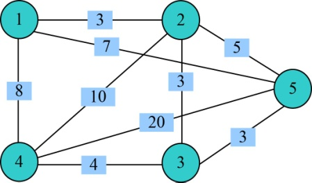

<b class="my_markdown">图5-116　无向带权图</b>

（1）数据结构

设置地图的带权邻接矩阵为**g**[][]，即如果从顶点i到顶点j有边，就让**g**[i][j]=<i，j>的权值，否则**g**[i][j]=∞（无穷大），如图5-117所示。

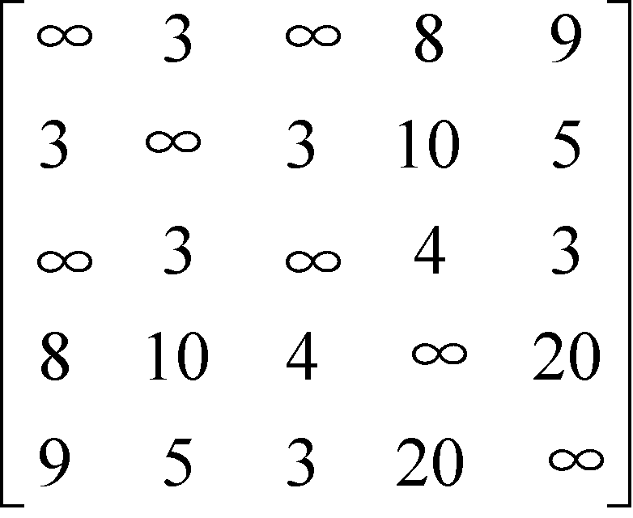

<b class="my_markdown">图5-117　邻接矩阵</b>

（2）初始化

当前已走过的路径长度cl=0，当前最优值bestl=∞。解分量x[i]和最优解bestx[i]初始化，如图5-118和图5-119所示。

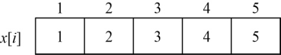

<b class="my_markdown">图5-118　解分量x[i]初始化</b>

<b class="my_markdown">图5-119　最优解bestx[i]初始化</b>

（3）开始搜索第一层（t=1）

扩展A0结点，因为我们是从1号结点出发，因此x[1]=1，生成A结点，如图5-120所示。

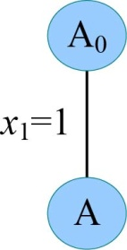

<b class="my_markdown">图5-120　搜索过程</b>

（4）扩展A结点（t=2）

沿着x[2]=2分支扩展，因为1号结点和2号结点有边相连，且cl+**g**[1][2]=0+3=3< bestl=∞，满足限界条件，生成B结点，如图5-121所示。

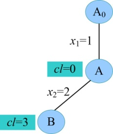

<b class="my_markdown">图5-121　搜索过程</b>

（5）扩展B结点（t=3）

沿着x[3]=3分支扩展，因为2号结点和3号结点有边相连，且cl+**g**[2][3]=3+3=6< bestl=∞，满足限界条件，生成C结点，如图5-122所示。

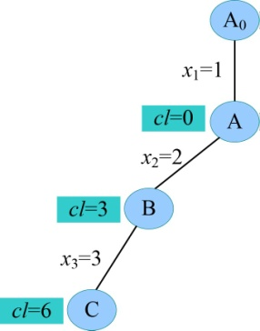

<b class="my_markdown">图5-122　搜索过程</b>

（6）扩展C结点（t=4）

沿着x[4]=4分支扩展，因为3号结点和4号结点有边相连，且cl+**g**[3][4]=6+4=10< bestl=∞，满足限界条件，生成D结点，如图5-123所示。

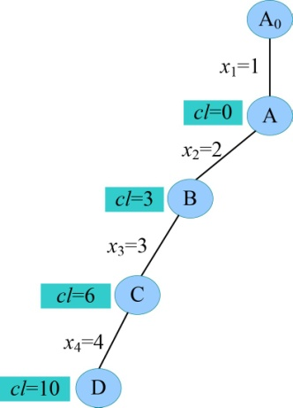

<b class="my_markdown">图5-123　搜索过程</b>

（7）扩展D结点（t=5）

沿着x[5]=5分支扩展，因为4号结点和5号结点有边相连，且cl+**g**[4][5]=10+20=30< bestl=∞，满足限界条件，生成E结点，如图5-124所示。

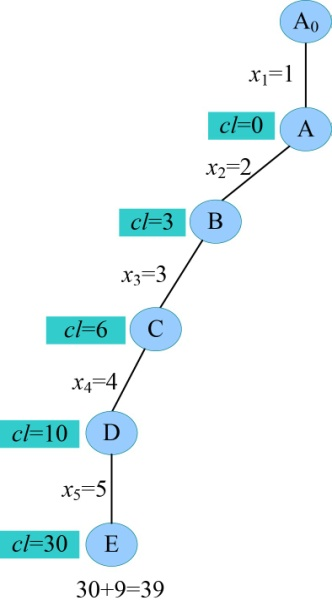

<b class="my_markdown">图5-124　搜索过程</b>

（8）扩展E结点（t=6）

t>n，判断5号结点和1号结点是否有边相连，有边相连且cl+**g**[5][1]=30+9=39<bestl=∞，找到一个当前最优解（1，2，3，4，5，1），更新当前最优值bestl=39。

（9）向上回溯到D，D结点孩子已生成完毕，成为死结点，继续向上回溯到C，C结点还有一个孩子未生成。

（10）重新扩展C结点（t=4）

沿着x[4]=5分支扩展，因为3号结点和5号结点有边相连，且cl+**g**[3][5]=6+3=9< bestl=39，满足限界条件，生成F结点，如图5-125所示。

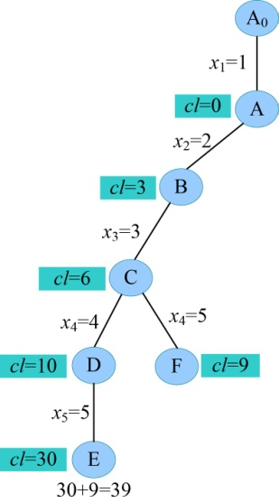

<b class="my_markdown">图5-125　搜索过程</b>

（11）扩展F结点（t=5）

沿着x[5]=4分支扩展，因为5号结点和4号结点有边相连，且cl+**g**[5][4]=9+20=29< bestl=39，满足限界条件，生成G结点，如图5-126所示。

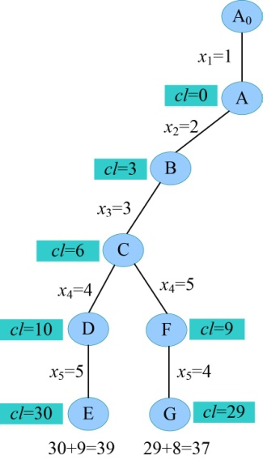

<b class="my_markdown">图5-126　搜索过程</b>

（12）扩展G结点（t=6）

t>n，判断4号结点和1号结点是否有边相连，有边相连且cl+**g**[4][1]=29+8=37<bestl=39，更新当前最优解（1，2，3，5，4，1），更新当前最优值bestl=37。

（13）向上回溯到F，F结点孩子已生成完毕，成为死结点，继续向上回溯到C，C结点孩子已生成完毕，成为死结点，继续向上回溯到B，B结点还有2个孩子未生成。

（14）重新扩展B结点（t=3）

沿着x[3]=4分支扩展，因为2号结点和4号结点有边相连，且cl+**g**[2][4]=3+10=13< bestl=37，满足限界条件，生成H结点，如图5-127所示。

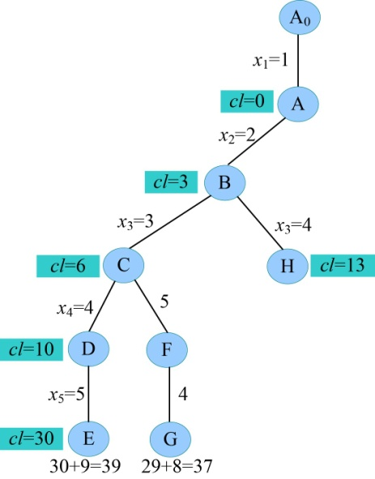

<b class="my_markdown">图5-127　搜索过程</b>

（15）扩展H结点（t=4）

沿着x[4]=3分支扩展，因为4号结点和3号结点有边相连，且cl+**g**[4][3]=13+4=17< bestl=37，满足限界条件，生成I结点。

（16）扩展I结点（t=5）

沿着x[4]=5分支扩展，因为3号结点和5号结点有边相连，且cl+**g**[3][5]=17+3=20< bestl=37，满足限界条件，生成J结点。

（17）扩展J结点（t=6）

t>n，判断5号结点和1号结点是否有边相连，有边相连且cl+**g**[5][1]=20+9=29<bestl=37，更新当前最优解（1，2，4，3，5，1），更新当前最优值bestl=29，如图5-128所示。

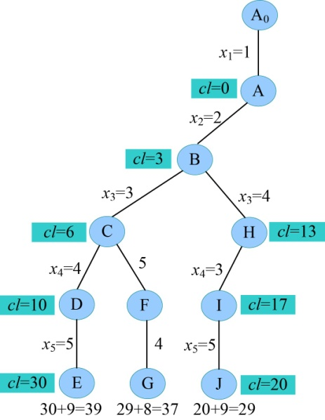

<b class="my_markdown">图5-128　搜索过程</b>

（18）向上回溯到I，I结点孩子已生成完毕，成为死结点，继续向上回溯到H，H结点还有1个孩子未生成。

（19）重新扩展H结点（t=4）

沿着x[4]=5分支扩展，因为4号结点和5号结点有边相连，且cl+**g**[4][5]=13+20=33> bestl=29，不满足限界条件，剪掉该分支。H结点孩子已生成完毕，成为死结点，继续向上回溯到B，B结点还有1个孩子未生成。

（20）重新扩展B结点（t=3）

沿着x[3]=5分支扩展，因为2号结点和5号结点有边相连，且cl+**g**[2][5]=3+5=8< bestl=29，满足限界条件，生成K结点。

（21）扩展K结点（t=4）

沿着x[4]=4分支扩展，因为5号结点和4号结点有边相连，且cl+**g**[5][4]=8+20=28< bestl=29，满足限界条件，生成L结点，如图5-129所示。

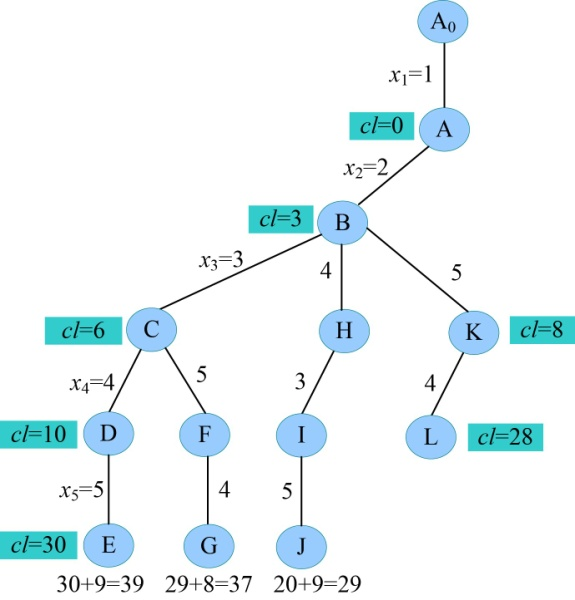

<b class="my_markdown">图5-129　搜索过程</b>

（22）扩展L结点（t=5）

沿着x[5]=3分支扩展，因为4号结点和3号结点有边相连，且cl+**g**[4][3]=28+4=32> bestl=29，不满足限界条件，剪掉该分支。L结点孩子已生成完毕，成为死结点，继续向上回溯到K，K结点还有1个孩子未生成。

（23）重新扩展K结点（t=4）

沿着x[4]=3分支扩展，因为5号结点和3号结点有边相连，且cl+**g**[5][3]=8+3=11< bestl=29，满足限界条件，生成M结点。

（24）扩展M结点（t=5）

沿着x[5]=4分支扩展，因为3号结点和4号结点有边相连，且cl+**g**[3][4]=11+4=15< bestl= 29，满足限界条件，生成N结点，如图5-130所示。

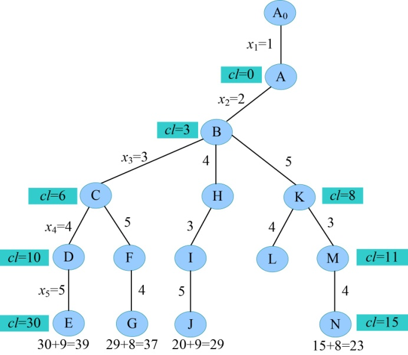

<b class="my_markdown">图5-130　搜索过程</b>

（25）扩展N结点（t=6）

t>n，判断4号结点和1号结点是否有边相连，有边相连且cl+**g**[4][1]=15+8=23<bestl=29，更新当前最优解（1，2，5，3，4，1），更新当前最优值bestl=23。向上回溯到M，M所有孩子生成完毕，成为死结点，继续向上回溯到K、B，K和B均为死结点，继续向上回溯到A，A还有3个孩子未生成。

（26）重新扩展A结点（t=2）

沿着x[2]=3分支扩展，因为1号结点和3号结点没有边相连，不满足约束条件，因此剪掉该分支。沿着x[2]=4分支扩展，因为1号结点和4号结点有边相连且cl+**g**[1][4]=0+8=8< bestl=23，满足限界条件，生成O结点。

（27）扩展O结点（t=3）

沿着x[3]=3分支扩展，因为4号结点和3号结点有边相连，且cl+**g**[4][3]=8+4=12< bestl=23，满足限界条件，生成P结点。

（28）扩展P结点（t=4）

沿着x[4]=2分支扩展，因为3号结点和2号结点有边相连，且cl+**g**[3][2]=12+3=15< bestl=23，满足限界条件，生成Q结点。

（29）扩展Q结点（t=5）

沿着x[5]=5分支扩展，因为2号结点和5号结点有边相连，且cl+**g**[2][5]=15+5=20< bestl=23，满足限界条件，生成R结点。

（30）扩展R结点（t=6）

t>n，判断5号结点和1号结点是否有边相连，有边相连且cl+**g**[5][1]=20+9=29>bestl=23，不满足限界条件，不更新最优解，如图5-131所示。

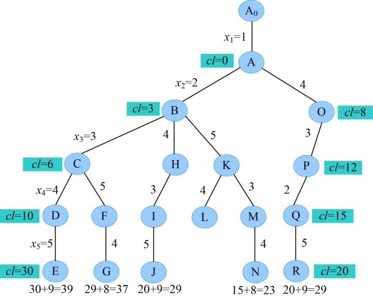

<b class="my_markdown">图5-131　搜索过程</b>

（31）向上回溯到Q，Q所有孩子生成完毕，成为死结点，继续向上回溯到P，P还有1个孩子未生成。

（32）重新扩展P结点（t=4）

沿着x[4]=5分支扩展，因为3号结点和5号结点有边相连，且cl+**g**[3][5]=12+3=15< bestl=23，满足限界条件，生成S结点。

（33）扩展S结点（t=5）

沿着x[5]=2分支扩展，因为5号结点和2号结点有边相连，且cl+**g**[3][5]=15+5=20< bestl=23，满足限界条件，生成T结点。

（34）扩展T结点（t=6）

t>n，判断2号结点和1号结点是否有边相连，有边相连且cl+**g**[2][1]=20+3=23=bestl=23，不满足限界条件，不更新最优解，如图5-132所示。

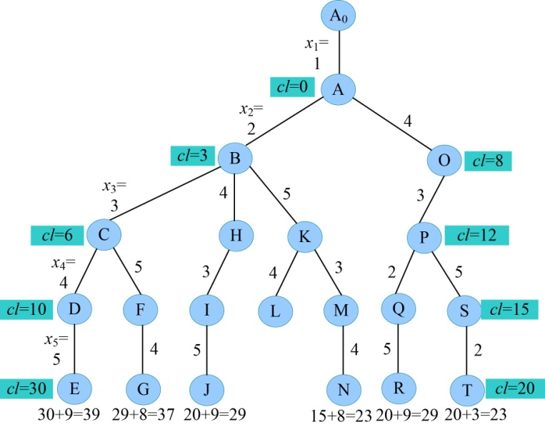

<b class="my_markdown">图5-132　搜索过程</b>

（35）向上回溯到S、P，S、P所有孩子生成完毕，成为死结点，继续向上回溯到O，O还有两个孩子未生成。

（36）重新扩展O结点（t=3）

沿着x[3]=2分支扩展，因为4号结点和2号结点有边相连，且cl+**g**[4][2]=8+10=18< bestl=23，满足限界条件，生成U结点。

（37）扩展U结点（t=4）

沿着x[4]=3分支扩展，因为2号结点和3号结点有边相连，且cl+**g**[2][3]=18+3=21< bestl=23，满足限界条件，生成V结点。

（38）扩展V结点（t=5）

沿着x[5]=5分支扩展，因为3号结点和5号结点有边相连，且cl+**g**[3][5]=21+3=24> bestl=23，不满足限界条件，剪掉该分支。向上回溯到U，U还有1个孩子未生成，如图5-133所示。

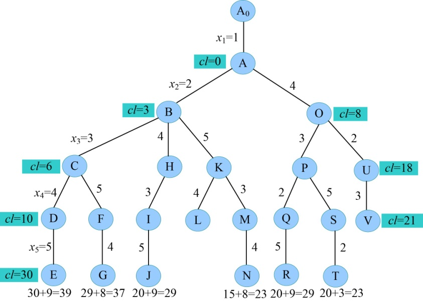

<b class="my_markdown">图5-133　搜索过程</b>

（39）重新扩展U结点（t=4）

沿着x[4]=5分支扩展，因为2号结点和5号结点有边相连，且cl+**g**[2][5]=18+5=23= bestl=23，不满足限界条件，剪掉该分支。向上回溯到O，O还有1个孩子未生成。

（40）重新扩展O结点（t=3）

沿着x[3]=5分支扩展，因为4号结点和5号结点有边相连，且cl+**g**[4][5]=8+20=28> bestl=23，不满足限界条件，剪掉该分支。向上回溯到A，A还有1个孩子未生成。

（41）重新扩展A结点（t=2）

沿着x[2]=5分支扩展，因为1号结点和5号结点有边相连且cl+**g**[1][5]=0+9=9<bestl=23，满足限界条件，生成W结点。

（42）扩展W结点（t=3）

沿着x[3]=3分支扩展，因为5号结点和3号结点有边相连，且cl+**g**[5][3]=9+3=12<bestl= 23，满足限界条件，生成X结点。

（43）扩展X结点（t=4）

沿着x[4]=4分支扩展，因为3号结点和4号结点有边相连，且cl+**g**[3][4]=12+4=16<bestl= 23，满足限界条件，生成Y结点。

（44）扩展Y结点（t=5）

沿着x[5]=2分支扩展，因为4号结点和2号结点有边相连，且cl+**g**[4][2]=16+10=26>bestl= 23，不满足限界条件，剪掉该分支。向上回溯到X，X还有1个孩子未生成。

（45）重新扩展X结点（t=4）

沿着x[4]=2分支扩展，因为3号结点和2号结点有边相连，且cl+**g**[3][2]=12+3=15<bestl= 23，满足限界条件，生成Z结点。

（46）扩展Z结点（t=5）

沿着x[5]=4分支扩展，因为2号结点和4号结点有边相连，且cl+**g**[2][4]=15+10=25>bestl= 23，不满足限界条件，剪掉该分支。向上回溯到W，W还有两个孩子未生成。

（47）重新扩展W结点（t=3）

沿着x[3]=4分支扩展，因为5号结点和4号结点有边相连，且cl+**g**[5][4]=9+20=29>bestl= 23，不满足限界条件，剪掉该分支。沿着x[3]=2分支扩展，因为5号结点和2号结点有边相连，且cl+**g**[5][2]=9+5=14<bestl=23，满足限界条件，生成X1结点。

（48）扩展X1结点（t=4）

沿着x[4]=4分支扩展，因为2号结点和4号结点有边相连，且cl+**g**[2][4]=14+10=24>bestl= 23，不满足限界条件，剪掉该分支。沿着x[4]=3分支扩展，因为2号结点和3号结点有边相连，且cl+**g**[2][3]=14+3=17<bestl=23，满足限界条件，生成X2结点。

（49）扩展X2结点（t=5）

沿着x[5]=4分支扩展，因为3号结点和4号结点有边相连，且cl+**g**[3][4]=17+4=21<bestl= 23，满足限界条件，生成X3结点。

（50）扩展X3结点（t=6）

t>n，判断4号结点和1号结点是否有边相连，有边相连且cl+**g**[4][1]=21+8=29> bestl=23，不满足限界条件，不更新最优解。所有的结点变成死结点，算法结束，如图5-134所示。

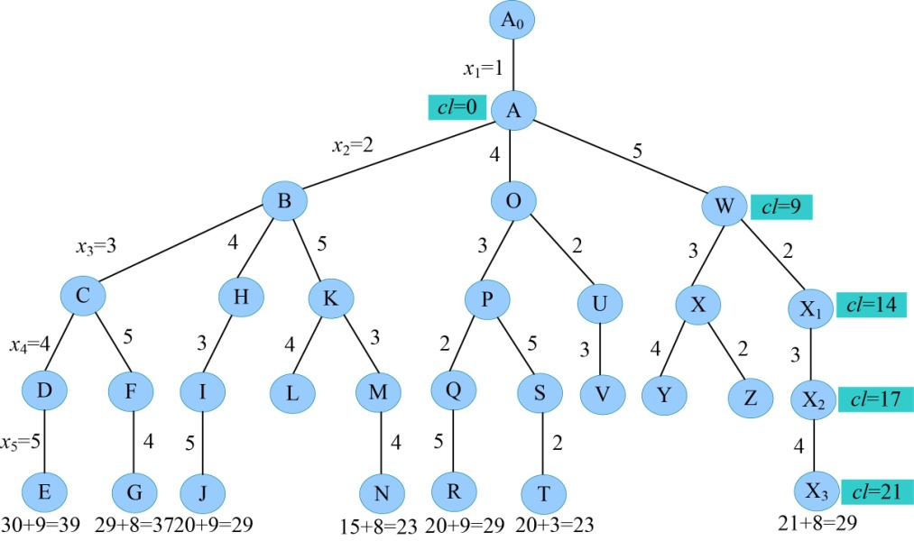

<b class="my_markdown">图5-134　搜索过程</b>

