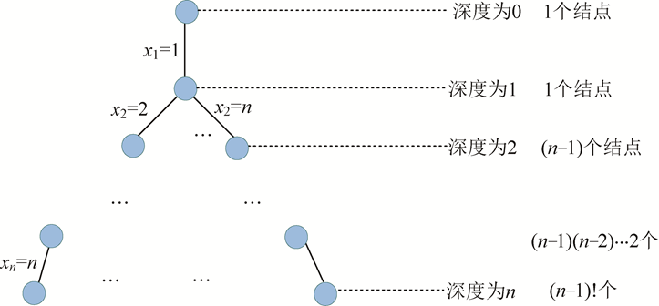

### 5.7.6　算法解析及优化拓展

#### 1．算法复杂度分析

（1）时间复杂度

最坏情况下，如图5-135所示。除了最后一层外，有1+n+n(n−1) +…+ (n−1)(n−2)…2n(n−1)!个结点需要判断约束函数和限界函数，判断两个函数需要O(1)的时间，因此耗时O(n!)。在叶子结点处记录当前最优解需要耗时O(n)，在最坏情况下回搜索到每一个叶子结点，叶子个数为(n−1)，故耗时为O(n!)。因此，时间复杂度为O(n!)。


<center class="my_markdown"><b class="my_markdown">图5-135　解空间树（排列树）</b></center>

（2）空间复杂度

回溯法的另一个重要特性就是在搜索执行的同时产生解空间。在所搜过程中的任何时刻，仅保留从开始结点到当前扩展结点的路径，从开始结点起最长的路径为n。程序中我们使用x[]数组记录该最长路径作为可行解，所以该算法的空间复杂度为O(n)。

#### 2．算法优化拓展

旅行商问题也可以使用动态规划算法，如program 5-6-1所示，仅作参考。

**注意：** 动态规划方法并不是解决TSP问题的一个好方法，因其占用空间和时间复杂度均较大。

```c
//program 5-6-1
#include<cstring>
#include<iostream>
#include<cstdlib>
#include<algorithm>
using namespace std;
const int M = 1<<13;
#define INF 0x3f3f3f3f
int dp[M+2][20];//dp[i][j] 表示第i个状态，到达第j个城市的最短路径
int g[15][15];
int path[M+2][15];    //最优路径
int n,m;              //n个城市，m条路
int bestl;            //最短路径长度
int sx,S;
void Init()           //初始化
{
     memset(dp,INF,sizeof(dp));
     memset(path,0,sizeof(path));
     memset(g,INF,sizeof(g));
     bestl = INF;
}
void Traveling()//计算dp[i][j]
{
     dp[1][0]=0;
     S=1<<n; //S=2^n
     for(int i=0; i<S; i++)
     {
          for(int j=0; j<n; j++)
          {
               if(!(i&(1<<j))) continue;
               for(int k = 0; k<n; k++)
               {
                    if(i&(1<<k)) continue;
                    if(dp[i|(1<<k)][k] > dp[i][j] + g[j][k])
                    {
                         dp[i|(1<<k)][k] = dp[i][j] + g[j][k];
                         path[i|(1<<k)][k] = j ;
                    }
               }
          }
     }
     for(int i=0; i<n; i++)     //查找最短路径长度
     {
          if(bestl>dp[S-1][i]+g[i][0])
          {
               bestl=dp[S-1][i]+g[i][0] ;
               sx=i ;
          }
     }
}
void print(int S ,int value)      //打印路径
{
     if(!S)  return ;
     for(int i=0; i<n ; i++)
     {
          if(dp[S][i]==value)
          {
               print(S^(1<<i) ,value - g[i][path[S][i]]) ;
               cout<<i+1<<"--->";
               break ;
          }
     }
}
int main()
{
     int u, v, w;//u,v代表城市，w代表u和v城市之间路的长度
     cout << "请输入景点数n（结点数）：";
     cin >> n;
     cout << "请输入景点之间的连线数（边数）：";
     cin >> m;
     Init();
     cout << "请依次输入两个景点u和v之间的距离w，格式：景点u 景点v 距离w";
     for(int i=0; i<m; i++)
     {
         cin >> u >> v >> w;
         g[u-1][v-1] = g[v-1][u-1] = w;
     }
     Traveling();
     cout<<"最短路径：";
     print(S-1 ,bestl-g[sx][0]) ;
     cout << 1 << endl;
     cout<<"最短路径长度：" ;
     cout << bestl << endl;
     return 0;
}
```

**算法实现和测试**

（1）运行环境

Code::Blocks

（2）输入

```c
请输入景点数 n（结点数）：5
请输入景点之间的连线数（边数）：9
请依次输入两个景点u和v之间的距离w，格式：景点u 景点v 距离w
1 2 3
1 4 8
1 5 9
2 3 3
2 4 10
2 5 5
3 4 4
3 5 3
4 5 20
```

（3）输出

```c
最短路径：1--->4--->3--->5--->2--->1
最短路径长度：23
上述动态规划算法的时间复杂度为O(2n*n2)，空间复杂度为O(2n)。 

```

