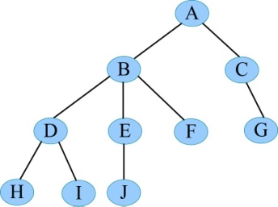
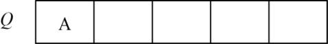
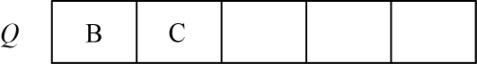
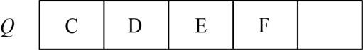
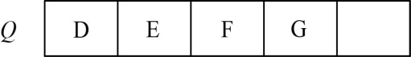
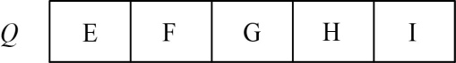
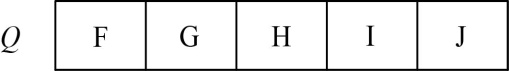

### 6.1　横行天下——广度优先

“体恭敬而心忠信，术礼义而情爱人，横行天下，虽困四夷，人莫不贵。”

——《荀子•修身》

那么如何横行天下呢？例如有一棵树，如图6-1所示。

<b class="my_markdown">图6-1　树</b>

对这样一棵树，我们要想横行（广度优先），那么首先搜索第1层A，然后搜索第2层，从左向右B、C，再搜索第3层，从左向右D、E、F、G，再搜索第4层，从左向右H、I、J，很简单吧，其实就是层次遍历。

程序用队列实现层次遍历。很多同学觉得数据结构没有用处，其实数据结构类似九九乘法表，你有时根本感觉不到它的存在，但却无时无刻不在用它！

首先创建一个队列Q：

（1）令树根入队，如图6-2所示。

<b class="my_markdown">图6-2　队列</b>

（2）队头元素出队，输出A，同时令A的所有孩子（从左向右顺序）入队，如图6-3所示。

<b class="my_markdown">图6-3　队列</b>

（3）队头元素出队，输出B，同时令B的所有孩子（从左向右顺序）入队，如图6-4所示。

<b class="my_markdown">图6-4　队列</b>

（4）队头元素出队，输出C，同时令C的所有孩子（从左向右顺序）入队，如图6-5所示。

<b class="my_markdown">图6-5　队列</b>

（5）队头元素出队，输出D，同时令D的所有孩子（从左向右顺序）入队，如图6-6所示。

<b class="my_markdown">图6-6　队列</b>

（6）队头元素出队，输出E，同时令E的所有孩子（从左向右顺序）入队，如图6-7所示。

<b class="my_markdown">图6-7　队列</b>

（7）队头元素出队，输出F，同时令F的所有孩子入队。F没有孩子，不操作。

（8）队头元素出队，输出G，同时令G的所有孩子入队。G没有孩子，不操作。

（9）队头元素出队，输出H，同时令H的所有孩子入队。H没有孩子，不操作。

（10）队头元素出队，输出I，同时令I的所有孩子入队。I没有孩子，不操作。

（11）队头元素出队，输出J，同时令J的所有孩子入队。J没有孩子，不操作。

（12）队列为空，结束。输出的顺序为A，B，C，D，E，F，G，H，I，J。

