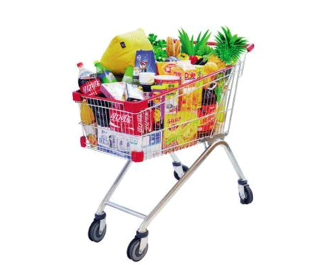

### 6.2　大卖场购物车3——0-1背包问题

央视有一个大型娱乐节目——购物街，舞台上模拟超市大卖场，有很多货物，每个嘉宾分配一个购物车，可以尽情地装满购物车，购物车装的价值最高者取胜。假设现在有n个物品和1个购物车，每个物品i对应价值为vi，重量wi，购物车的容量为W（你也可以将重量设定为体积）。每个物品只有一件，要么装入，要么不装入，不可拆分。如何选取物品装入购物车，使购物车所装入的物品的总价值最大？要求输出最优值（装入的最大价值）和最优解（装入了哪些物品）。

<b class="my_markdown">图6-8　大卖场购物车3</b>

