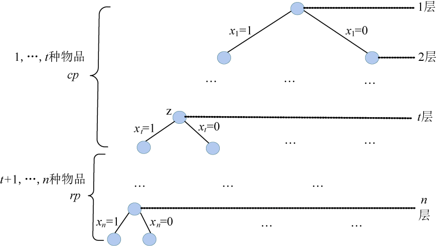

### 6.2.2　算法设计

（1）定义问题的解空间

购物车问题属于典型的0-1背包问题，问题的解是从n个物品中选择一些物品使其在不超过容量的情况下价值最大。每个物品有且只有两种状态，要么装入购物车，要么不装入。那么第i个物品装入购物车，能够达到目标要求，还是不装入购物车能够达到目标要求呢？很显然目前还不确定。因此，可以用变量xi表示第i种物品是否被装入购物车的行为，如果用“0”表示不被装入背包，用“1”表示装入背包，则xi的取值为0或1。第i个物品装入购物车，xi=1，i=1，2，…，n；不装入购物车，xi=0。该问题解的形式是一个n元组，且每个分量的取值为0或1。

由此可得，问题的解空间为：{x1，x2，…，xi，…，xn}，其中，显约束xi =0或1，i=1，2，…，n。

（2）确定解空间的组织结构

问题的解空间描述了2n种可能的解，也可以说是n个元素组成的集合所有子集个数。例如3个物品的购物车问题，解空间是：{0，0，0}，{0，0，1}，{0，1，0}，{0，1，1}，{1，0，0}，{1，0，1}，{1，1，0}，{1，1，1}。该问题有23个可行解。

如图6-9所示，问题的解空间树为子集树，解空间树的深度为问题的规模n。

<b class="my_markdown">图6-9　解空间树（子集树）</b>

（3）搜索解空间

+ 约束条件

购物车问题的解空间包含2n种可能的解，存在某种或某些物品无法装入购物车的情况，因此需要设置约束条件，来判断所有可能的解装入背包的物品的总重量是否超出购物车的容量，如果超出，为不可行解；否则为可行解。搜索过程不再搜索那些导致不可行解的结点及其孩子结点。

约束条件为：

+ 限界条件

购物车问题的可行解可能不止一个，问题的目标是找一个装入购物车的物品总价值最大的可行解，即最优解。因此，需要设置限界条件来加速找出该最优解的速度。

如图6-10所示，根据解空间的组织结构可知，对于任何一个中间结点z（中间状态），从根节点到z结点的分支所代表的行为已经确定，从z到其子孙结点的分支的行为是不确定的。也就是说，如果z在解空间树中所处的层次是t，说明第1种物品到第t−1种物品的状态已经确定了。我们只需要沿着z的分支扩展很容易确定第t种物品的状态。那么前t种物品的状态就确定了。但第t+1种物品到第n种物品的状态还不确定。这样，前t种物品的状态确定后，当前已装入购物车的物品的总价值，用cp表示。已装入物品的价值高并一定就是最优解，因为还有剩余物品未确定。

<b class="my_markdown">图6-10　解空间树（cp+rp）</b>

我们还不确定第t+1种物品到第n种物品的实际状态，因此只能用估计值。假设第t+1种物品到第n种物品都装入购物车，第t+1种物品到第n种物品的总价值用rp来表示。因此cp+rp是所有从根出发经过中间结点z的可行解的价值上界。

如果价值上界小于或等于当前搜索到的最优值（最优值用bestp表示，初始值为0），则说明从中间结点z继续向子孙结点搜索不可能得到一个比当前更优的可行解，没有继续搜索的必要，反之，则继续向z的子孙结点搜索。

限界条件为：

cp+rp>=bestp

注意：回溯法中的购物车问题，限界条件不带等号，因为bestp初始化为0，首次到达叶子时才会更新bestp，因此只要有解，必然存在至少到达叶子结点一次。而在分支限界法中，只要cp>bestp，就立即更新bestp，如果限界条件中不带等号，则会出现无法到达叶子的情况，例如解的最后一位是0时，如（1，1，1，0），就无法找到这个的解向量。因为最后一位是0时，cp+rp=bestp，而不是cp+rp>bestp，如果限界条件不带等号，就无法到达叶子，得不到解（1，1，1，0）。算法均设置了到叶子结点判断更新最优解和最优值。

+ 搜索过程。

从根结点开始，以广度优先的方式进行搜索。根节点首先成为活结点，也是当前的扩展结点。一次性生成所有孩子结点，由于子集树中约定左分支上的值为“1”，因此沿着扩展结点的左分支扩展，则代表装入物品；由于子集树中约定右分支上的值为“0”，因此沿着扩展结点的右分支扩展，则代表不装入物品。此时，判断是否满足约束条件和限界条件，如果满足，则将其加入队列中；反之，舍弃。然后再从队列中取出一个元素，作为当前扩展结点，搜索过程队列为空时为止。

