### 6.2.3　完美图解

假设现在有4个物品和购物车的容量，每个物品的重量w为（2，5，4，2），价值v为（6，3，5，4），购物车的容量为10（W=10），如图6-11所示。求在不超过购物车容量的前提下，把哪些物品放入购物车，才能获得最大价值。

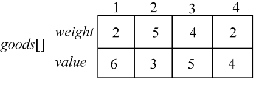

<b class="my_markdown">图6-11　物品的重量和价值</b>

（1）初始化

sumw和sumv分别用来统计所有物品的总重量和总价值。sumw=13，sumv=18，sumw>W，因此不能全部装完，需要搜索求解。初始化当前放入购物车的物品价值cp=0；当前剩余物品价值rp=sumv；当前剩余容量rw=W；当前处理物品序号为1；当前最优值bestp=0。解向量为x[]=（0，0，0，0），创建一个根结点Node（cp，rp，rw，id），标记为A，加入先进先出队列q中。cp为装入购物车的物品价值，rp剩余物品的总价值，rw为剩余容量，id为物品号，x[]为当前解向量，如图6-12所示。

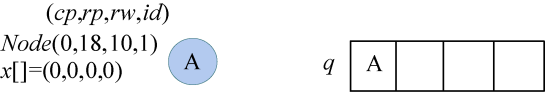

<b class="my_markdown">图6-12　搜索过程及队列状态</b>

（2）扩展A结点

队头元素A出队，该结点的cp+rpbestp，满足限界条件，可以扩展。rw=10>goods[1]. weight=2，剩余容量大于1号物品重量，满足约束条件，可以放入购物车，cp=0+6=6，rp=18−6=12，rw=10−2=8，t=2，x[1]=1，解向量更新为x[]=（1，0，0，0），生成左孩子B，加入q队列，更新bestp=6，如图6-13所示。

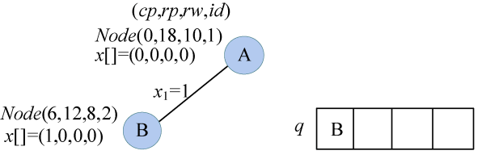

<b class="my_markdown">图6-13　搜索过程及队列状态</b>

再扩展右分支，cp=0，rp=18−6=12，cp+rpbestp=6，满足限界条件，不放入1号物品，cp=0，rp=12，rw=10，t=2，x[1]=0，解向量为x[]=（0，0，0，0），创建新结点C，加入q队列，如图6-14所示。

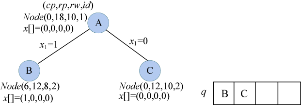

<b class="my_markdown">图6-14　搜索过程及队列状态</b>

（3）扩展B结点

队头元素B出队，该结点的cp+rpbestp，满足限界条件，可以扩展。rw=8>goods[2]. weight=5，剩余容量大于2号物品重量，满足约束条件，cp=6+3=9，rp=12−3=9，rw=8−5=3，t=3，x[2]=1，解向量更新为x[]=（1，1，0，0），生成左孩子D，加入q队列，更新bestp=9。

再扩展右分支，cp=6，rp=12−3=9，cp+rpbestp=9，满足限界条件，t=3，x[2]=0，解向量为x[]=（1，0，0，0），生成右孩子E，加入q队列，如图6-15所示。

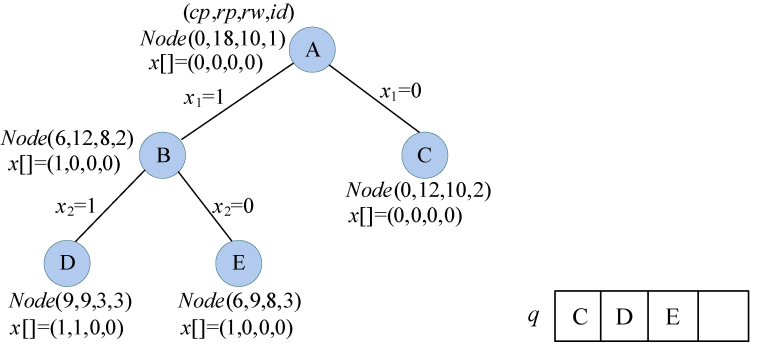

<b class="my_markdown">图6-15　搜索过程及队列状态</b>

（4）扩展C结点

队头元素C出队，该结点的cp+rpbestp，满足限界条件，可以扩展。rw=10>goods[2]. weight=5，剩余容量大于2号物品重量，满足约束条件，cp=0+3=3，rp=12−3=9，rw=10−5=5，t=3，x[2]=1，解向量更新为x[]=（0，1，0，0），生成左孩子F，加入q队列。

再扩展右分支，cp=0，rp=12−3=9，cp+rpbestp=9，满足限界条件，rw=10，t=3，x[2]=0，解向量为x[]=（0，0，0，0），生成右孩子G，加入q队列，如图6-16所示。

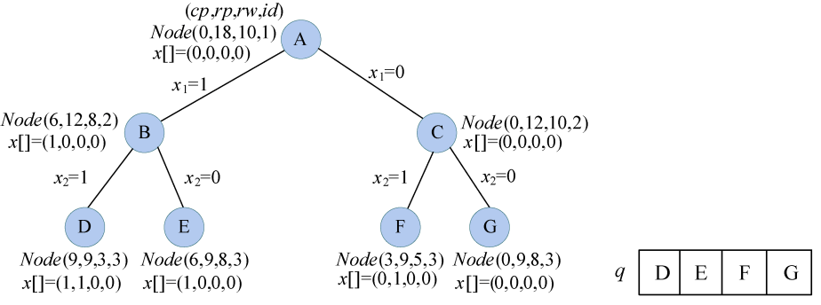

<b class="my_markdown">图6-16　搜索过程及队列状态</b>

（5）扩展D结点

队头元素D出队，该结点的cp+rpbestp，满足限界条件，可以扩展。rw=3>goods[3]. weight=4，剩余容量小于3号物品重量，不满足约束条件，舍弃左分支。

再扩展右分支，cp=9，rp=9−5=4，cp+rpbestp=9，满足限界条件，t=4，x[3]=0，解向量为x[]=（1，1，0，0），生成右孩子H，加入q队列，如图6-17所示。

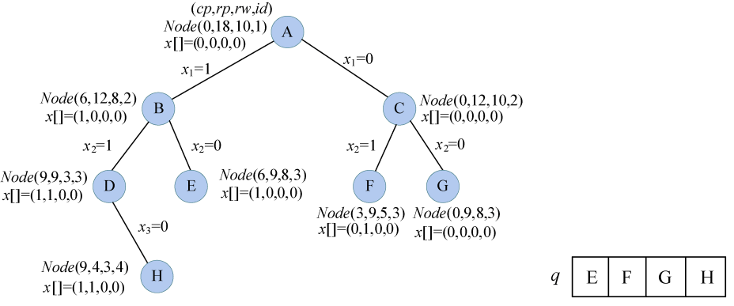

<b class="my_markdown">图6-17　搜索过程及队列状态</b>

（6）扩展E结点

队头元素E出队，该结点的cp+rpbestp，满足限界条件，可以扩展。rw=8>goods[3]. weight=4，剩余容量大于3号物品重量，满足约束条件，cp=6+5=11，rp=9−5=4，rw=8−4=4，t=4，x[3]=1，解向量更新为x[]=（1，0，1，0），生成左孩子I，加入q队列，更新bestp=11。

再扩展右分支，cp=6，rp=9−5=4，cp+rp<bestp=11，不满足限界条件，舍弃，如图6-18所示。

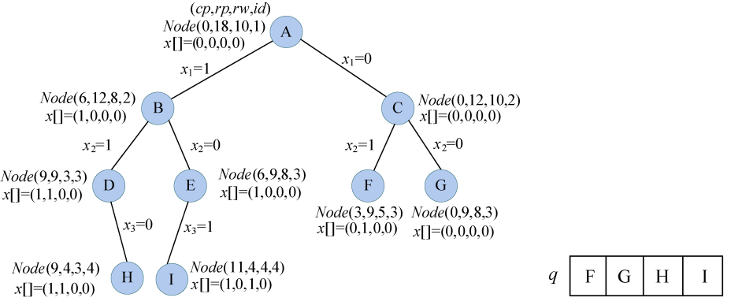

<b class="my_markdown">图6-18　搜索过程及队列状态</b>

（7）扩展F结点

队头元素F出队，该结点的cp+rpbestp，满足限界条件，可以扩展。rw=5>goods[3]. weight=4，剩余容量大于3号物品重量，满足约束条件，cp=3+5=8，rp=9−5=4，rw=5−4=1，t=4，x[3]=1，解向量更新为x[]=（0，1，1，0），生成左孩子J，加入q队列。

再扩展右分支，cp=3，rp=9−5=4，cp+rp<bestp=11，不满足限界条件，舍弃，如图6-19所示。

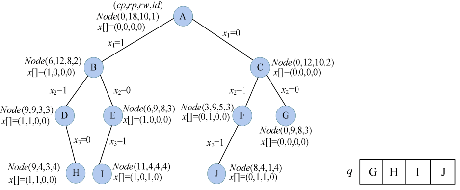

<b class="my_markdown">图6-19　搜索过程及队列状态</b>

（8）扩展G结点

队头元素G出队，该结点的cp+rp<bestp=11，不满足限界条件，不再扩展。

（9）扩展H结点

队头元素H出队，该结点的cp+rpbestp，满足限界条件，可以扩展。rw=3>goods[4]. weight=2，剩余容量大于4号物品重量，满足约束条件，令cp=9+4=13，rp=4−4=0，rw=3−2=1，t=5，x[4]=1，解向量更新为x[]=（1，1，0，1），生成左孩子K，加入q队列，更新bestp=13。

再扩展右分支，cp=9，rp=4−4=0，cp+rp<bestp，不满足限界条件，舍弃，如图6-20所示。

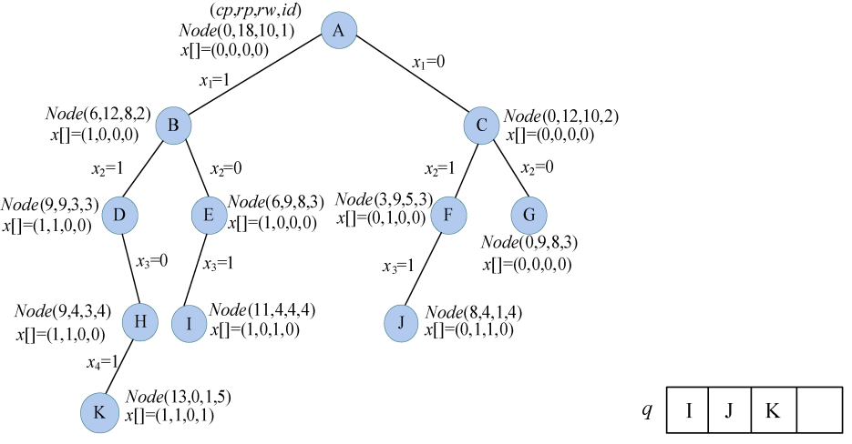

<b class="my_markdown">图6-20　搜索过程及队列状态</b>

（10）扩展I结点

队头元素I出队，该结点的cp+rpbestp，满足限界条件，可以扩展。rw=4>goods[4]. weight=2，剩余容量大于4号物品重量，满足约束条件，cp=11+4=15，rp=4-4=0，rw=4−2=2，t=5，x[4]=1，解向量更新为x[]=（1，0，1，1），生成左孩子L，加入q队列，更新bestp=15。

再扩展右分支，cp=11，rp=4−4=0，cp+rp<bestp，不满足限界条件，舍弃，如图6-21所示。

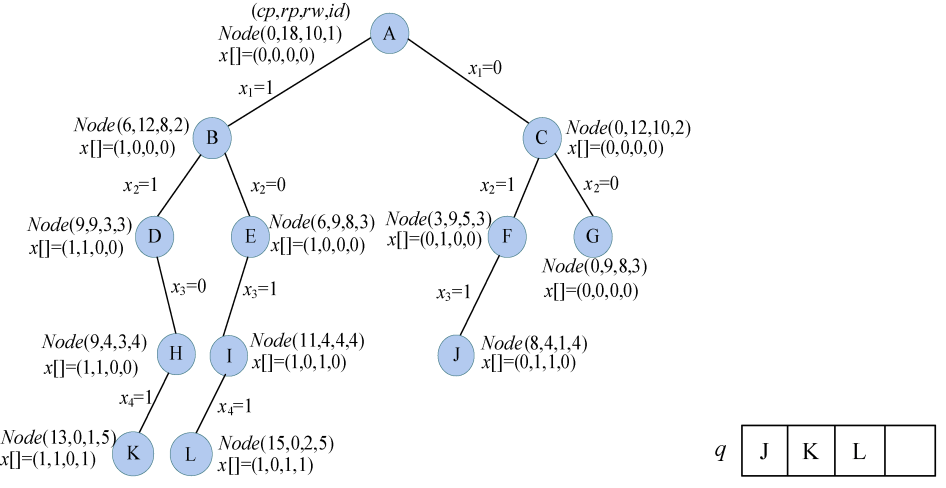

<b class="my_markdown">图6-21　搜索过程及队列状态</b>

（11）队头元素J出队，该结点的cp+rp<bestp=15，不满足限界条件，不再扩展。

（12）队头元素K出队，扩展K结点：t=5，已经处理完毕，cp<bestp，不是最优解。

（13）队头元素L出队，扩展L结点：t=5，已经处理完毕，cp=bestp，是最优解，输出该解向量（1，0，1，1）。

（14）队列为空，算法结束。

