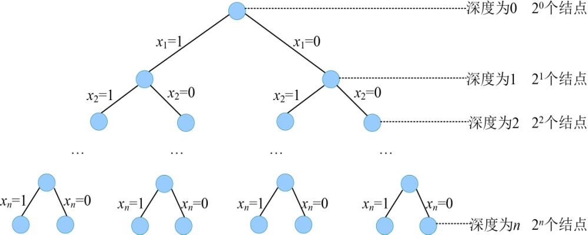

### 6.2.6　算法解析

（1）时间复杂度

算法的运行时间取决于它在搜索过程中生成的结点数，而限界函数可以大大减少所生成的结点个数，避免无效搜索，加快搜索速度。

左孩子需要判断约束函数，右孩子需要判断限界函数，那么最坏有多少个左孩子和右孩子呢？我们看规模为n的子集树，最坏情况下的状态如图6-22所示。

<b class="my_markdown">图6-22　解空间树（子集树）</b>

总的结点个数有20 +21+…+2<em>n</em> =2<em>n</em>+1−1，减去树根结点再除2就得到了左右孩子结点的个数，左右孩子结点的个数=（2<em>n</em>+1−1−1）/2=2<em>n</em>−1。

约束函数时间复杂度为O(1)，限界函数时间复杂度为O(1)。最坏情况下有O(2n)个左孩子结点调用约束函数，有O(2n)个右孩子结点需要调用限界函数，故计算购物车问题的分支限界法的时间复杂度为O(2n+1)。

（2）空间复杂度

空间主要耗费在Node结点里面存储的变量和解向量，因为最多有O(2n+1)个结点，而每个结点的解向量需要O(n)个空间，则空间复杂度为O(n*2n+1)。其实每个结点都记录解向量的办法是很笨的噢，我们可以用指针记录当前结点的左右孩子和父亲，到达叶子时逆向找其父亲结点，直到根结点，就得到了解向量，这样空间复杂度降为O(n)，大家不妨动手写写看。

