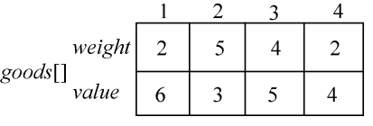
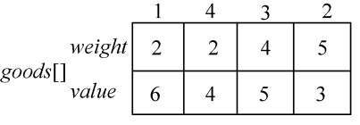
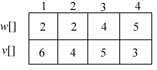
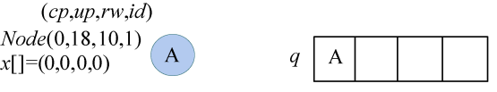
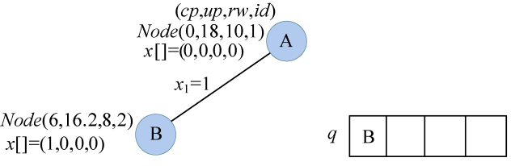
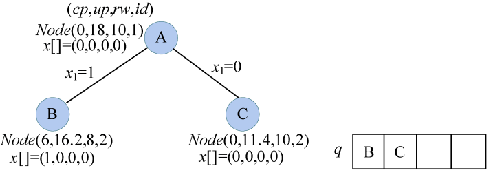
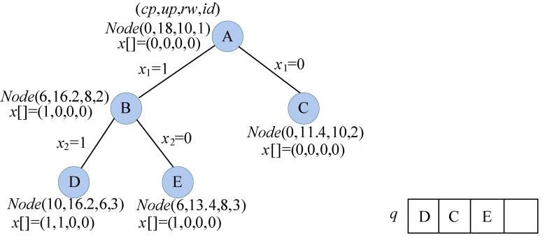
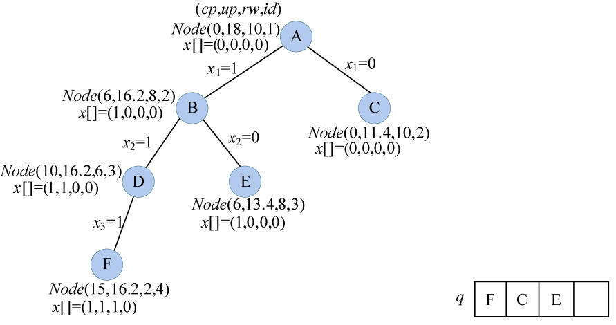
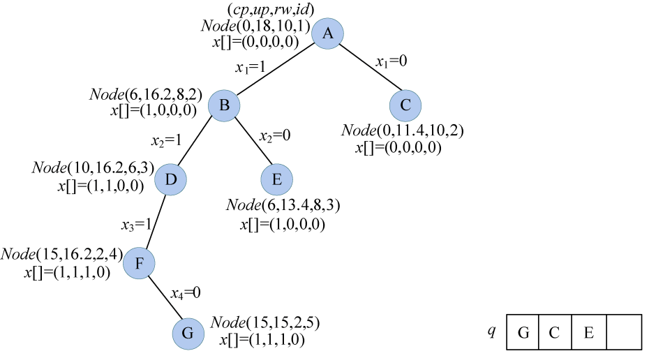

### 6.2.7　算法优化拓展——优先队列式分支限界法

优先队列优化，简单来说就是以当前结点的上界为优先值，把普通队列改成优先队列，这样就得到了优先队列式分支限界法。

#### 1．算法设计

优先级定义为活结点代表的部分解所描述的装入的物品价值上界，该价值上界越大，优先级越高。活结点的价值上界up =活结点的cp+剩余物品装满购物车剩余容量的最大价值rp'。

约束条件：


限界条件：

up = cp + rp'  bestp

#### 2．完美图解

假设我们现在有4个物品和购物车的容量，每个物品的重量w为（2，5，4，2），价值v为（6，3，5，4），购物车的容量为10（W=10），如图6-23所示。求在不超过购物车容量的前提下，把哪些物品放入购物车，才能获得最大价值。


<center class="my_markdown"><b class="my_markdown">图6-23　物品的重量和价值</b></center>

（1）初始化

sumw和sumv分别用来统计所有物品的总重量和总价值。sumw=13，sumv=18，sumw>W，因此不能全部装完，需要搜索求解。

（2）按价值重量比非递增排序

把序号和价值重量比存储在辅助数组中，按价值重量比非递增排序，排序后的结果如图6-24所示。


<center class="my_markdown"><b class="my_markdown">图6-24　物品的重量和价值（排序后）</b></center>

为了程序处理方便，把排序后的数据存储在w[]和v[]数组中。后面的程序在该数组上操作即可，如图6-25所示。


<center class="my_markdown"><b class="my_markdown">图6-25　物品的重量和价值</b></center>

（3）创建根结点A

初始化当前放入购物车的物品重量cp=0；当前价值上界up=sumv；当前剩余容量rw=W；当前处理物品序号为1；当前最优值bestp=0。最优解初始化为x[]=（0，0，0，0），创建一个根结点Node（cp，up，rw，id），标记为A，加入优先队列q中，如图6-26所示。


<center class="my_markdown"><b class="my_markdown">图6-26　搜索过程及优先队列状态</b></center>

（4）扩展A结点

队头元素A出队，该结点的upbestp，满足限界条件，可以扩展。rw=10>w[1]=2，剩余容量大于1号物品重量，满足约束条件，可以放入购物车，生成左孩子，令cp=0+6=6，rw=10-2=8。

那么上界怎么算呢？up=cp+rp'=cp+剩余物品装满购物车剩余容量的最大价值rp'。剩余容量还有8，可以装入2、3号物品，装入后还有剩余容量2，只能装入4号物品的一部分，装入的价值为剩余容量*单位重量价值，即2×3/5=1.2，rp'=4+5+1.2=10.2，up= cp+rp'=16.2，在此需要注意，购物车问题属于0-1背包问题，物品要么装入，要么不装入，是不可以分割，这里为什么还会有部分装入的问题呢？很多同学看到这里都有这样的疑问，我们在此不是真的部分装入了，只是算上界而已。

令t=2，x[1]=1，解向量更新为x[]=（1，0，0，0），创建新结点B，加入q队列，更新bestp=6，如图6-27所示。


<center class="my_markdown"><b class="my_markdown">图6-27　搜索过程及优先队列状态</b></center>

再扩展右分支，cp=0，rw=10，剩余容量可以装入2、3号物品，装入后还有剩余容量4，只能装入4号物品的一部分，装入的价值为剩余容量*单位重量价值，即4×3/5=2.4，rp'=4+5+2.4=11.4，up=cp+rp'=11.4，up>bestp，满足限界条件，令t=2，x[1]=0，解向量更新为x[]=（0，0，0，0），生成右孩子C，加入q队列，如图6-28所示。


<center class="my_markdown"><b class="my_markdown">图6-28　搜索过程及优先队列状态</b></center>

（5）扩展B结点

队头元素B出队，该结点的upbestp，满足限界条件，可以扩展。剩余容量rw=8>w[2]=2，大于2号物品重量，满足约束条件，令cp=6+4=10，rw=8−2=6，up=cp+rp'=10+5+2×3/5=16.2，t=3，x[2]=1，解向量更新为x[]=（1，1，0，0），生成左孩子D，加入q队列，更新bestp=10。

再扩展右分支，cp=6，rw=8，剩余容量可以装入3号物品，4号物品部分装入，up=cp+rp'=6+5+3×4/5=13.4，up>bestp，满足限界条件，令t=3，x[2]=0，解向量为x[]=（1，0，0，0），生成右孩子E，加入q队列。注意：q为优先队列，其实是堆实现的，如果不想搞清楚，只需要知道每次up值最大的结点出队即可，如图6-29所示。


<center class="my_markdown"><b class="my_markdown">图6-29　搜索过程及优先队列状态</b></center>

（6）扩展D结点

队头元素D出队，该结点的upbestp，满足限界条件，可以扩展。剩余容量rw=6>w[3]=4，大于3号物品重量，满足约束条件，令cp=10+5=15，rw=6−4=2，up=cp+rp'=10+5+2×3/5=16.2，t=4，x[3]=1，解向量更新为x[]=（1，1，1，0），生成左孩子F，加入q队列，更新bestp=15。

再扩展右分支，cp=10，rw=8，剩余容量可以装入4号物品，up=cp+rp'=10+3=13，up<bestp，不满足限界条件，舍弃右孩子，如图6-30所示。


<center class="my_markdown"><b class="my_markdown">图6-30　搜索过程及优先队列状态</b></center>

（7）扩展F结点

队头元素F出队，该结点的upbestp，满足限界条件，可以扩展。剩余容量rw=2<w[4]=5，不满足约束条件，舍弃左孩子。

再扩展右分支，cp=15，rw=2，虽然有剩余容量，但物品已经处理完毕，已没有物品可以装入，up=cp+rp'=15+0=15，upbestp，满足限界条件，令t=5，x[4]=0，解向量为x[]=（1，1，1，0），生成右孩子G，加入q队列，如图6-31所示。


<center class="my_markdown"><b class="my_markdown">图6-31　搜索过程及优先队列状态</b></center>

（8）扩展G结点

队头元素G出队，该结点的upbestp，满足限界条件，可以扩展。t=5，已经处理完毕，bestp=cp=15，是最优解，解向量（1，1，1，0）。注意：虽然解是（1，1，1，0），但对应的物品原来的序号是1、4、3。G出队后队列，如图6-32所示。


<center class="my_markdown"><b class="my_markdown">图6-32　优先队列状态</b></center>

（9）队头元素E出队，该结点的up<bestp，不满足限界条件，不再扩展。

（10）队头元素C出队，该结点的up<bestp，不满足限界条件，不再扩展。

（11）队列为空，算法结束。

#### 3．伪码详解

（1）定义结点和物品结构体

```c
struct Node      //定义结点,记录当前结点的解信息
{
     int cp;     //cp装入购物车的物品价值
     double up;  //价值上界
     int rw;     //背包剩余容量
     int id;     //物品号
     bool x[N];
     Node() { memset(bestx, 0, sizeof(bestx)); }
     Node(int _cp, double _up, int _rw, int _id)
     {
          cp = _cp;
          up = _up;
          rw = _rw;
          id = _id;
     }
};
struct Goods   //定义物品结构体，包含物品重量、价值
{
     int weight;
     int value;
}goods[N];
```

（2）定义辅助结构体和排序优先级（从大到小排序）

```c
struct Object  //包含物品序号和单位重量价值，用于按单位重量价值（价值/重量比）排序
{
     int id;   //物品序号
     double d; //单位重量价值
}S[N];
//定义排序优先级按照物品单位重量价值由大到小排序
bool cmp(Object a1,Object a2)
{
     return a1.d>a2.d;
}
```

（3）定义队列的优先级

以up为优先级，up值越大，越优先。

```c
bool operator <(const Node &a, const Node &b)
{
     return a.up<b.up;
}
```

（4）计算结点的上界

```c
double Bound(Node tnode)
{
     double maxvalue=tnode.cp;//已装入购物车物品价值
     int t=tnode.id;//排序后序号
     double left=tnode.rw;//剩余容量
     while(t<=n&&w[t]<=left)
     {
          maxvalue+=v[t];
          left-=w[t];
     }
     if(t<=n)
          maxvalue+=1.0*v[t]/w[t] *left;
     return maxvalue;
}
```

（5）优先队列分支限界法搜索函数

```c
int priorbfs()
{
      int t,tcp,tup,trw;     //当前处理的物品序号t，当前装入购物车物品价值tcp，
     //当前装入购物车物品价值上界tup，当前剩余容量trw
     priority_queue<Node> q; //创建一个优先队列，优先级为装入购物车的物品价值上界up
     q.push(Node(0, sumv, W, 1));//初始化，根结点加入优先队列
     while(!q.empty())
     {
          Node livenode, lchild, rchild;//定义3个结点型变量
          livenode=q.top();  //取出队头元素作为当前扩展结点livenode
          q.pop();           //队头元素出队
          t=livenode.id;     //当前处理的物品序号
          // 搜到最后一个物品的时候不需要往下搜索。
          // 如果当前的购物车没有剩余容量（已经装满）了，不再扩展。
          if(t>n||livenode.rw==0)
          {
               if(livenode.cp>=bestp)//更新最优解和最优值
               {
                  for(int i=1; i<=n; i++)
                  {
                    bestx[i]=livenode.x[i];
                  }
                  bestp=livenode.cp;
               }
               continue;
          }
          //判断当前结点是否满足限界条件，如果不满足不再扩展
          if(livenode.up <bestp) 
             continue;
          //扩展左孩子
          tcp=livenode.cp;   //当前购物车中的价值
          trw=livenode.rw;   //购物车剩余容量
          if(trw>=w[t])      //满足约束条件，可以放入购物车
          {
               lchild.cp=tcp+v[t];
               lchild.rw=trw-w[t];
               lchild.id=t+1;
               tup=Bound(lchild); //计算左孩子上界
               lchild=Node(lchild.cp,tup,lchild.rw,t+1);//传递参数
               for(int i=1;i<t;i++)
               {
                 lchild.x[i]=livenode.x[i];//复制以前的解向量
               }
               lchild.x[t]=true;
               if(lchild.cp>bestp)//比最优值大才更新
                   bestp=lchild.cp;
               q.push(lchild);//左孩子入队
          }
          //扩展右孩子
            rchild.cp=tcp;
            rchild.rw=trw;
            rchild.id=t+1;
            tup=Bound(rchild);  //右孩子计算上界
            if(tup>=bestp)      //满足限界条件，不放入购物车
            {
                 rchild=Node(tcp,tup,trw,t+1);//传递参数
                 for(int i=1;i<t;i++)
                 {
                   rchild.x[i]=livenode.x[i];//复制以前的解向量
                 }
                 rchild.x[t]=false;
                 q.push(rchild);//右孩子入队
              }
     }
     return bestp;              //返回最优值
}
```

#### 4．实战演练

```c
//program 6-1-1
#include <iostream>
#include <algorithm>
#include <cstring>
#include <cmath>
#include <queue>
using namespace std;
const int N = 10;
bool bestx[N];                  //记录最优解
int w[N],v[N];                  //辅助数组，用于存储排序后的重量和价值
struct Node                     //定义结点，记录当前结点的解信息
{
     int cp;                    //cp装入购物车的物品价值
     double up;                 //价值上界
     int rw;                    //背包剩余容量
     int id;                    //物品号
     bool x[N];
     Node() { memset(x, 0, sizeof(x)); }
     Node(int _cp, double _up, int _rw, int _id)
     {
          cp = _cp;
          up = _up;
          rw = _rw;
          id = _id;
     }
};
struct Goods                    //定义物品结构体，包含物品重量、价值
{
     int weight;
     int value;
}goods[N];
struct Object//定义辅助物品结构体，包含物品序号和单位重量价值，用于按单位重量价值(价值/重量比)排序
{
     int id; //物品序号
     double d;//单位重量价值
}S[N];
//定义排序优先级按照物品单位重量价值由大到小排序
bool cmp(Object a1,Object a2)
{
     return a1.d>a2.d;
}
//定义队列的优先级。以up为优先级，up值越大，也就越优先
bool operator <(const Node &a, const Node &b)
{
     return a.up<b.up;
}
int bestp,W,n,sumw,sumv;
/*
  bestv 用来记录最优解
  W为背包的最大容量
  n为物品的个数
  sumw 为所有物品的总重量
  sumv 为所有物品的总价值
*/
double Bound(Node tnode)
{
     double maxvalue=tnode.cp;//已装入购物车物品价值
     int t=tnode.id;//排序后序号
     double left=tnode.rw;//剩余容量
     while(t<=n&&w[t]<=left)
     {
          maxvalue+=v[t];
          left-=w[t];
     }
     if(t<=n)
          maxvalue+=1.0*v[t]/w[t] *left;
     return maxvalue;
}
//priorbfs 为优先队列式分支限界法搜索
int priorbfs()
{
       int t,tcp,tup,trw; //当前处理的物品序号t，当前装入购物车物品价值tcp，
     //当前装入购物车物品价值上界tup，当前剩余容量trw
     priority_queue<Node> q; //创建一个优先队列,优先级为装入购物车的物品价值上界up
     q.push(Node(0, sumv, W, 1));//初始化,根结点加入优先队列
     while(!q.empty())
     {
          Node livenode, lchild, rchild;//定义3个结点型变量
          livenode=q.top();             //取出队头元素作为当前扩展结点livenode
          q.pop();                      //队头元素出队
          t=livenode.id;                //当前处理的物品序号
          // 搜到最后一个物品的时候不需要往下搜索。
          // 如果当前的购物车没有剩余容量（已经装满）了，不再扩展
          if(t>n||livenode.rw==0)
          {
               if(livenode.cp>=bestp)   //更新最优解和最优值
               {
                  for(int i=1; i<=n; i++)
                  {
                    bestx[i]=livenode.x[i];
                  }
                  bestp=livenode.cp;
               }
               continue;
          }
          //判断当前结点是否满足限界条件，如果不满足不再扩展
          if(livenode.up <bestp) 
             continue;
          //扩展左孩子
          tcp=livenode.cp;              //当前购物车中的价值
          trw=livenode.rw;              //购物车剩余容量
          if(trw>=w[t])                 //满足约束条件，可以放入购物车
          {
               lchild.cp=tcp+v[t];
               lchild.rw=trw-w[t];
               lchild.id=t+1;
               tup=Bound(lchild);       //计算左孩子上界
               lchild=Node(lchild.cp,tup,lchild.rw,t+1);//传递参数
               for(int i=1;i<t;i++)
               {
                 lchild.x[i]=livenode.x[i];//复制以前的解向量
               }
               lchild.x[t]=true;
               if(lchild.cp>bestp)      //比最优值大才更新
                   bestp=lchild.cp;
               q.push(lchild);          //左孩子入队
          }
          //扩展右孩子
            rchild.cp=tcp;
            rchild.rw=trw;
            rchild.id=t+1;
            tup=Bound(rchild);          //右孩子计算上界
            if(tup>=bestp)              //满足限界条件，不放入购物车
            {
               rchild=Node(tcp,tup,trw,t+1);//传递参数
               for(int i=1;i<t;i++)
               {
                 rchild.x[i]=livenode.x[i];//复制以前的解向量
               }
               rchild.x[t]=false;
               q.push(rchild);     //右孩子入队
             }
     }
     return bestp;                 //返回最优值。
}
int main()
{
     bestp=0;                      //bestv 用来记录最优解
     sumw=0;                       //sumw为所有物品的总重量
     sumv=0;                       //sum 为所有物品的总价值
     cout << "请输入物品的个数n：";
     cin >> n;
     cout << "请输入购物车的容量W：";
     cin >> W;
     cout << "请依次输入每个物品的重量w和价值v，用空格分开：";
     for(int i=1; i<=n; i++)
     {
          cin >> goods[i].weight >> goods[i].value;//输入第 i 件物品的体积和价值。
          sumw+= goods[i].weight;
          sumv+= goods[i].value;
          S[i-1].id=i;
          S[i-1].d=1.0*goods[i].value/goods[i].weight;
     }
     if(sumw<=W)
     {
          bestp=sumv;
          cout<<"放入购物车的物品最大价值为："<<bestp<<endl;
          cout<<"所有的物品均放入购物车。";
          return 0;
     }
     sort(S, S+n, cmp);            //按价值重量比非递增排序
     cout<<"排序后的物品重量和价值："<<endl;
     for(int i=1;i<=n;i++)
     {
          w[i]=goods[S[i-1].id].weight;//把排序后的数据传递给辅助数组
          v[i]=goods[S[i-1].id].value;
          cout<<w[i]<<"  "<<v[i]<<endl;
     }
     priorbfs();                   //优先队列分支限界法搜索
     // 输出最优解
     cout<<"放入购物车的物品最大价值为："<<bestp<<endl;
     cout<<"放入购物车的物品序号为：";
     //输出最优解
     for(int i=1;i<=n;i++)
     {
          if(bestx[i])
              cout<<S[i-1].id<<" ";//输出原物品序号（排序前的）
     }
     return 0;
}
```

**算法实现和测试**

（1）运行环境

Code::Blocks

（2）输入

```c
请输入物品的个数n：4
请输入购物车的容量W：10
请依次输入每个物品的重量w和价值v，用空格分开：
2 6 5 3 4 5 2 4
```

（3）输出

排序后的物品重量和价值：

```c
2  6
2  4
4  5
5  3
放入购物车的物品最大价值为：15
放入购物车的物品序号为：1 4 3
```

#### 5．算法复杂度分析

虽然在算法复杂度数量级上，优先队列的分支限界法算法和普通队列的算法相同，但从图解可以看出，优先队列式的分支限界法算法生成的结点数更少，找到最优解的速度更快。

