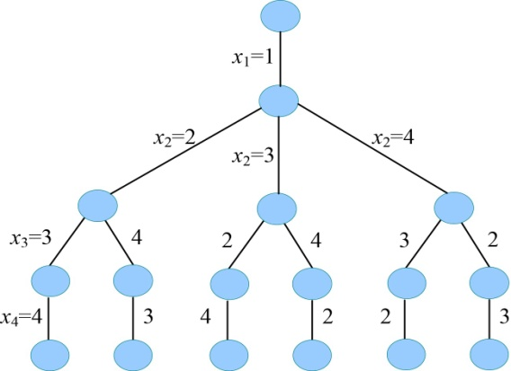

### 6.3.2　算法设计

（1）定义问题的解空间

奇妙之旅问题解的形式为n元组：{x1，x2，…，xi，…，xn}，分量xi表示第i个要去的旅游景点编号，景点的集合为S={1，2，…，n}。因为景点不可重复走，因此在确定xi时，前面走过的景点{x1，x2，…，xi−1}不可以再走，xi的取值为S−{x1，x2，…，xi−1}，i=1，2，…，n。

（2）解空间的组织结构

问题解空间是一棵排列树，树的深度为n=4，如图6-35所示。

<b class="my_markdown">图6-35　解空间树（排列树）</b>

（3）搜索解空间

+ 约束条件

用二维数组**g**[][]存储无向带权图的邻接矩阵，如果**g**[i][j]≠∞表示城市i和城市j有边相连，能走通。

+ 限界条件

cl<bestl，cl的初始值为0，bestl始值为+∞。

cl：当前已走过的城市所用的路径长度。

bestl：表示当前找到的最短路径的路径长度。

+ 搜索过程

如果采用普通队列（先进先出）式的分支限界法，那么除了最后一层外，所有的结点都会生成，这显然不是我们想要的，因此解决该问题，普通队列式的分支限界法是不可行的。那么可以使用优先队列式分支限界法，加速算法的搜索速度。

设置优先级：当前已走过的城市所用的路径长度cl。cl越小，优先级越高。

从根结点开始，以广度优先的方式进行搜索。根节点首先成为活结点，也是当前的扩展结点。一次性生成所有孩子结点，判断孩子结点是否满足约束条件和限界条件，如果满足，则将其加入队列中；反之，舍弃。然后再从队列中取出一个元素，作为当前扩展结点，搜索过程队列为空时为止。

