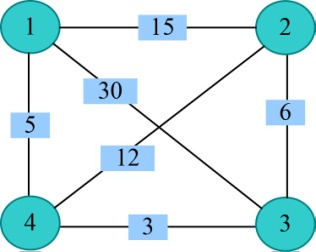
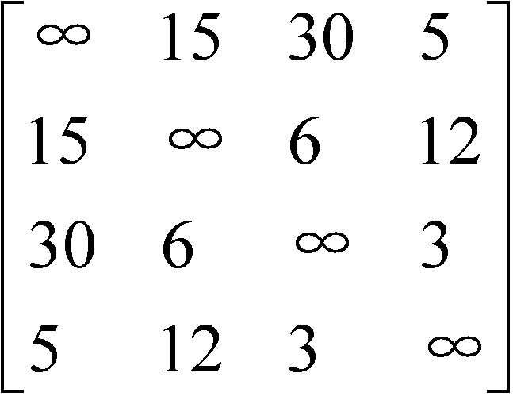
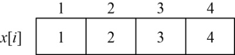
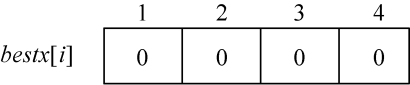
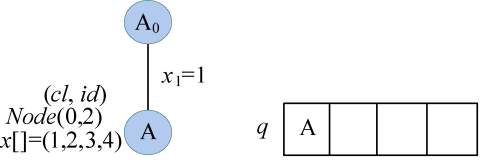
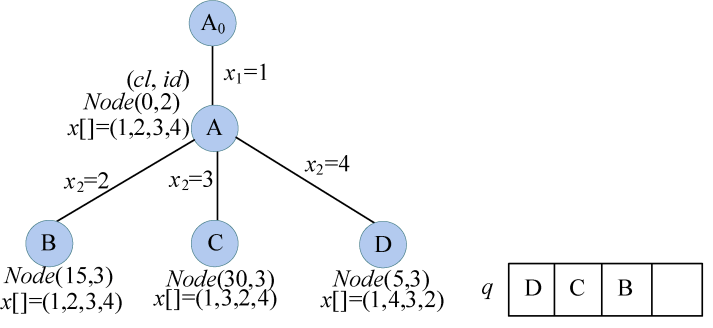
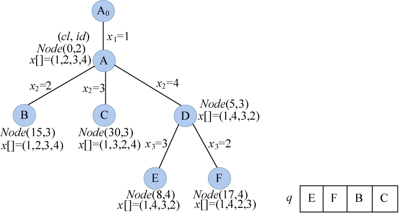
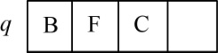
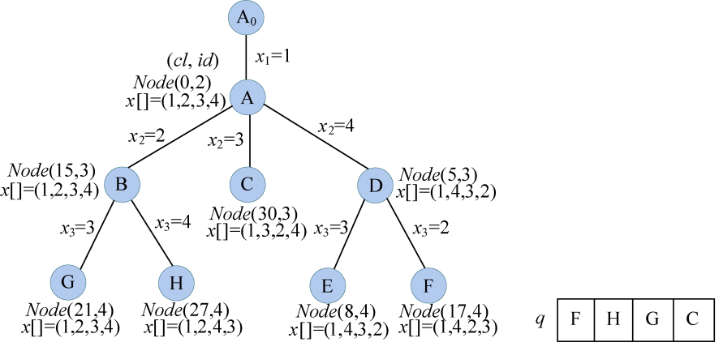
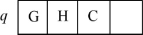

### 6.3.3　完美图解

例如，一个景点地图就转化成无向带权图后，如图6-36所示。

<b class="my_markdown">图6-36　无向带权图</b>

（1）数据结构

设置地图的带权邻接矩阵为**g**[][]，即如果从顶点i到顶点j有边，就让**g**[i][j]等于<i，j>的权值，否则**g**[i][j]=∞（无穷大），如图6-37所示。

<b class="my_markdown">图6-37　邻接矩阵</b>

（2）初始化

当前已走过的路径长度cl=0，当前最优值bestl=∞。初始化解向量x[i]和最优解bestx[i]，如图6-38和图6-39所示。

<b class="my_markdown">图6-38　解向量x[i]</b>

<b class="my_markdown">图6-39　最优解bestx[i]</b>

（3）创建A节点

A0作为初始结点，因为我们是从1号结点出发，因此x[1]=1，生成A结点。创建A结点Node（cl，id），cl=0，id=2；cl表示当前已走过的城市所用的路径长度，id表示层号；解向量x[]=（1，2，3，4），A加入优先队列q中，如图6-40所示。

<b class="my_markdown">图6-40　搜索过程及优先队列状态</b>

（4）扩展A结点

队头元素A出队，一次性生成A结点的所有孩子，用t记录A结点的id，t=2。

搜索A结点的所有分支，for(j=t; j<=n; j++)。对每一个j，判断x[t−1]结点和x[j]结点是否有边相连，且cl+**g**[x[t−1]][[x[j]]<bestl，即判定是否满足约束条件和限界条件。如果满足则生成新结点Node（cl，id），新结点的cl=cl+**g**[x[t−1]][[x[j]]，新结点的id=t+1，复制父结点A的解向量，并执行交换操作swap（x[t]，x[j]），刚生成的新结点加入优先队列；如果不满足，则舍弃。

+ j=2：因为x[1]结点和x[2]结点有边相连，且cl+**g**[1][2]=0+15=15<bestl=∞，满足约束条件和限界条件，生成B结点Node（15，3）。复制父结点A的解向量x[]=（1，2，3，4），并执行交换操作swap（x[t]，x[j]），即x[2]和x[2]交换，解向量x[]=（1，2，3，4）。B加入优先队列。
+ j=3：因为x[1]结点和x[3]结点有边相连，且cl+**g**[1][3]=0+30=30<bestl=∞，满足约束条件和限界条件，生成C结点Node（30，3）。复制父结点A的解向量x[]=（1，2，3，4），并执行交换操作swap（x[t]，x[j]），即x[2]和x[3]交换，解向量x[]=（1，3，2，4）。C加入优先队列。
+ j=4：因为x[1]结点和x[4]结点有边相连，且cl+**g**[1][4]=0+5=5<bestl=∞，满足约束条件和限界条件，生成D结点Node（8，3）。复制父结点A的解向量x[]=（1，2，3，4），并执行交换操作swap（x[t]，x[j]），即x[2]和x[4]交换，解向量x[]=（1，4，3，2）。D加入优先队列。

结果如图6-41所示。

<b class="my_markdown">图6-41　搜索过程及优先队列状态</b>

（5）队头元素D出队

一次性生成D结点的所有孩子，x[]=（1，4，3，2），用t记录D结点的id，t=3。搜索D结点的所有分支，for(j=t; j<=n; j++)。

+ j=3：因为x[2]结点和x[3]结点有边相连，且cl+**g**[4][3]=5+3=8<bestl=∞，满足约束条件和限界条件，生成E结点Node（8，4）。复制父结点D的解向量x[]=（1，4，3，2），并执行交换操作swap（x[t]，x[j]），即x[3]和x[3]交换，解向量x[]=（1，4，3，2）。E加入优先队列。
+ j=4：因为x[2]结点和x[4]结点有边相连，且cl+**g**[4][2]=5+12=17<bestl=∞，满足约束条件和限界条件，生成F结点Node（17，4）。复制父结点D的解向量x[]=（1，4，3，2），并执行交换操作swap（x[t]，x[j]），即x[3]和x[4]交换，解向量x[]=(1，4，3，2)。F加入优先队列。

结果如图6-42所示。

<b class="my_markdown">图6-42　搜索过程及优先队列状态</b>

（6）队头元素E出队

x[]=（1，4，3，2），用t记录E结点的id，t=4。

+ j=n，立即判断因为x[3]=3结点和x[4]=2结点有边相连，以及x[4]=2结点和x[1]=1结点有边相连，如果满足，则判断cl+**g**[3][2]+**g**[2][1]=8+6+15=29<bestl=∞，立即更新最优值bestl=29，更新最优解向量x[]=（1，4，3，2）。

当前优先队列元素，如图6-43所示。

<b class="my_markdown">图6-43　优先队列状态</b>

（7）队头元素B出队

一次性生成B结点的所有孩子，x[]=（1，2，3，4），用t记录B结点的id，t=3。搜索B结点的所有分支，for(j=t; j<=n; j++)。

+ j=3：因为x[2]结点和x[3]结点有边相连，且cl+**g**[2][3]=15+6=21<bestl=29，满足约束条件和限界条件，生成G结点Node（21，4）。复制父结点B的解向量x[]=（1，2，3，4），并执行交换操作swap（x[t]，x[j]），即x[3]和x[3]交换，解向量x[]=（1，2，3，4）。G加入优先队列。
+ j=4：因为x[2]结点和x[4]结点有边相连，且cl+**g**[2][4]=15+12=27<bestl=29，满足约束条件和限界条件，生成H结点Node（17, 4）。复制父结点B的解向量x[]=（1，2，3，4），并执行交换操作swap（x[t]，x[j]），即x[3]和x[4]交换，解向量x[]=（1，2，4，3）。H加入优先队列。

结果如图6-44所示。

<b class="my_markdown">图6-44　搜索过程及优先队列状态</b>

（8）队头元素F出队

x[]=（1，4，2，3），用t记录E结点的id，t=4。

+ j=n，立即判断因为x[3]=2结点和x[4]=3结点有边相连，以及x[4]=3结点和x[1]=1结点有边相连，如果满足，则判断cl+**g**[2][3]+**g**[3][1]=17+6+30>bestl=29，不更新。

当前优先队列元素，如图6-45所示。

<b class="my_markdown">图6-45　优先队列状态</b>

（9）队头元素G出队

x[]=（1，2，3，4），用t记录G结点的id，t=4。

+ j=n，立即判断因为x[3]=3结点和x[4]=4结点有边相连，以及x[4]=4结点和x[1]=1结点有边相连，如果满足，则判断cl+**g**[3][4]+**g**[4][1]=21+3+5=bestl=29，不更新。

（10）队头元素H出队

x[]=（1，2，4，3），用t记录H结点的id，t=4。

+ j=n，立即判断因为x[3]=4结点和x[4]=3结点有边相连，以及x[4]=3结点和x[1]=1结点有边相连，如果满足，则判断cl+**g**[4][3]+**g**[3][1]=27+3+30>bestl=29，不更新。

（11）队头元素C出队

C结点的cl=30>bestl=29，不再扩展。队列为空，算法结束。

