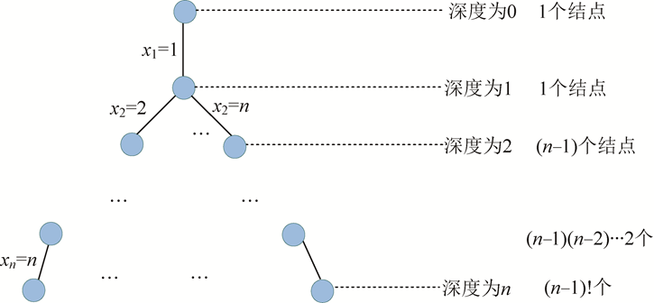

### 6.3.6　算法解析

（1）时间复杂度

最坏情况下，如图6-46所示。除了最后一层外，有1+n+n(n−1) +…+ (n−1)(n−2)…2n（n−1）!个结点需要判断约束函数和限界函数，判断两个函数需要O(1)的时间，因此耗时O(n!)，时间复杂度为O(n!)。

<b class="my_markdown">图6-46　解空间树（排列树）</b>

（2）空间复杂度

程序中我们设置了每个结点都要记录当前的解向量x[]数组，占用空间为O(n)，结点的个数最坏为O(n!)，所以该算法的空间复杂度为O(n*n!)。

