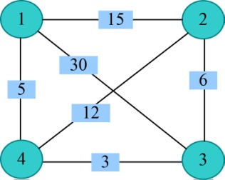
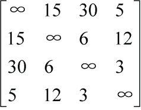
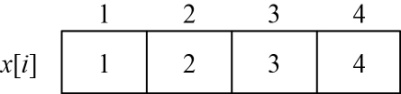
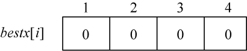
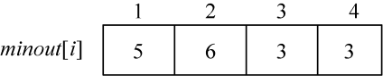
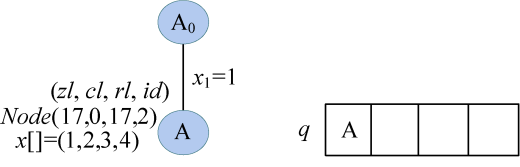
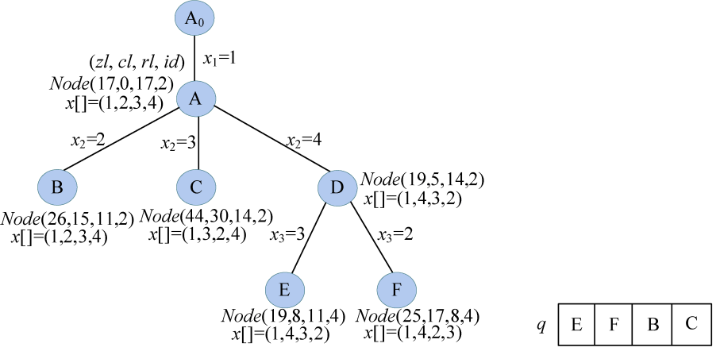
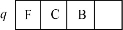
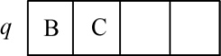

### 6.3.7　算法优化拓展

#### 1．算法设计

算法开始时创建一个用于表示活结点优先队列。每个结点的费用下界zl=cl+rl值作为优先级。cl表示已经走过的路径长度，rl表示剩余路径长度的下界，rl用剩余每个结点的最小出边之和来计算。初始时先计算图中每个顶点i的最小出边并用minout[i]数组记录，minsum记录所有结点的最小出边之和。如果所给的有向图中某个顶点没有出边，则该图不可能有回路，算法立即结束。

（1）约束条件

用二维数组**g**[][]存储无向带权图的邻接矩阵，如果**g**[i][j]≠∞表示城市i和城市j有边相连，能走通。

（2）限界条件

zl<bestl。

zl=cl+rl。

cl：当前已走过的城市所用的路径长度。

rl：当前剩余路径长度的下界。

bestl：当前找到的最短路径的路径长度。

（3）优先级

设置优先级：zl指已经走过的路径长度+剩余路径长度的下界。zl越小，优先级越高。

#### 2．完美图解

例如，一个景点地图就转化成无向带权图后，如图6-47所示。


<center class="my_markdown"><b class="my_markdown">图6-47　无向带权图</b></center>

（1）数据结构

设置地图的带权邻接矩阵为**g**[][]，即如果从顶点i到顶点j有边，就让**g**[i][j]=<i，j>的权值，否则**g**[i][j]=∞（无穷大）。如图6-48所示。


<center class="my_markdown"><b class="my_markdown">图6-48　邻接矩阵</b></center>

（2）初始化

当前已走过的路径长度cl=0，rl=minsum=17=cl+rl=minsum，当前最优值bestl=∞。初始化解向量x[i]、最优解bestx[i]和最小出边minout[i]，如图6-49～图6-51所示。


<center class="my_markdown"><b class="my_markdown">图6-49　解向量x[i]</b></center>


<center class="my_markdown"><b class="my_markdown">图6-50　最优解bestx[i]</b></center>


<center class="my_markdown"><b class="my_markdown">图6-51　最小出边minout[i]</b></center>

（3）创建A节点

A<sub class="my_markdown">0</sub>作为初始结点，因为我们是从1号结点出发，因此x[1]=1，生成A结点。创建A结点Node（zl，cl，rl，id），cl=0，rl=minsum=17，zl=cl+rl=17，id=2；cl表示当前已走过的城市的路径长度，rl表示剩余路径长度的下界，zl=cl+rl作为优先级，id表示层号；解向量x[]=（1，2，3，4），A加入优先队列q中，如图6-52所示。


<center class="my_markdown"><b class="my_markdown">图6-52　搜索过程及优先队列状态</b></center>

（4）扩展A结点

队头元素A出队，一次性生成A结点的所有孩子，A的解向量x[]=（1，2，3，4），用t记录A结点的id，t=2。

搜索A结点的所有分支，for(j=t; j<=n; j++)。对每一个j，判断x[t−1]结点和x[j]结点是否有边相连，且cl=cl+**g**[x[t−1]][[x[j]]，rl=rl−minout[x[j]]，zl=cl+rl，zl<bestl，即判定是否满足约束条件和限界条件，如果满足则生成新结点NodeNode（zl，cl，rl，id），新结点的id=t+1，复制父结点A的解向量，并执行交换操作swap（x[t]，x[j]），刚生成的新结点加入优先队列；如果不满足，则舍弃。

+ j=2：因为x[1]结点和x[2]结点有边相连，且cl+**g**[1][2]=0+15=15，rl=rl−minout[2]=11，zl=cl+rl=26，zl<bestl=∞，满足约束条件和限界条件，生成B结点Node（26，15，11，3）。复制父结点A的解向量x[]=（1，2，3，4），并执行交换操作swap（x[t]，x[j]），即x[2]和x[2]交换，解向量x[]=（1，2，3，4）。B加入优先队列。
+ j=3：因为x[1]结点和x[3]结点有边相连，且cl+**g**[1][3]=0+30=30，rl=rl−minout[3]=14，zl=cl+rl=44，zl<bestl=∞，满足约束条件和限界条件，生成C结点Node（44，30，14，3）。复制父结点A的解向量x[]=（1，2，3，4），并执行交换操作swap（x[t]，x[j]），即x[2]和x[3]交换，解向量x[]=（1，3，2，4）。C加入优先队列。
+ j=4：因为x[1]结点和x[4]结点有边相连，且cl+**g**[1][4]=0+5=5，rl=rl−minout[4]=14，zl=cl+rl=19，zl<bestl=∞，满足约束条件和限界条件，生成D结点Node（19，5，14，3）。复制父结点A的解向量x[]=（1，2，3，4），并执行交换操作swap（x[t]，x[j]），即x[2]和x[4]交换，解向量x[]=（1，4，3，2）。D加入优先队列。

结果如图6-53所示。


<center class="my_markdown"><b class="my_markdown">图6-53　搜索过程及优先队列状态</b></center>

（5）队头元素D出队

一次性生成D结点的所有孩子，D的解向量x[]=（1，4，3，2），用t记录D结点的id，t=3。搜索D结点的所有分支，for(j=t; j<=n; j++)。

+ j=3：因为x[2]=4结点和x[3]=3结点有边相连，且cl+**g**[4][3]=5+3=8，rl=rl−minout[3]= 11，zl=cl+rl=19，zl<bestl=∞，满足约束条件和限界条件，生成E结点Node（19，8，11，4）。复制父结点D的解向量x[]=（1，4，3，2），并执行交换操作swap（x[t]，x[j]），即x[3]和x[3]交换，解向量x[]=（1，4，3，2）。E加入优先队列。
+ j=4：因为x[2]=4结点和x[4]=2结点有边相连，且cl+**g**[4][2]=5+12=17，rl=rl−minout[2]= 8，zl=cl+rl=25，zl<bestl=∞，满足约束条件和限界条件，生成F结点Node（25，17，8，4）。复制父结点D的解向量x[]=（1，4，3，2），并执行交换操作swap（x[t]，x[j]），即x[3]和x[4]交换，解向量x[]=（1，4，2，3）。F加入优先队列。

结果如图6-54所示。


<center class="my_markdown"><b class="my_markdown">图6-54　搜索过程及优先队列状态</b></center>

（6）队头元素E出队

E的解向量x[]=（1，4，3，2），用t记录E结点的id，t=4。

+ j=n，立即判断x[3]=3结点和x[4]=2结点有边相连，以及x[4]=2结点和x[1]=1结点有边相连，如果满足，则判断cl+**g**[3][2]+**g**[2][1]=8+6+15=29<bestl=∞，立即更新最优值bestl=29，更新最优解向量x[]=（1，4，3，2）。

当前优先队列元素，如图6-55所示。


<center class="my_markdown"><b class="my_markdown">图6-55　优先队列状态</b></center>

（7）队头元素F出队

F的解向量x[]=（1，4，2，3），用t记录E结点的id，t=4。

+ j=n，立即判断x[3]=2结点和x[4]=3结点有边相连，以及x[4]=3结点和x[1]=1结点有边相连，如果满足，则判断cl+**g**[2][3]+**g**[3][1]=17+6+30=53>bestl=29，不更新最优解。

当前优先队列元素，如图6-56所示。


<center class="my_markdown"><b class="my_markdown">图6-56　优先队列状态</b></center>

（8）队头元素B出队

一次性生成B结点的所有孩子，B的解向量x[]=（1，2，3，4），用t记录B结点的id，t=3。搜索B结点的所有分支，for(j=t; j<=n; j++)。

+ j=3：因为x[2]结点和x[3]结点有边相连，且cl+**g**[2][3]=15+6=21，rl=rl−minout[3]=8，zl=cl+rl=29，zl=bestl=29，不满足限界条件，舍弃。
+ j=4：因为x[2]结点和x[4]结点有边相连，且cl+**g**[2][4]=15+12=27，rl=rl−minout[4]=8，zl=cl+rl=35，zl>bestl=29，不满足限界条件，舍弃。

（9）队头元素C出队

C结点的cl=30>bestl=29，不再扩展。队列为空，算法结束。

#### 3．伪码详解

（1）定义结点结构体

```c
struct Node                   //定义结点,记录当前结点的解信息
{
     double cl;               //当前已走过的路径长度
     double rl;               //剩余路径长度的下界
     double zl;               //当前路径长度的下界zl=rl+cl
     int id;                  //景点序号
     int x[N];                //记录当前解向量
};
```

（2）定义队列优先级

```c
//定义队列的优先级。 以zl为优先级，zl值越小，越优先
bool operator <(const Node &a, const Node &b)
{
     return a.zl>b.zl;
}
```

（3）计算下界

```c
bool Bound()                  //计算下界（即每个景点最小出边权值之和）
{
     for(int i=1;i<=n;i++)
     {
         double minl=INF;     //初时化景点点出边最小值
         for(int j=1;j<=n;j++)//找每个景点的最小出边
           if(g[i][j]!=INF&&g[i][j]<minl)
                minl=g[i][j];
         if(minl==INF)
             return false;    //表示无回路
         minout[i]=minl;      //记录每个景点的最少出边
         cout<<"第"<<i<<"个景点的最少出边:"<<minout[i]<<" "<<endl;
         minsum+=minl;        //记录所有景点的最少出边之和
     }
     cout<<"每个景点的最少出边之和:""minsum= "<<minsum<<endl;
     return true;
}
```

#### 4．实战演练

```c
//program 6-2-1
#include <iostream>
#include <algorithm>
#include <cstring>
#include <cmath>
#include <queue>
using namespace std;
const int INF=1e7;            //设置无穷大的值为107
const int N=100;
double g[N][N];               //景点地图邻接矩阵
double minout[N];             //记录每个景点的最少出边
double minsum;                //记录所有景点的最少出边之和
int bestx[N];                 //记录当前最优路径
double bestl;                 //当前最优路径长度
int n,m;                      //景点个数n,边数m
struct Node                   //定义结点,记录当前结点的解信息
{
     double cl;               //当前已走过的路径长度
     double rl;               //剩余路径长度的下界
     double zl;               //当前路径长度的下界zl=rl+cl
     int id;                  //景点序号
     int x[N];                //记录当前解向量
     Node() {}
     Node(double _cl,double _rl,double _zl,int _id)
     {
          cl = _cl;
          rl = _rl;
          zl = _zl;
          id = _id;
     }
};
//定义队列的优先级。 以zl为优先级，zl值越小，越优先
bool operator <(const Node &a, const Node &b)
{
     return a.zl>b.zl;
}
bool Bound()                  //计算下界（即每个景点最小出边权值之和）
{
     for(int i=1;i<=n;i++)
     {
         double minl=INF;     //初时化景点的出边最小值
         for(int j=1;j<=n;j++)//找每个景点的最小出边
           if(g[i][j]!=INF&&g[i][j]<minl)
               minl=g[i][j];
         if(minl==INF)
             return false;    //表示无回路
         minout[i]=minl;      //记录每个景点的最少出边
         minsum+=minl;        //记录所有景点的最少出边之和
     }
     return true;
}
//Travelingbfsopt 为优化的优先队列式分支限界法
double Travelingbfsopt()
{
     if(!Bound())
          return -1;          //表示无回路
     Node livenode,newnode;   //定义当前扩展结点livenode,生成新结点newnode
     priority_queue<Node> q;         //创建一个优先队列,优先级为当前路径长度的下界zl=rl+cl,zl值越小，越优先
     newnode=Node(0,minsum,minsum,2);//创建根节点
     for(int i=1;i<=n;i++)
     {
         newnode.x[i]=i;             //初时化根结点的解向量
     }
     q.push(newnode);                //根结点加入优先队列
     while(!q.empty())
     {
          livenode=q.top();         //取出队头元素作为当前扩展结点livenode
          q.pop();                  //队头元素出队
          int t=livenode.id;        //当前处理的景点序号
          // 搜到倒数第2个结点时个景点的时候不需要往下搜索
          if(t==n)                  //立即判断是否更新最优解，
         //例如当前找到一个路径(1243)，到达4号结点时，立即判断g[4][3]和g[3][1]是否有边相连，如果有边则判断当前路径长度cl+g[4][3]+g[3][1]<bestl，满足则更新最优值和最优解
          {
              //说明找到了一条更好的路径，记录相关信息
              if(g[livenode.x[n-1]][livenode.x[n]]!=INF&&g[livenode.x[n]][1]!=INF)
                if(livenode.cl+g[livenode.x[n-1]][livenode.x[n]]+g[livenode.x[n]][1]<bestl)
                {
                    bestl=livenode.cl+g[livenode.x[n-1]][livenode.x[n]]+g[livenode.x[n]][1];
                    //记录当前最优的解向量:";
                    for(int i=1;i<=n;i++)
                    {
                      bestx[i]=livenode.x[i];
                     }
                 }
               continue;
          }
          //判断当前结点是否满足限界条件，如果不满足不再扩展
         if(livenode.cl>=bestl)
             continue;
          //扩展
          //没有到达叶子结点
          for(int j=t; j<=n; j++)//搜索扩展结点的所有分支
          {
               if(g[livenode.x[t-1]][livenode.x[j]]!=INF)//如果x[t-1]景点与x[j]景点有边相连
               {
                    double cl=livenode.cl+g[livenode.x[t-1]][livenode.x[j]];
                    double rl=livenode.rl-minout[livenode.x[j]];
                    double zl=cl+rl;
                    if(zl<bestl)//有可能得到更短的路线
                    {
                         newnode=Node(cl,rl,zl,t+1);
                         for(int i=1;i<=n;i++)
                         {
                           newnode.x[i]=livenode.x[i];//复制以前的解向量
                         }
                         swap(newnode.x[t], newnode.x[j]);//交换两个元素的值
                         q.push(newnode);//新结点入队
                    }
               }
          }
     }
     return bestl;//返回最优值
}
void init()//初始化
{
     bestl=INF;
     minsum=0;
     for(int i=0; i<=n; i++)
     {
          bestx[i]=0;
     }
     for(int i=1;i<=n;i++)
         for(int j=i;j<=n;j++)
             g[i][j]=g[j][i]=INF;//表示路径不可达
}
void print()//打印路径
{
     cout<<endl;
     cout<<"最短路径：";
     for(int i=1;i<=n; i++)
          cout<<bestx[i]<<"--->";
     cout<<"1"<<endl;
     cout<<"最短路径长度："<<bestl;
}
int main()
{
     int u, v, w;//u,v代表城市，w代表u和v城市之间路的长度
     cout << "请输入景点数n（结点数）：";
     cin >> n;
     init();
     cout << "请输入景点之间的连线数（边数）：";
     cin >> m;
     cout << "请依次输入两个景点u和v之间的距离w，格式：景点u 景点v 距离w："<<endl;
     for(int i=1;i<=m;i++)
     {
          cin>>u>>v>>w;
          g[u][v]=g[v][u]=w;
     }
     Travelingbfsopt();
     print();
     return 0;
}
```

**算法实现和测试**

（1）运行环境

Code::Blocks

（2）输入

```c
请输入景点数n（结点数）：4
请输入景点之间的连线数（边数）：6
请依次输入两个景点u和v之间的距离w，格式：景点u 景点v 距离w：
1 2 15
1 3 30
1 4 5
2 3 6
2 4 12
3 4 3
```

（3）输出

```c
最短路径：1--->4--->3--->2--->1
最短路径长度：29
```

#### 5．算法复杂度分析

（1）时间复杂度：此算法的时间复杂度最坏为O(nn!)。

（2）空间复杂度：程序中我们设置了每个结点都要记录当前的解向量x[]数组，占用空间为O(n)，结点的个数最坏为O(nn!)，所以该算法的空间复杂度为O(n<sup class="my_markdown">2</sup>*(n+1)!)。

虽然在算法复杂度数量级上，cl优先队列的分支限界法算法和zl优先队列的算法相同，但从图解我们可以看出，zl优先队列式的分支限界法算法生成的结点数更少，找到最优解的速度更快。

