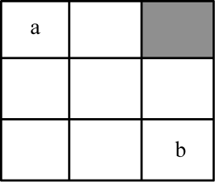
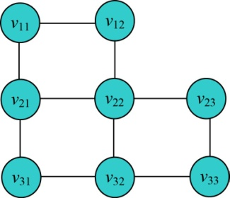

### 6.4.1　问题分析

如图6-58所示，3×3的方格阵列，其中灰色方格表示封锁，不能通过。将每个方格抽象为一个结点，方格和相邻4个方向（上、下、左、右）中能通过的方格用一条边连起来，不能通过的方格不连线。这样，可以把 **问题的解空间定义为一个图** ，如图6-59所示。

<b class="my_markdown">图6-58　3×3的方格阵列</b>

<b class="my_markdown">图6-59　解空间图</b>

该问题是特殊的最短路径问题，特殊之处在于用布线走过的方格数代表布线的长度，布线时每布一个方格，布线长度累加1。我们可以从图中看出，从a到b有多种布线方案，最短的布线长度即从a到b的最短路径长度为4。

既然只能朝上、下、左、右4个方向进行布线，也就是说如果从树型搜索的角度来看，我们把它看作m叉树，又如何？那么问题的解空间就变成了一棵m叉树，m=4。

