### 6.4.3　完美图解

在实现该问题时，需要存储方格阵列、封锁标记、起点、终点位置4个方向的相对位置、边界。用二维数组**grid**表示给定的方格，−1表示未布线，−2表示封锁围墙（或者障碍物），大于0表示已布线。

如图6-61所示，以此图为例。

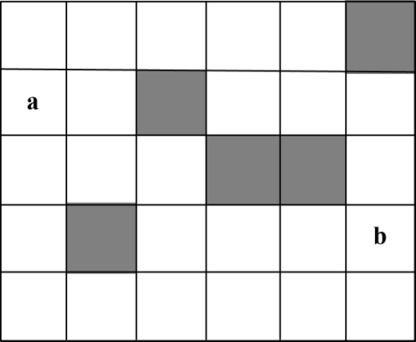

<b class="my_markdown">图6-61　最优工程布线</b>

（1）数据结构及初始化

设置方格阵列为二维数组**grid**[][]，我们对其四周封锁，并将封锁和障碍物标记为−2，未布线标记为−1。对应的数值如图6-62所示。

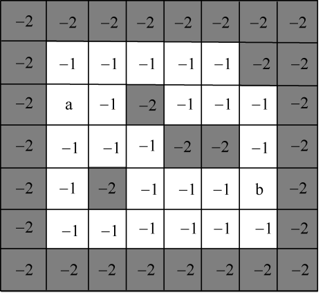

<b class="my_markdown">图6-62　最优工程布线封锁围墙</b>

（2）创建并扩展A结点

初始结点a所在的位置，即当前位置here=（2，1），标记初始结点的**grid**（2，1）=0。我们从当前结点出发，按照顺行进行扩展，左侧是封锁状态不可行，右、下、上3个方向可行，因此生成B、C、D这3个结点，并加入先进先出队列q，如图6-63所示，对应的数值如图6-64所示。

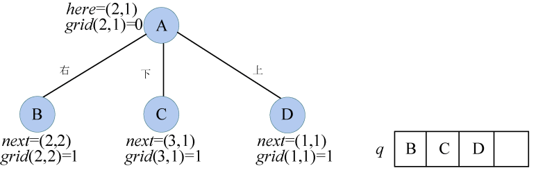

<b class="my_markdown">图6-63　搜索过程及队列状态</b>

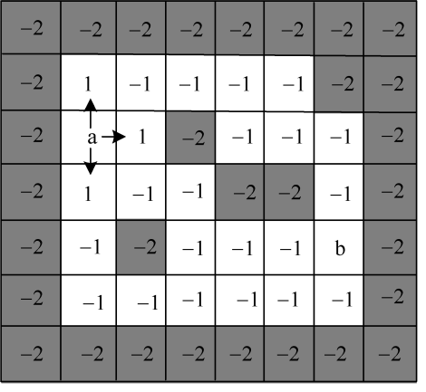

<b class="my_markdown">图6-64　最优工程布线方案</b>

（3）扩展B结点

B结点出队，B所在的位置，即当前位置here=（2，2），**grid**（2，2）=1。我们从当前结点出发，按照右、下、左、上的顺序进行扩展，右侧是障碍物不可行，左侧是初始状态不可行，下面和上面可行，因此生成E、F两个结点，并加入先进先出队列q，如图6-65所示，对应的数值如图6-66所示。

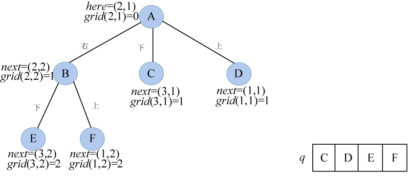

<b class="my_markdown">图6-65　搜索过程及队列状态</b>

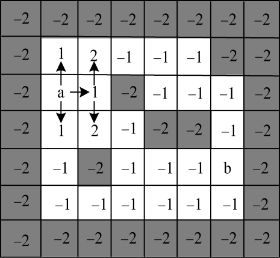

<b class="my_markdown">图6-66　最优工程布线方案</b>

（4）扩展C结点

C结点出队，C所在的位置，即当前位置here=（3，1），**grid**（3，1）=1。我们从当前结点出发，按照右、下、左、上的顺序进行扩展，右侧已布线，左侧是封锁，上面是初始状态不可行，只有下面可行，因此生成G结点，并加入先进先出队列q，如图6-67所示。对应的数值如图6-68所示。

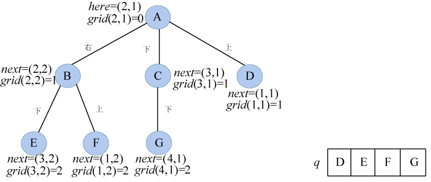

<b class="my_markdown">图6-67　搜索过程及队列状态</b>

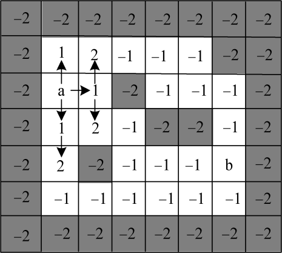

<b class="my_markdown">图6-68　最优工程布线方案</b>

（5）扩展D结点

D结点出队，D所在的位置，即当前位置here=（1，1），**grid**（1，1）=1。我们从当前结点出发，按照右、下、左、上的顺序进行扩展，右侧已布线，上面是初始状态，左侧上面是封锁，4个方向都不可行，因此不生成结点。

（6）扩展E结点

E结点出队，E所在的位置，即当前位置here=（3，2），**grid**（3，2）=2。我们从当前结点出发，按照右、下、左、上的顺序进行扩展，左侧上面已布线，下面是封锁，不可行，只有右侧可行，因此生成H结点，并加入先进先出队列q，如图6-69所示，对应的数值如图6-70所示。

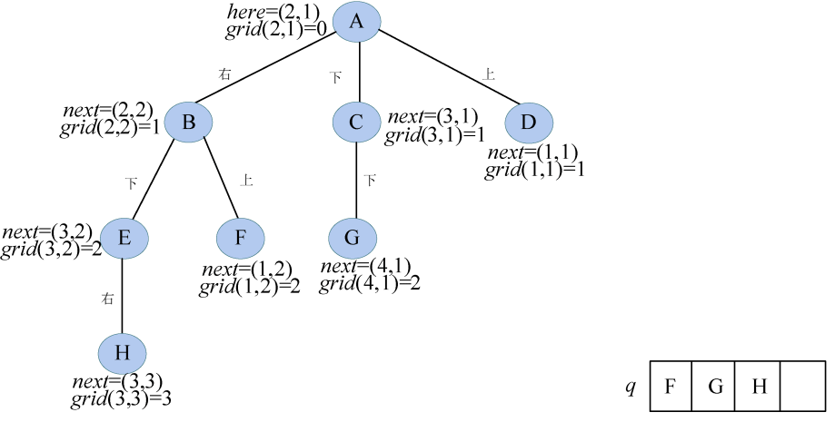

<b class="my_markdown">图6-69　搜索过程及队列状态</b>

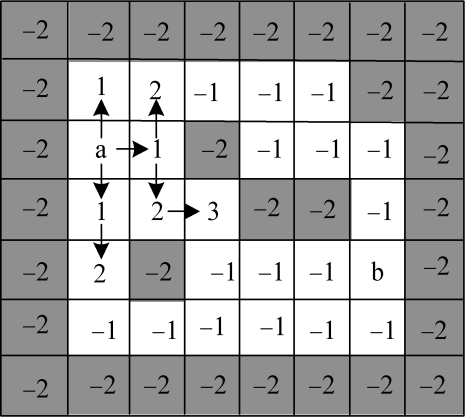

<b class="my_markdown">图6-70　最优工程布线方案</b>

（7）扩展F结点

F结点出队，F所在的位置，即当前位置here=（1，2），**grid**（1，2）=2。我们从当前结点出发，按照右、下、左、上的顺序进行扩展，左侧下面已布线，上面是封锁，不可行，只有右侧可行，因此生成I结点，并加入先进先出队列q，如图6-71所示，对应的数值如图6-72所示。

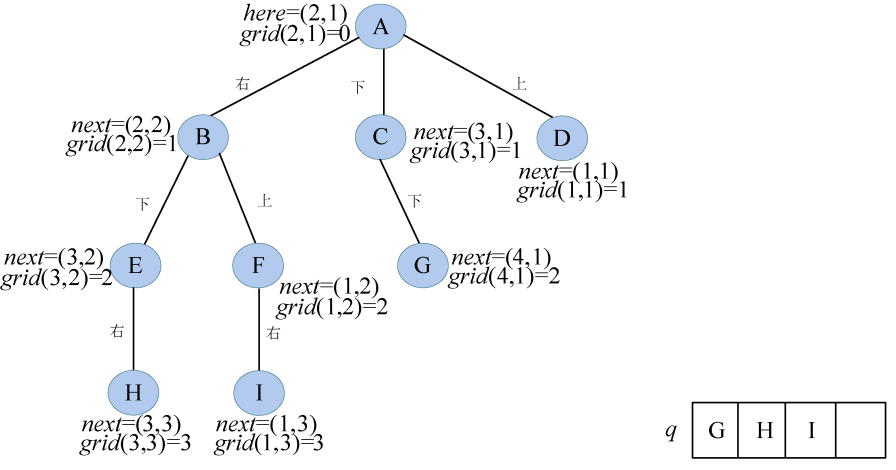

<b class="my_markdown">图6-71　搜索过程及队列状态</b>

<b class="my_markdown">图6-72　最优工程布线方案</b>

（8）扩展G结点

G结点出队，G所在的位置，即当前位置here=（4，1），**grid**（4，1）=2。我们从当前结点出发，按照右、下、左、上的顺序进行扩展，右侧是障碍物，左侧是封锁，上面已布线，不可行，只有下面可行，因此生成J结点，并加入先进先出队列q，如图6-73所示，对应的数值如图6-74所示。

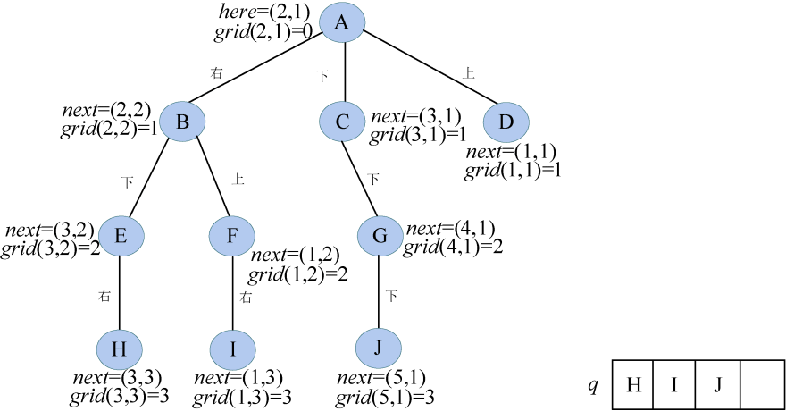

<b class="my_markdown">图6-73　搜索过程及队列状态</b>

<b class="my_markdown">图6-74　最优工程布线方案</b>

（9）扩展H结点

H结点出队，H所在的位置，即当前位置here=（3，3），**grid**（3，3）=3。我们从当前结点出发，按照右、下、左、上的顺序进行扩展，右侧上面是障碍物，左侧已布线，不可行，只有下面可行，因此生成K结点，并加入先进先出队列q，如图6-75所示，对应的数值如图6-76所示。

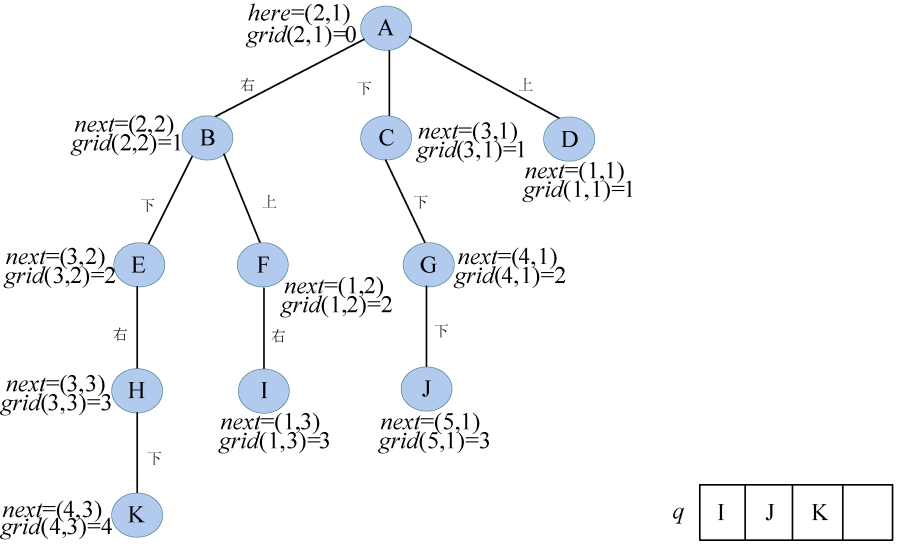

<b class="my_markdown">图6-75　搜索过程及队列状态</b>

<b class="my_markdown">图6-76　最优工程布线方案</b>

（10）扩展I结点

I结点出队，I所在的位置，即当前位置here=（1，3），**grid**（1，3）=3。我们从当前结点出发，按照右、下、左、上的顺序进行扩展，上面封锁，下面是障碍物，左侧已布线，不可行，只有右侧可行，因此生成L结点，并加入先进先出队列q，如图6-77所示，对应的数值如图6-78所示。

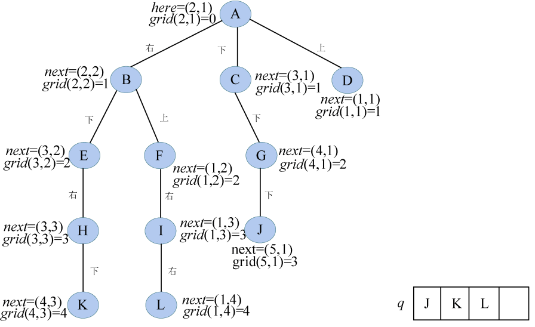

<b class="my_markdown">图6-77　搜索过程及队列状态</b>

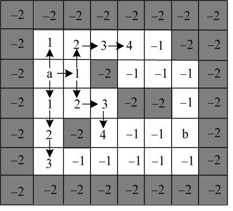

<b class="my_markdown">图6-78　最优工程布线方案</b>

（11）扩展J结点

J结点出队，J所在的位置，即当前位置here=（5，1），**grid**（5，1）=3。我们从当前结点出发，按照右、下、左、上的顺序进行扩展，上面已布线，左侧下面封锁，不可行，只有右侧可行，因此生成M结点，并加入先进先出队列q，如图6-79所示，对应的数值如图6-80所示。

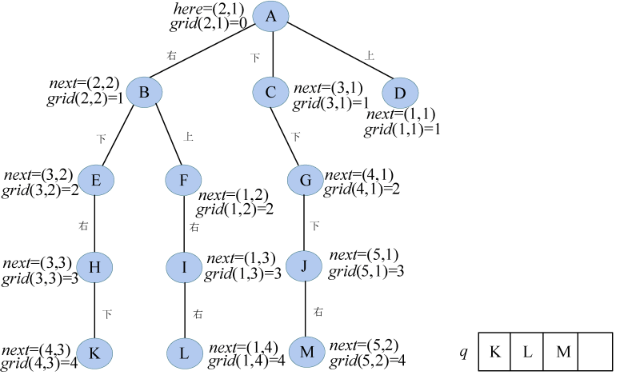

<b class="my_markdown">图6-79　搜索过程及队列状态</b>

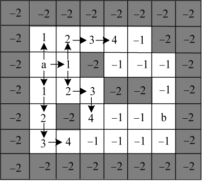

<b class="my_markdown">图6-80　最优工程布线方案</b>

（12）扩展K结点

K结点出队，K所在的位置，即当前位置here=（4，3），**grid**（4，3）=4。我们从当前结点出发，按照右、下、左、上的顺序进行扩展，上面已布线，左侧是障碍物，不可行，只有右侧和下面可行，因此生成N、O两个结点，并加入先进先出队列q，如图6-81所示，对应的数值如图6-82所示。

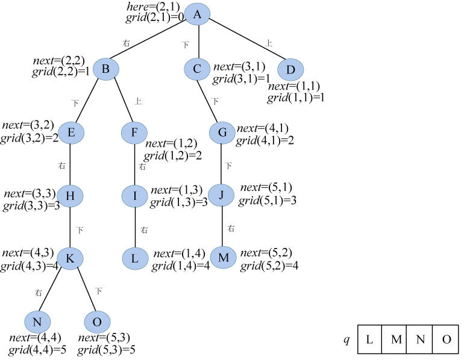

<b class="my_markdown">图6-81　搜索过程及队列状态</b>

<b class="my_markdown">图6-82　最优工程布线方案</b>

（13）扩展L结点

L结点出队，L所在的位置，即当前位置here=（1，4），**grid**（1，4）=4。我们从当前结点出发，按照右、下、左、上的顺序进行扩展，左侧已布线，上面是封锁，不可行，只有右侧和下面可行，因此生成P、Q两个结点，并加入先进先出队列q，如图6-83所示，对应的数值如图6-84所示。

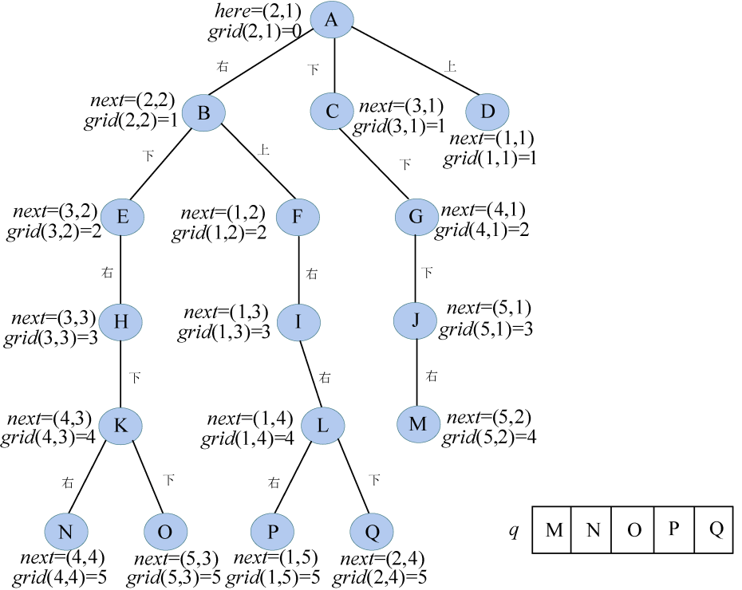

<b class="my_markdown">图6-83　搜索过程及队列状态</b>

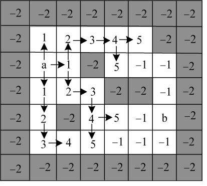

<b class="my_markdown">图6-84　最优工程布线方案</b>

（14）扩展M结点

M结点出队，M所在的位置，即当前位置here=（5，2），**grid**（5，2）=4。我们从当前结点出发，按照右、下、左、上的顺序进行扩展，左右侧已布线，上面障碍物，下面是封锁，4个方向都不可行，因此不生成结点。

（15）扩展N结点

N结点出队，N所在的位置，即当前位置here=（4，4），**grid**（4，4）=5。我们从当前结点出发，按照右、下、左、上的顺序进行扩展，左侧已布线，上面是障碍物，不可行，只有右侧和下面可行，因此生成R、S两个结点，并加入先进先出队列q，如图6-85所示，对应的数值如图6-86所示。

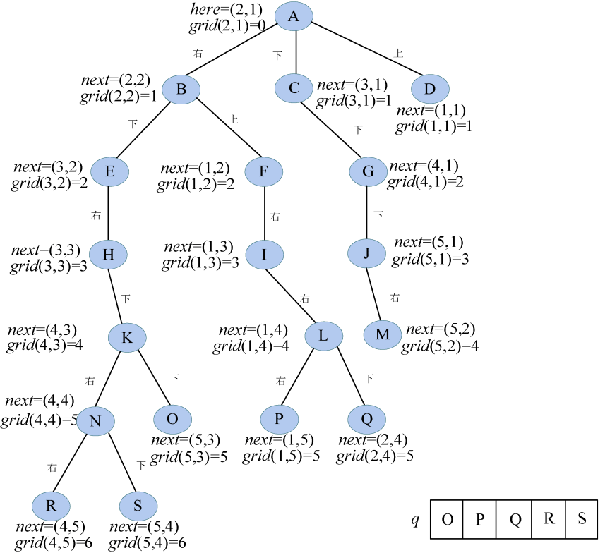

<b class="my_markdown">图6-85　搜索过程及队列状态</b>

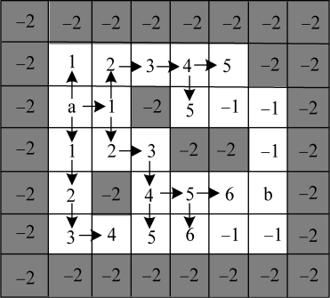

<b class="my_markdown">图6-86　最优工程布线方案</b>

（16）扩展O结点

O结点出队，O所在的位置，即当前位置here=（5，3），**grid**（5，3）=5。我们从当前结点出发，按照右、下、左、上的顺序进行扩展，左右侧及上面已布线，下面是封锁，4个方向都不可行，因此不生成结点。

（17）扩展P结点

P结点出队，P所在的位置，即当前位置here=（1，5），**grid**（1，5）=5。我们从当前结点出发，按照右、下、左、上的顺序进行扩展，右侧障碍物，左侧已布线，上面是封锁，不可行，只有下面可行，因此生成T结点，并加入先进先出队列q，如图6-87所示，对应的数值如图6-88所示。

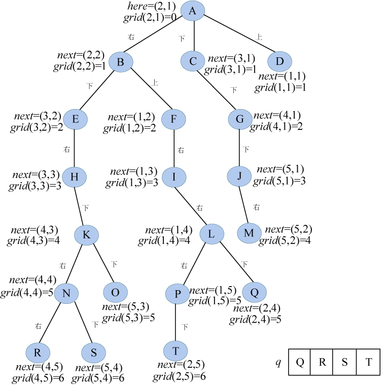

<b class="my_markdown">图6-87　搜索过程及队列状态</b>

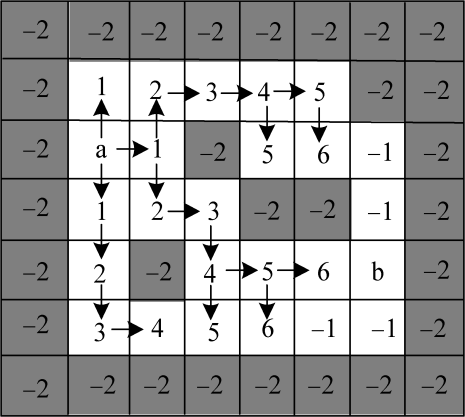

<b class="my_markdown">图6-88　最优工程布线方案</b>

（18）扩展Q结点

Q结点出队，Q所在的位置，即当前位置here=（2，4），**grid**（2，4）=5。我们从当前结点出发，按照右、下、左、上的顺序进行扩展，右侧上面已布线，左侧下面障碍物，4个方向都不可行，因此不生成结点。

（19）扩展R结点

R结点出队，R所在的位置，即当前位置here=（4，5），**grid**（4，5）=6。我们从当前结点出发，按照右、下、左、上的顺序进行扩展，右侧位置 next=（4，6），**grid**（4，6）=7，此位置正好是终点b的位置，算法结束，最优布线长度为7。如图6-89所示，逆向求路径即可。

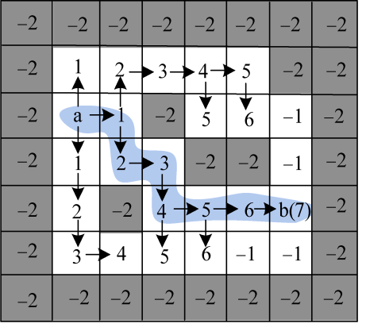

<b class="my_markdown">图6-89　最优工程布线方案</b>

