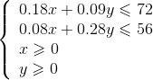
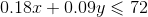
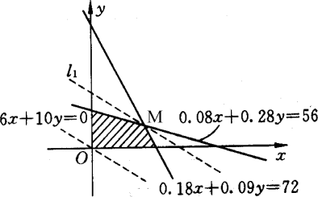
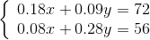
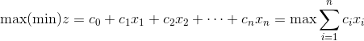
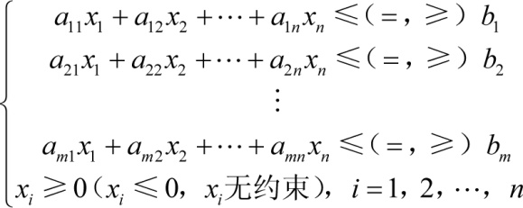

### 7.1　线性规划问题

线性规划（Linear programming，LP）是运筹学中研究较早、发展较快、应用广泛、方法较成熟的一个重要分支，它是辅助人们进行科学管理的一种数学方法，是研究线性约束条件下线性目标函数的极值问题的数学理论和方法。线性规划广泛应用于军事作战、经济分析、经营管理和工程技术等方面。为合理地利用有限的人力、物力、财力等资源做出最优决策，提供了科学的依据。在企业的各项管理活动中，例如计划、生产、运输、技术等问题，线性规划是指从各种限制条件的组合中，选择出最为合理的计算方法，建立线性规划模型，从而求得最佳结果。

遇到一个线性规划问题，该如何解决呢？

（1） **确定决策变量。** 即哪些变量对决策目标有影响。

（2） **确定目标函数。** 把目标表示为含有决策变量的线性函数，通常目标函数是求最大值或最小值。

（3） **找出约束条件。** 将对决策变量的约束表示为线性方程或不等式（，=，）。

（4） **求最优解。** 求解的方法有很多，例如图解法、单纯形法。

例如，某木器厂生产圆桌和衣柜两种产品，现有两种木料，第一种有72m3，第二种有56m3。假设生产每种产品都需要用两种木料，生产一张圆桌和一个衣柜分别所需木料如表7-1所示。每生产一张圆桌可获利6元，生产一个衣柜可获利10元。木器厂在现有木料条件下，圆桌和衣柜各生产多少，才使获得利润最多?

<b class="my_markdown">表7-1　产品需要的木料</b>

| 产品 | 木料（单位：m3） |
| :-----  | :-----  | :-----  | :-----  |
| 第一种 | 第二种 |
| 圆桌 | 0.18 | 0.08 |
| 衣柜 | 0.09 | 0.28 |

解：设生产圆桌x张，生产衣柜y个，利润总额为z元。

（1）确定决策变量：x、y分别为生产圆桌、衣柜的数量。

（2）明确目标函数：获利最大，即求6x+10y最大值。

（3）找出约束条件：

如果采用画图求解法：首先画出x、y坐标，再画出两条直线和，这两条直线和、构成了可行解区间，如图7-1阴影部分所示。然后画出目标函数6x+10y=0，使其从原点开始平移，直到 **直线与阴影区域恰好不再有交点为止，** 此时目标函数达到最大值，如图7-1所示。

<b class="my_markdown">图7-1　图解法平移线</b>

这个交点正好是两条直线和的交叉点M，解方程组：

得M点坐标（350，100）。因此应生产圆桌350张，生产衣柜100个，能使利润总额达到最大。

一般线性规划问题可表示为如下形式。

目标函数：

约束条件：

+ 变量满足约束条件的一组值（x1，x，…，xn）称为线性规划问题的一个 **可行解** 。
+ 所有可行解构成的集合称为线性规划问题的 **可行区域** 。
+ 使目标函数取得极值的可行解称为 **最优解** 。
+ 在最优解处目标函数的值称为 **最优值** 。

线性规划问题解的情况：

+ 有唯一最优解。
+ 有无数多个最优解。
+ 没有最优解（问题根本无解或者目标函数没有极值，即无界解）。

