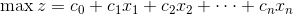
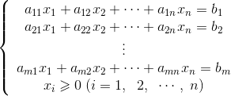
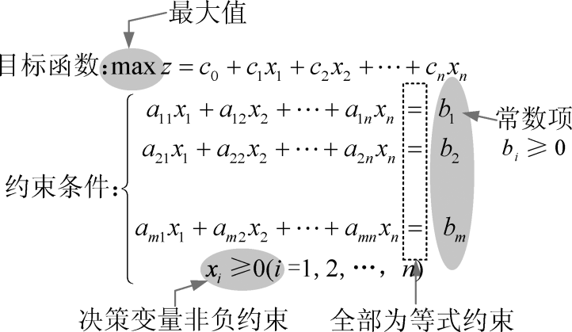
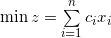
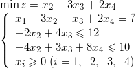
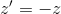
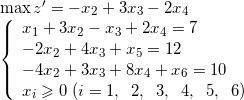

### 7.1.1　线性规划标准型

图解法只能解决简单的线性规划问题，因为二维图形很容易画出来，三维就需要一定空间想象能力了，四维以上就很难用图形表达，因此图解法只能解决一些简单的低维问题，复杂的线性规划问题还需要更好的办法来解决。

首先我们要把一般的线性规划问题转化为如下 **线性规划标准型。**

目标函数：

约束条件：

**标准型4要求：**

**线性规划标准型转化方法：**

（1）一般线性规划形式中目标函数如果求最小值，即那么，令，则，。求解，得到最优解后，加负号即可。

（2）右端常数项小于零时，则不等式两边同乘以−1，将其变成大于零；同时改变不等号的方向，保证恒等变形。例如2x1+x2−5，−2x1−x25。

（3）约束条件为大于等于约束时，则在不等式左边减去一个新的非负变量将不等式约束改为等式约束。例如2x1−3x210，2x1−3x2−x3＝10，x30；

（4）约束条件为小于等于约束时，则在左边加上一个新的非负变量将不等式约束改为等式约束。例如3x1−5x29，3x1−5x2＋x3＝9，x30；

（5）无约束的决策变量x，即可正可负的变量，则引入两个新的非负变量x'和x"，令x=x'−x"，其中x'0，x"0，将x代入线性规划模型。例如2x1−3x2+x310，x3无约束，令x3 = x4−x5，x40，x50，代入方程，2x1−3x2+x4−x510，x40，x50。

（6）决策变量x小于等于0时，令x'＝−x，显然x'0，将x'代入线性规划模型。例如2x1−3x25，x20，令x3=−x2，将x2=−x3代入线性方程，2x1+3x35，x30。

**注意：** 引入的新的非负变量称为 **松弛变量** 。

以一般的线性规划问题为例：

将其转化为线性规划标准型：。

