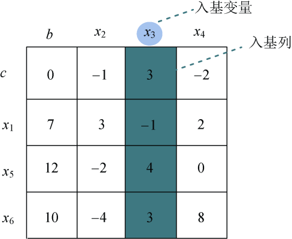
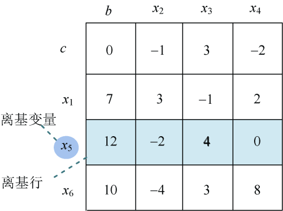
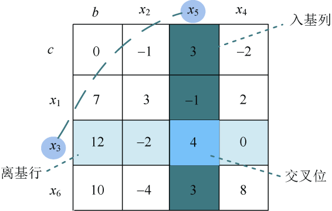
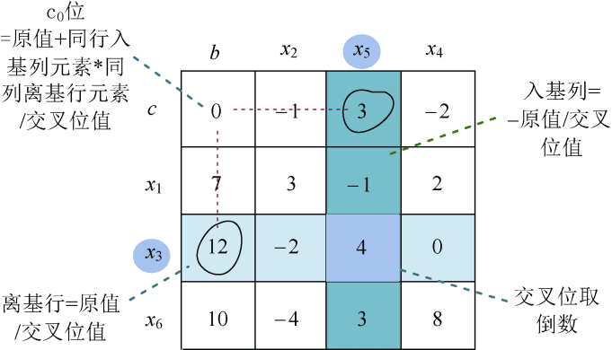
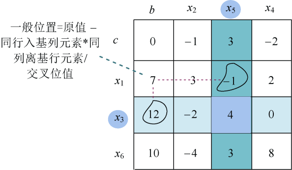
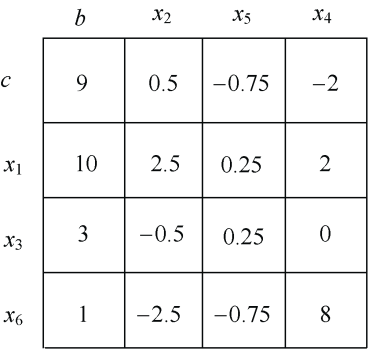
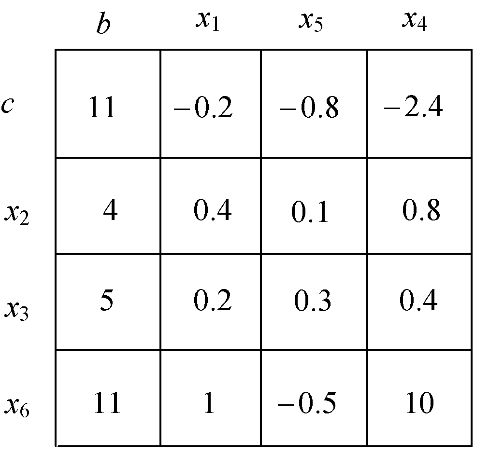
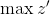

### 7.1.2　单纯形算法图解

单纯形法是1947年数学家乔治•丹捷格（George Dantzing）发明的一种求解线性规划模型的一般性方法。

为了便于讨论，先考查一类特殊的标准形式的线性规划问题。在这类问题中，每个等式约束条件中均至少含有一个正系数的变量，且这个变量只出现在一个约束条件中。将每个约束条件中这样的变量作为非0变量来求解该约束方程，这类特殊的标准形式线性规划问题称为约束标准型线性规划问题。

首先介绍一些基本概念。

+ **基本变量：** 每个约束条件中的系数为正且只出现在一个约束条件中的变量。
+ **非基本变量：** 除基本变量外的变量全部为非基本变量。
+ **基本可行解：** 满足标准形式约束条件的可行解称为基本可行解。由此可知，如果令n−m个非基本变量等于0，那么根据约束条件求出m个基本变量的值，它们组成的一组可行解为一个基本可行解。
+ **检验数：** 目标函数中非基本变量的系数。

线性规划基本定理如下。

+ **定理1：** 最优解判别定理

若目标函数中关于非基本变量的所有系数（检验数cj）小于等于0，则当前基本可行解就是最优解。

+ **定理2：** 无穷多最优解判别定理

若目标函数中关于非基本变量的所有检验数小于等于0，同时存在某个非基本变量的检验数等于0，则线性规划问题有无穷多个最优解。

+ **定理3：** 无界解定理

如果某个检验数cj大于0，而cj所对应的列向量的各分量a1<em>j</em>，a2<em>j</em>，…，amj都小于等于0，则该线性规划问题有无界解。

约束标准型线性规划问题单纯形算法步骤如下。

（1）建立初始单纯形表

找出基本变量和非基本变量， **将目标函数由非基本变量表示** ，建立初始单纯形表。

**注意：** 如果目标函数含有基本变量，要通过约束条件方程转换为非基本变量。

例如：

基本变量（系数为正且只出现在一个约束条件中的变量）为x1、x5、x6。

**注意：** 基本变量的系数要转化为1，否则不能按下面计算方法，其余的x2、x3、x4都是非基本变量。基本变量做行，非基本变量做列，检验数放第一行，常数项放第一列，约束条件中非基本变量的系数作为值，构造初始单纯形表，如图7-2所示。

<b class="my_markdown">图7-2　初始单纯形表</b>

（2）判断是否得到最优解

判别并检查目标函数的所有系数，即检验数cj（j=1，2，…，n）。

+ 如果所有的cj0，则已获得最优解，算法结束。
+ 若在检验数cj中，有些为正数，但其中某一正的检验数所对应的列向量的各分量均小于等于0，则线性规划问题无界，算法结束。
+ 若在检验数cj中，有些为正数且它们对应的列向量中有正的分量，则转到第（3）步。

（3）选入基变量

选取所有正检验数中最大的一个，记为ce，其对应的非基本变量为xe称为入基变量，xe对应的列向量[a1<em>e</em>，a2<em>e</em>，…，ame]T为入基列。

在图7-2中，正检验数中最大的一个为3，其对应的非基本变量为x3称为入基变量。x3对应的列向量为入基列，如图7-3所示。

<b class="my_markdown">图7-3　单纯形表（选入基列）</b>

（4）选离基变量

选取“常数列元素/入基列元素”正比值的最小者，所对应的非基本变量xk为离基变量。xk对应的行向量[ak1，ak2，…，akn]为离基行。

在图7-3中，“常数列元素/入基列元素”正比值的最小者，所对应的基本变量x5为入基变量。x5对应的行向量为离基行，如图7-4所示。

<b class="my_markdown">图7-4　单纯形表（选离基行）</b>

（5）换基变换

在单纯形表上将入基变量和离基变量互换位置，即x3和x5交换位置，换基变换之后如图7-5所示。

<b class="my_markdown">图7-5　单纯形表（换基变换）</b>

（6）计算新的单纯形表

按以下方法计算新的单纯形表，转第（2）步。

4个特殊位置如下：

+ **入基列** =−原值/交叉位值（不包括交叉位）。
+ **离基行** =原值/交叉位值（不包括交叉位）。
+ **交叉位** =原值取倒数。
+ c0 **位** =原值+同行入基列元素*同列离基行元素/交叉位值。

如图7-6所示。

<b class="my_markdown">图7-6　单纯形表（4个特殊位置）</b>

一般位置元素=原值−同行入基列元素*同列离基行元素/交叉位值，如图7-7所示。

<b class="my_markdown">图7-7　单纯形表（一般位置）</b>

计算后得到新的单纯形表，如图7-8所示。

<b class="my_markdown">图7-8　新的单纯形表</b>

（7）判断是否得到最优解，如果没有，继续第（3）～（6）步，直到找到最优解或判定无界解停止。

再次选定基列变量x2和离基变量x1，将入基变量和离基变量互换位置，重新计算新的单纯形表，如图7-9所示。

<b class="my_markdown">图7-9　新的单纯形表</b>

判断是否得到最优解，因为检验数全部小于0，因此得到最优解。c0位就是我们要的最优值11，而最优解是由基本变量对应的常数项组成的，即x2=4、x3=5、x6=11，非基本变量全部置零，得到唯一的最优解向量（0，4，5，0，0，11）。

以上算法获得最优值是，而本题要求的是，，因此本题的最优值为−11。

