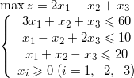

### 7.1.4　练习

利用单纯形算法，练习下面这道题：


参考答案：

```c
----------单纯形表如下：----------
       b       x1      x2      x3
c       0       2      −1       1
x4     60       3       1       1
x5     10       1      −1       2
x6     20       1       1      −1
基列变量：x1 离基变量：x5
----------单纯形表如下：----------
       b       x5      x2      x3
c      20      −2       1      −3
x4     30      −3       4      −5
x1     10       1      −1       2
x6     10      −1       2      −3
基列变量：x2 离基变量：x6
----------单纯形表如下：----------
       b       x5      x6      x3
c      25      −1.5    −0.5    −1.5
x4     10      −1      −2       1
x1     15      0.5     0.5     0.5
x2      5     −0.5     0.5     −1.5
获得最优解：25
```

