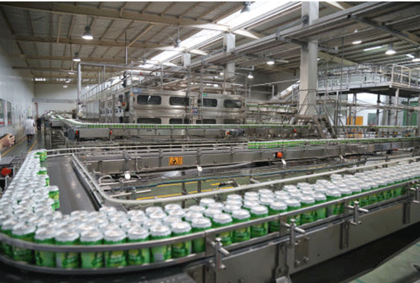

### 7.2　工厂最大效益——单纯形算法

某食品加工厂一共有三个车间，第一车间用1个单位的原料N可以加工5个单位的产品A或2个单位的产品B。产品A如果直接售出，售价为10元，如果在第二车间继续加工，则需要额外加工费5元，加工后售价为19元。产品B如果直接售出，售价16元，如果在第三车间继续加工，则需要额外加工费4元，加工后售价为24元。原材料N的单位购入价为5元，每工时的工资是15元，第一车间加工一个单位的N，需要0.05个工时，第二车间加工一个单位需要0.1工时，第三车间加工一个单位需要0.08工时。每个月最多能得到12000单位的原材料N，工时最多为1000工时。如何安排生产，才能使工厂的效益最大呢？

<b class="my_markdown">图7-10　工厂最大效益问题</b>

