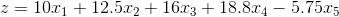
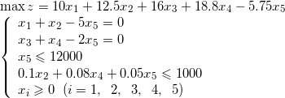

### 7.2.1　问题分析

很明显，这是一个资源有限求最大效益问题，是典型的线性规划问题，我们先假设几个变量。

x1：产品A的售出量。

x2：产品A在第二车间加工后的售出量。

x3：产品B的售出量。

x4：产品B在第三车间加工后的售出量。

x5：第一车间所用原材料数量。

那么收益怎么计算呢？

就是产品的售价减去成本，成本除了原材料，还有人工工资费用。

+ 第一车间所有原材料费和人工费为：5x5+0.05×15x5=5.75x5，下面计算盈利时，均已除去第一车间的材料和人工费。
+ A直接售出，盈利：10x1。
+ A加工后售出，因为有额外加工费、人工费：5+0.1×15=6.5，售价−额外成本=19−6.5，盈利：12.5x2。
+ B直接售出，盈利：16x3。
+ B加工后售出，因为有额外加工费、人工费：4+0.08×15=5.2，售价−额外成本=24−5.2，盈利：18.8x4。

总盈利：。

**目标函数和约束条件** 如下：

