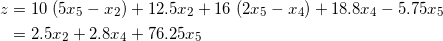
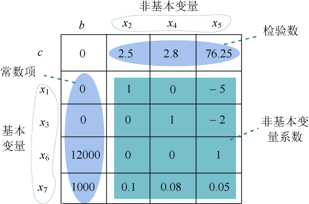
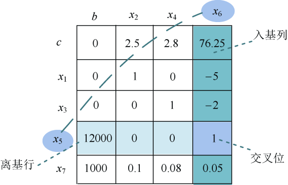
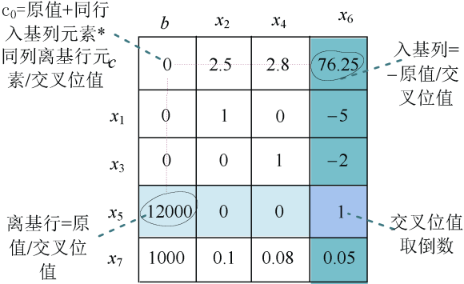
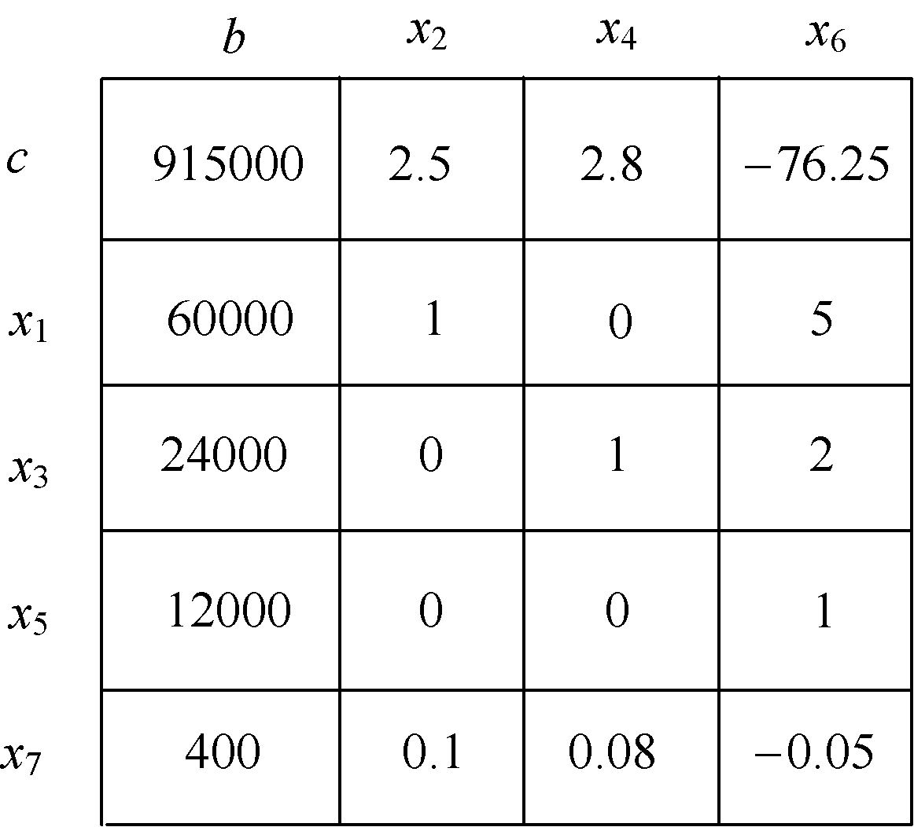
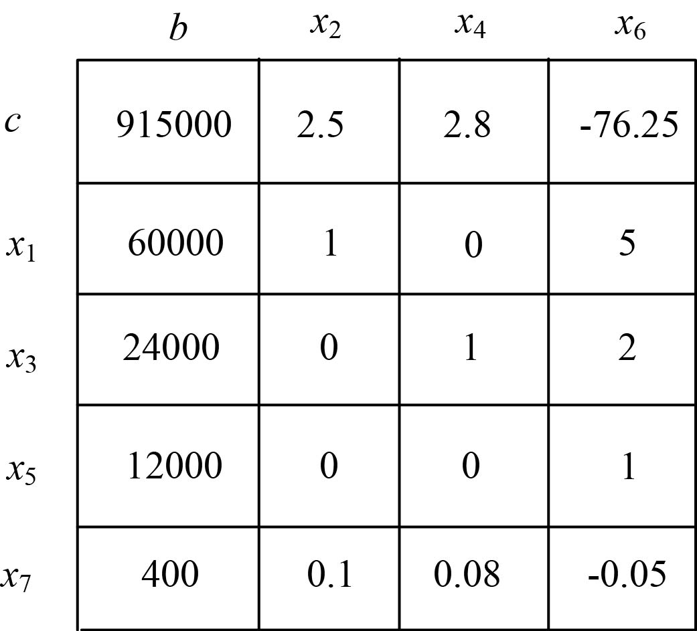

### 7.2.2　完美图解

首先将线性规划形式 **转化为标准型** ：把两个不等式增加两个非负变量，转化为等式。

然后使用单纯形算法求解。

（1）建立初始单纯形表

找出基本变量和非基本变量， **将目标函数由非基本变量表示** ，建立初始单纯形表。

基本变量：x1，x3，x6，x7。

非基本变量：x2，x4，x5。

**将目标函数由非基本变量表示** ，目标函数里面含有基本变量x1、x3，因此利用约束条件的1、2式替换，将下面两个公式代入目标函数：

目标函数：

基本变量做行，非基本变量做列，检验数放第一行，常数项放第一列，非基本变量的系数作为值，构造初始单纯形表，如图7-11所示。

<b class="my_markdown">图7-11　初始单纯形表</b>

（2）判断是否得到最优解

判别并检查目标函数的所有系数，即检验数cj（j=1，2，…，n）。

+ 如果所有的cj0，则已获得最优解，算法结束。
+ 若在检验数cj中，有些为正数，但其中某一正的检验数所对应的列向量的各分量均小于等于0，则线性规划问题无界，算法结束。
+ 若在检验数cj中，有些为正数且它们对应的列向量中有正的分量，则继续计算。

（3）选入基变量

正检验数中最大的一个76.25对应的非基本变量为x5为入基变量，x5对应的列为入基列。

（4）选离基变量

选取“常数列元素/入基列元素”正比值的最小者，所对应的非基本变量x6为离基变量，x6对应的行为离基行。

（5）换基变换

在单纯形表上将入基变量x5和离基变量x6互换位置，换基变换后如图7-12所示。

<b class="my_markdown">图7-12　单纯形表（换基变换后）</b>

（6）新的单纯形表

按以下方法计算新的单纯形表，转第（2）步。

4个特殊位置如下：

+ **入基列** = −原值/交叉位值（不包括交叉位）。
+ **离基行** =原值/交叉位值（不包括交叉位）。
+ **交叉位** =原值取倒数。
+ c0 **位** =原值+同行入基列元素*同列离基行元素/交叉位值。

如图7-13所示。

<b class="my_markdown">图7-13　单纯形表（4个特殊位置）</b>

一般位置元素=原值−同行入基列元素*同列离基行元素/交叉位值，如图7-14所示。

<b class="my_markdown">图7-14　单纯形表（一般位置）</b>

计算后得到新的单纯形表，如图7-15所示。

<b class="my_markdown">图7-15　新的单纯形表</b>

（7）判断是否得到最优解，若没有，则继续第（3）～（6）步

再次选定基列变量x4和离基变量x7，将入基变量和离基变量互换位置，重新计算新的单纯形表，如图7-16所示。

<b class="my_markdown">图7-16　新的单纯形表</b>

判断是否得到最优解，因为检验数全部小于0，因此得到最优解，c0位就是最优值929000，而最优解是由基本变量对应的常数项组成的，即x1=60000、x3=19000、x4=5000、x5=12000，非基本变量全部置零，得到唯一的最优解向量（60000，0，19000，5000，12000，0，0）。

产品A的售出量：x1=60000。

产品A在第二车间加工后的售出量：x2=0。

产品B的售出量：x3=19000。

产品B在第三车间加工后的售出量：x4=5000。

第一车间所用原材料数量：x5=12000。

从最优解可以看到x2=0，也就是说产品A在第二车间加工后的售出量为0，显然产品A在第二车间加工后再售出赚取的效益不大，也是不划算的，可以取消第二车间加工对产品A的再加工，其他的按最优解数量生产，工厂即可获得最大效益。

