### 7.3.1　问题分析

无论是电网、水管网、交通运输网，还是其他的一些网络，都有一个共同点：在网络中传输都是有方向和容量的。所以设有向带权图**G**=（V，E），V={s，v1，v2，v3，…，t}。在图**G**中有两个特殊的结点s和t，s称为源点，t称为汇点。图中各边的方向表示允许的流向，边上的权值表示该边允许通过的最大可能流量cap，且cap0，称它为边的容量。而且如果边集合E含有一条边（u，v），必然不存在反方向的边（v，u），我们称这样的有向带权图为 **网络** 。

**网络是一个有向带权图，包含一个源点和一个汇点，没有反平行边。**

反平行边如图7-18所示。就是说如果v1和v3之间有边，要么是v1—v3，要么是v3—v1，但两个不会同时存在。

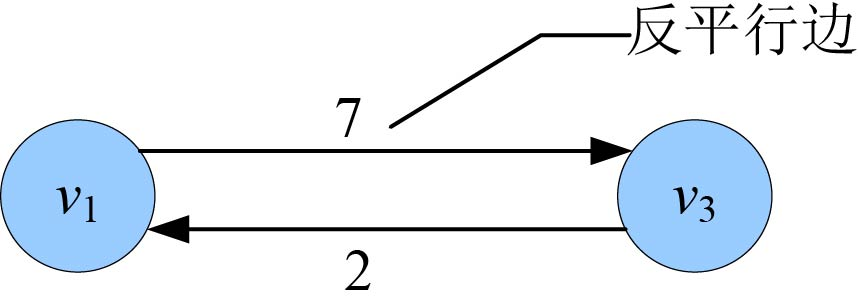

<b class="my_markdown">图7-18　反平行边</b>

例如：一家郑州电子产品制造公司要把一批货物从工厂（s）运往北京仓库（t），找到一家货运代理公司，代理公司安排了若干货车和运输线路，中间要经过若干个城市，边上的数值代表两个城市之间每天最多运送的产品数量。电子公司不管货运代理是怎么运输的，只需要知道每天从工厂最多发出去多少货。而且从工厂发出多少货物，在北京仓库就要收到多少货物，否则由货运代理照价赔偿，因此中间的城市是没有存货的，该运输网络如图7-19所示。

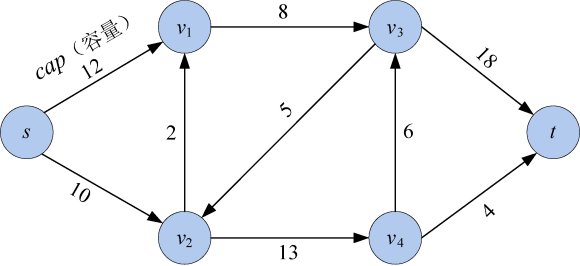

<b class="my_markdown">图7-19　运输网络</b>

这就像一个地下水管网络，我们看不到水在地下管道内是怎么流动的，但是知道从进水口流进去多少水，就从出水口流出来多少水，如图7-20所示。

<b class="my_markdown">图7-20　地下水管网络</b>

**网络流：** 网络流即网络上的流，是定义在网络边集E上的一个非负函数flow={flow（u，v）}，flow（u，v）是边上的流量。

**可行流：** 满足以下两个性质的网络流flow称为可行流。

（1）容量约束

每个管道的实际流量flow不能超过该管道的最大容量cap。每个管道粗细不同，因此管道的最大容量也是不同的。例如：从结点u到结点v的管道容量是10，那么从结点u到结点v的实际流量不能大于10，如图7-21所示。

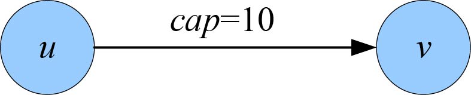

<b class="my_markdown">图7-21　容量约束</b>

对所有的结点u和v，满足容量约束：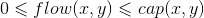。

（2）流量守恒

除了源点s和汇点t之外，所有内部结点流入量等于流出量。即：

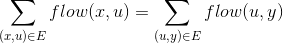
例如：流入u结点的流量之和是10，那么从u结点流出的流量之和也是10，如图7-22所示。

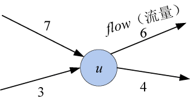

<b class="my_markdown">图7-22　流量守恒（中间结点）</b>

+ 源点s

源点主要是流出，但也有可能流入，例如货物运出后检测出一些不合格产品需要返厂，对源点来说就是流入量。因此，源点的净输出值f=流出量之和−流入量之和。即：

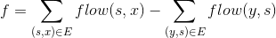
例如：源点s的流出量之和是10，流入量之和是2，那么净输出是8，如图7-23所示。

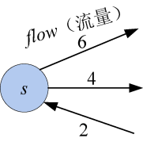

<b class="my_markdown">图7-23　流量守恒（源点）</b>

+ 汇点t

汇点主要是流入，但也有可能流出，例如货物到达仓库后检测出一些不合格产品需要返厂，对汇点来说是流出量。因此，汇点的净输入值f=流入量之和−流出量之和。即：

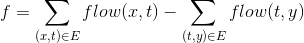
例如：源点t的流入量之和是9，流出量之和是1，那么净输入是8，如图7-24所示。

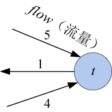

<b class="my_markdown">图7-24　流量守恒（汇点）</b>

**注意：** 对于一个网络可行流flow，净输出等于净输入，这仍然是流量守恒，如图7-25所示。

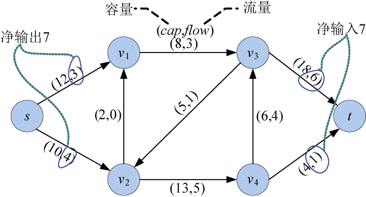

<b class="my_markdown">图7-25　网络**G**及其上的一个流flow</b>

**网络最大流：** 在满足容量约束和流量守恒的前提下，在流网络中找到一个净输出最大的网络流。

那么如何找到最大流呢？接下来看Ford-Fulkerson方法。

