### 7.3.2　增广路算法

1957年，Ford和Fullkerson提出了求解网络最大流的方法。该方法的基本思想是在残余网络中找可增广路，然后在实流网络中沿可增广路增流，直到不存在可增广路为止。

#### 1．基本概念

（1）实流网络

为了更清楚地表达，我们引入实流网络的概念，即只显示实际流量的网络。

例如：网络**G**及其上的一个流flow，如图7-26所示。

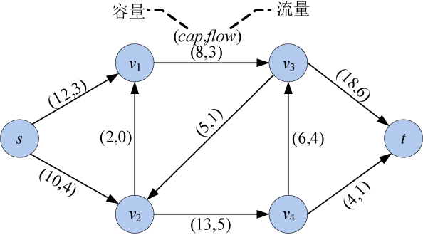

<b class="my_markdown">图7-26　网络**G**及其上的一个流flow</b>

我们只显示每条边实际流量，不显示容量，图7-26对应的实流网络如图7-27所示。

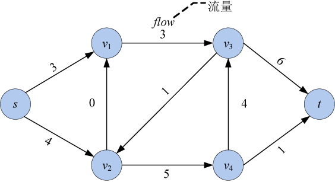

<b class="my_markdown">图7-27　实流网络**G'**</b>

（2）残余网络

每个网络**G**及其上的一个流flow，都对应一个残余网络**G***。**G***和G结点集相同，而网络**G**中的每条边对应**G***中的一条边或两条边，如图7-28和图7-29所示。

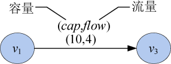

<b class="my_markdown">图7-28　网络**G**的边</b>

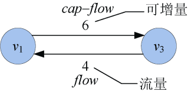

<b class="my_markdown">图7-29　残余网络**G***对应的边</b>

**在残余网络中，与网络边对应的同向边是可增量（即还可以增加多少流量），反向边是实际流量。**

残余网络中没有0流边，因此如果网络中的边实际流量是0，则在残余网络中只对应一条同向边，没有反向边，如图7-30和图7-31所示。

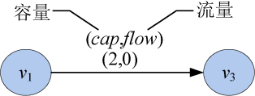

<b class="my_markdown">图7-30　网络**G**的边</b>

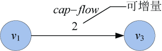

<b class="my_markdown">图7-31　残余网络**G***对应的边</b>

网络**G**及可行流如图7-32所示，对应的残余网络**G***如图7-33所示。

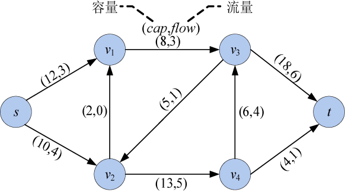

<b class="my_markdown">图7-32　网络**G**及可行流</b>

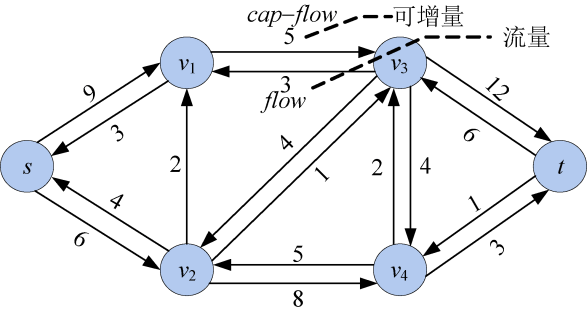

<b class="my_markdown">图7-33　残余网络**G***</b>

**可增广路** 是残余网络**G***中一条从源点s到汇点t的简单路径。例如：s—v1—v3—t就是一条可增广路，如图7-34所示。

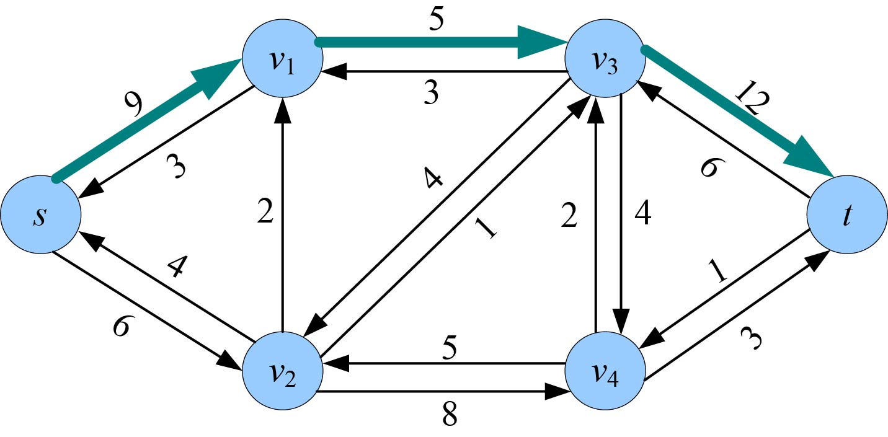

<b class="my_markdown">图7-34　残余网络**G***</b>

**可增广量** 是指在可增广路p上每条边可以增加的流量最小值。那么对于一条可增广路s—v1—v3—t，可以增加的最大流量是多少呢？s—v1最多可以增加的流量为9，v1—v3最多可以增加的流量为5，v3—t最多可以增加的流量为12，如果超出这个值就不满足流量约束了，因此这条可增广路最多可以增加的流量是5。

可增广量d等于可增广路p上每条边值的最小值，如图7-35所示。

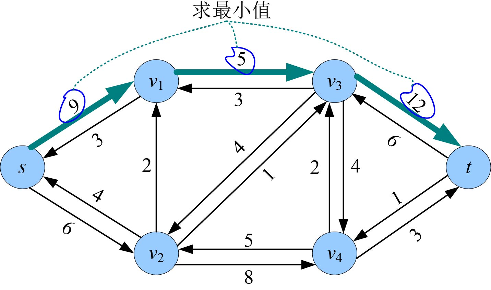

<b class="my_markdown">图7-35　残余网络**G***</b>

求网络**G**的最大流，首先在残余网络中找可增广路，然后在实流网络**G** '中沿可增广路增流，直到不存在可增广路为止。这时实流网络**G** '就是最大流网络。

#### 2．可增广路增流

增流操作分为两个过程：一是在实流网络中增流，二是在残余网络中减流。因为残余网络中可增广路上的边值表示可增量，在实流网络中流量增加了，那么可增量就少了。

（1）实流网络增流

仍以图7-35为例，我们已经找到一条可增广路s—v1—v3—t，并且知道可增广量d=5。那么首先在实流网络中沿着可增广路增流：可增广路上同向边增加流量d，反向边减少流量d。本例中都是和可增广路同向的边，因此每条边上增加流量5，增流前后的实流网络如图7-36和图7-37所示。

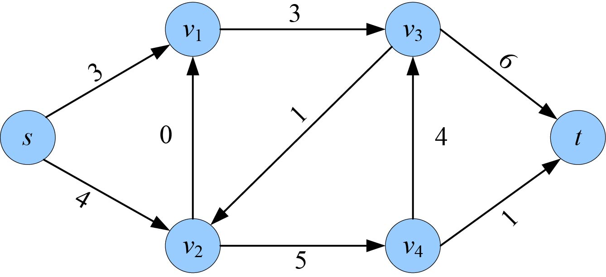

<b class="my_markdown">图7-36　实流网络**G** '（增流前）</b>

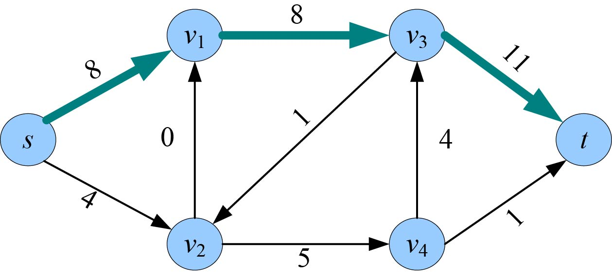

<b class="my_markdown">图7-37　实流网络**G** '（增流后）</b>

（2）残余网络减流

在残余网络中沿着可增广路减流：可增广路上的同向边减少流量d，反向边增加流量d。沿着可增广路s—v1—v3—t，同向边（可增量）减少流量5，反向边增加流量5。如果一条边流量为0，则删除这条边。减流后v1—v3流量为0，删除这条边，减流前后的残余网络如图7-38和图7-39所示。

<b class="my_markdown">图7-38　残余网络**G***（减流前）</b>

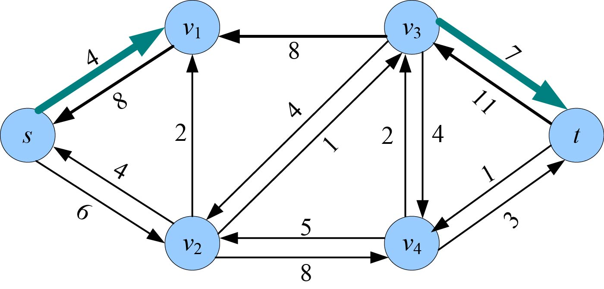

<b class="my_markdown">图7-39　残余网络**G***（减流后）</b>

#### 3．增广路算法

增广路定理：设flow是网络**G**的一个可行流，如果不存在从源点s到汇点t关于flow的可增广路p，则flow是**G**的一个最大流。

增广路算法的基本思想是在残余网络中找到可增广路，然后在实流网络中沿可增广路增流，在残余网络中沿可增广路减流；继续在残余网络中找可增广路，直到不存在可增广路为止。此时，实流网络中的可行流就是所求的最大流。

增广路算法其实不是一种算法，而是一种方法，因为Ford-Fullkerson并没有说明如何找可增广路，而找增广路的算法不同，算法的时间复杂度相差很大。

如果采用随意找可增广路的方式，我们看一个例子：网络**G**及可行流如图7-40所示。

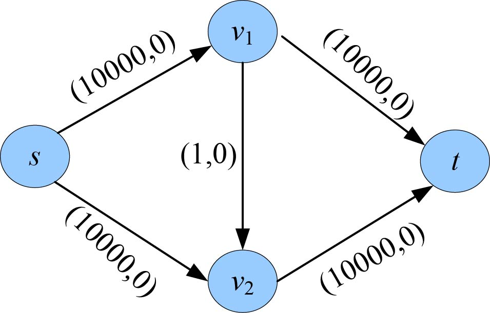

<b class="my_markdown">图7-40　网络**G**及可行流</b>

图7-40对应的实流网络和残余网络如图7-41和图7-42所示。

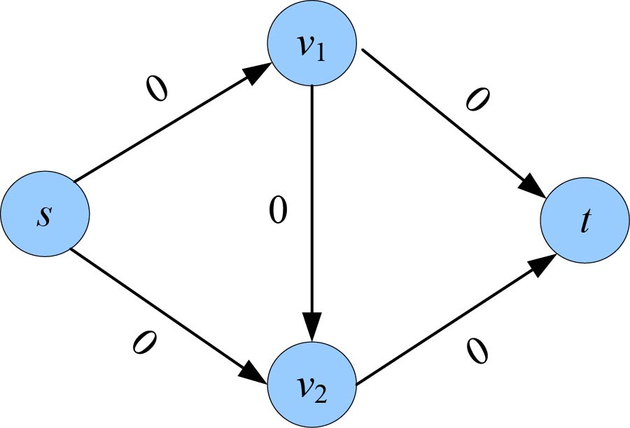

<b class="my_markdown">图7-41　实流网络**G** '</b>

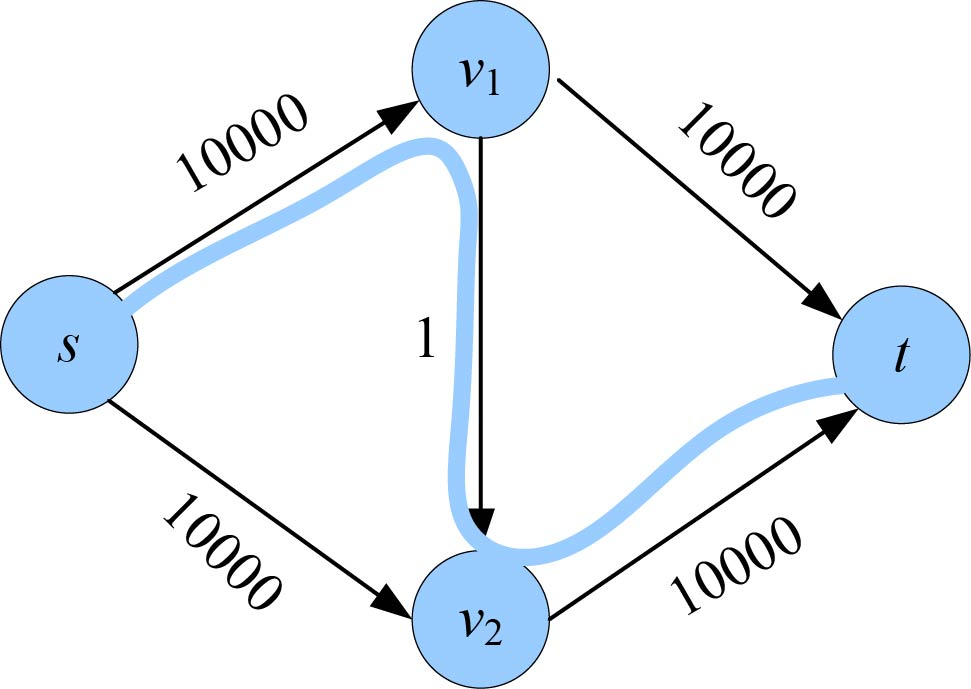

<b class="my_markdown">图7-42　残余网络**G***</b>

如果我们在残余网络**G***中随意找一条可增广路p：s—v1—v2—t，如图7-42所示。沿可增广路p增流后的实流网络**G** '如图7-43所示，减流后的残余网络**G***如图7-44所示。

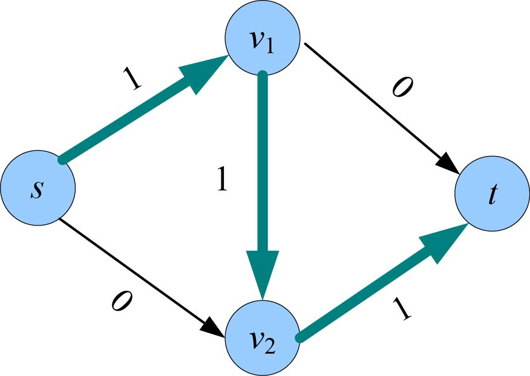

<b class="my_markdown">图7-43　实流网络**G** '</b>

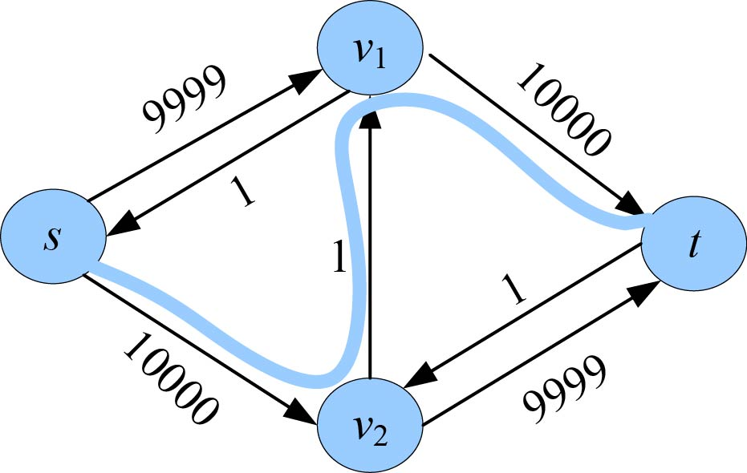

<b class="my_markdown">图7-44　残余网络**G***</b>

如果我们继续在残余网络**G***中随意找一条可增广路p：s—v2—v1—t，如图7-44所示。沿可增广路p增流后的实流网络**G** '如图7-45所示，减流后的残余网络**G***如图7-46所示。

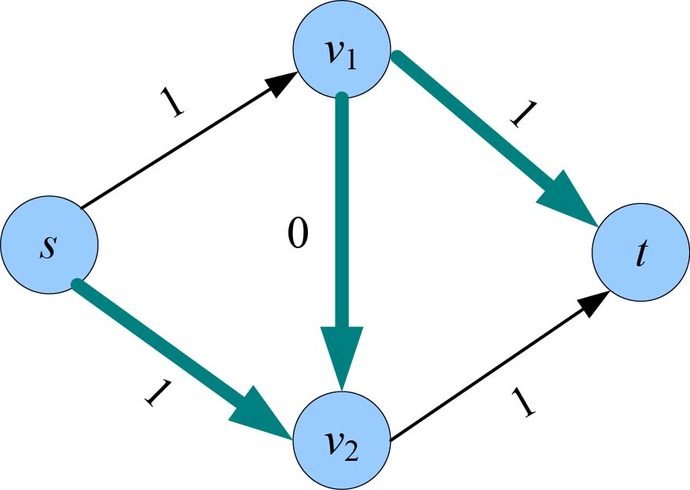

<b class="my_markdown">图7-45　实流网络**G** '</b>

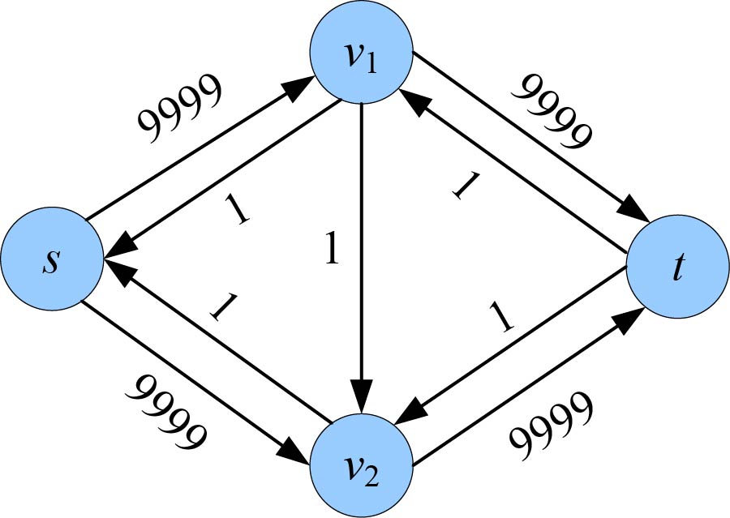

<b class="my_markdown">图7-46　残余网络**G***</b>

**注意** ：在实流网络中，沿可增广路p上的边是v1—v2的反向边，因此，减流1，其他的正向边增流1。

如果继续在残余网络**G***中随意找一条可增广路p：s—v1—v2—t，沿可增广路p增流，如此下去，每次增加的流量为1，而本题网络最大流值f=20000，那么需要执行20000次增流操作，每次找可增广路的算法时间复杂度为O(E)，如果每次只增加一个单位流量，那么需要找可增广路f次，总的时间复杂度为O(Ef)。

#### 4．最短增广路算法

如何找到一条可增广路呢？仁者见仁，智者见智。可以设置最大容量优先，也可以是最短路径（广度优先）优先。Edmonds-Karp算法就是以广度优先的增广路算法，又称为最短增广路算法（Shortest Augument Path，SAP）。

最短增广路算法步骤：

采用队列q来存放已访问未检查的结点。布尔数组vis[]标识结点是否被访问过，pre[]数组记录可增广路上结点的前驱。pre[v]=u表示可增广路上v结点的前驱是u，最大流值maxflow=0。

（1）初始化可行流flow为零流，即实流网络中全是零流边，残余网络中全是最大容量边（可增量）。初始化vis[]数组为false，pre[]数组为−1。

（2）令vis[s]=true，s加入队列q。

（3）如果队列不空，继续下一步，否则算法结束，找不到可增广路。当前的实流网络就是最大流网络，返回最大流值maxflow。

（4）队头元素new出队，在残余网络中检查new的所有邻接结点i。如果未被访问，则访问之，令vis[i]=true，pre[i]=new；如果i=t，说明已到达汇点，找到一条可增广路，转向第（5）步；否则结点i加入队列q，转向第（3）步。

（5）从汇点开始，通过前驱数组pre[]，逆向找可增广路上每条边值的最小值，即可增量d。

（6）在实流网络中增流，在残余网络中减流，Maxflow+=d，转向第（2）步。

