### 7.3.3　完美图解

一般来说，实际问题通常会给出每个结点之间的最大容量cap是多少，然后求解最大流。那么我们在求解时需要先初始化一个可行流，然后在可行流上不断找可增广路增流即可。初始化为任何一个可行流都可以，但需要满足容量约束和平衡约束。为了简单起见，我们通常初始化可行流为0流，这样肯定满足容量约束和平衡约束。如图7-47所示的网络**G**，1号结点为源点，6号结点为汇点。

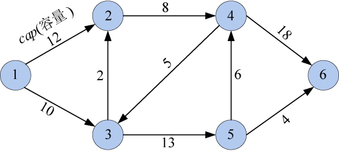

<b class="my_markdown">图7-47　网络**G**</b>

（1）数据结构

网络**G**邻接矩阵为**g**[][]，即如果从结点i到结点j有边，就让**g**[i][j]=<i，j>的权值，否则**g**[i][j]=∞（无穷大），如图7-48所示。

<b class="my_markdown">图7-48　邻接矩阵</b>

（2）初始化

初始化可行流flow为零流，即实流网络中全是零流边，残余网络中全是最大容量边（可增量）。初始化访问标记数组vis[]为0（false），前驱数组pre[]为−1，如图7-49和图7-50所示。

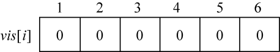

<b class="my_markdown">图7-49　访问标记数组</b>

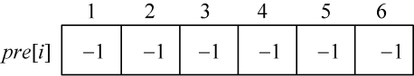

<b class="my_markdown">图7-50　前驱数组</b>

初始化实流网络为0流，如图7-51所示。

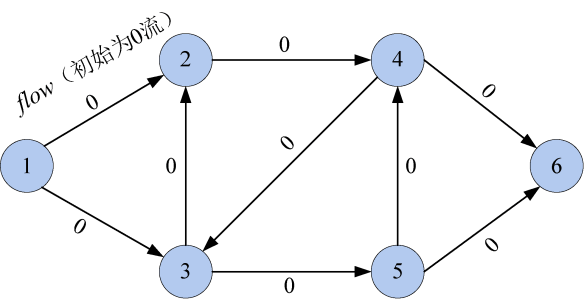

<b class="my_markdown">图7-51　实流网络**G** '</b>

实流网络**G** '对应的残余网络，如图7-52所示。

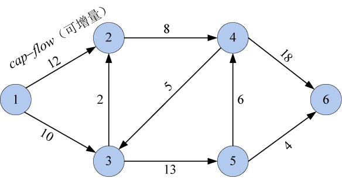

<b class="my_markdown">图7-52　残余网络**G** *</b>

（3）令vis[1]=true，1加入队列q，如图7-53所示。

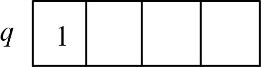

<b class="my_markdown">图7-53　队列</b>

（4）队头元素1出队

在残余网络**G***中依次检查1的所有邻接结点2和3，两个结点都未被访问，令vis[2] =true，pre[2]=1，结点2加入队列q；vis[3]=true，pre[3]=1，结点3加入队列q，搜索路径如图7-54所示。

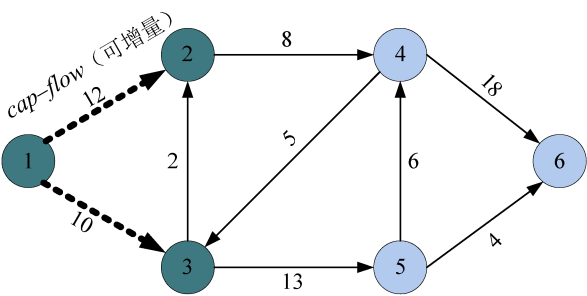

<b class="my_markdown">图7-54　残余网络**G** *</b>

访问标记数组、前驱数组及队列状态如图7-55～图7-57所示。

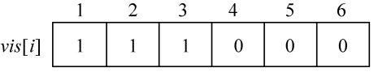

<b class="my_markdown">图7-55　访问标记数组</b>

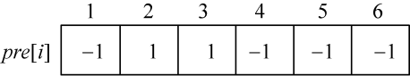

<b class="my_markdown">图7-56　前驱数组</b>

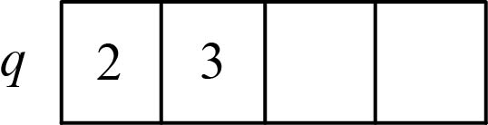

<b class="my_markdown">图7-57　队列</b>

（5）队头元素2出队

在残余网络中依次检查2的所有邻接结点4，4未被访问，令vis[4]= true，pre[4]=2，结点4加入队列q，搜索路径如图7-58所示。

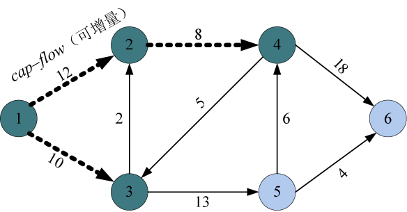

<b class="my_markdown">图7-58　残余网络**G** *</b>

访问标记数组、前驱数组及队列状态如图7-59～图7-61所示。

<b class="my_markdown">图7-59　访问标记数组</b>

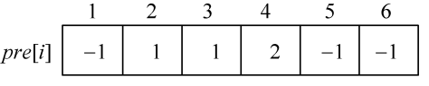

<b class="my_markdown">图7-60　前驱数组</b>

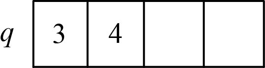

<b class="my_markdown">图7-61　队列</b>

（6）队头元素3出队

在残余网络中依次检查3的所有邻接结点2和5，2被访问过，什么也不做；5未被访问，令vis[5] =true，pre[5]=3，结点5加入队列q，搜索路径如图7-62所示。

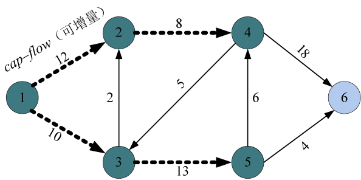

<b class="my_markdown">图7-62　残余网络**G** *</b>

访问标记数组、前驱数组及队列状态如图7-63～图7-65所示。

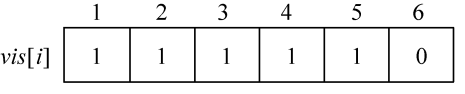

<b class="my_markdown">图7-63　访问标记数组</b>

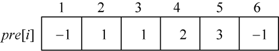

<b class="my_markdown">图7-64　前驱数组</b>

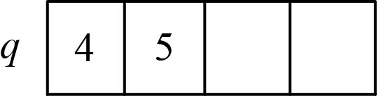

<b class="my_markdown">图7-65　队列</b>

（7）队头元素4出队

在残余网络中依次检查4的所有邻接结点3和6，3被访问过，什么也不做；6未被访问，令vis[6] =true，pre[6]=4，结点6就是汇点，找到一条增广路。搜索路径如图7-66所示。

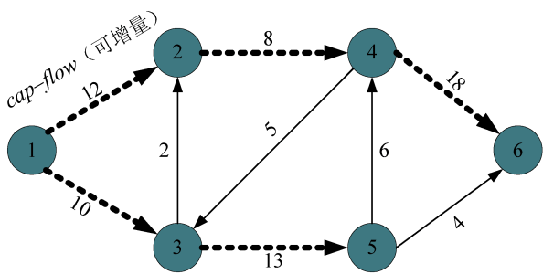

<b class="my_markdown">图7-66 残余网络**G** *</b>

访问标记数组、前驱数组及队列状态如图7-67～图7-69所示。

<b class="my_markdown">图7-67　访问标记数组</b>

<b class="my_markdown">图7-68　前驱数组</b>

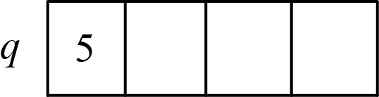

<b class="my_markdown">图7-69　队列</b>

（8）读取图7-68中的前驱数组pre[6]=4，pre[4]=2，pre[2]=1，即：1—2—4—6。找到该路径上最小的边值为8，即可增量d=8，如图7-70所示。

<b class="my_markdown">图7-70　残余网络**G** *</b>

（9）实流网络增流

与可增广路同向的边增流d，反向的边减流d，如图7-71所示。

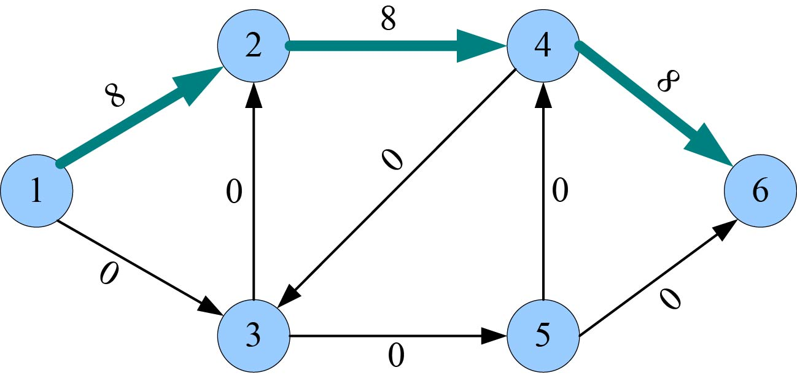

<b class="my_markdown">图7-71　实流网络**G** '</b>

（10）残余网络减流

与可增广路同向的边减流d，反向的边增流d，如图7-72所示。

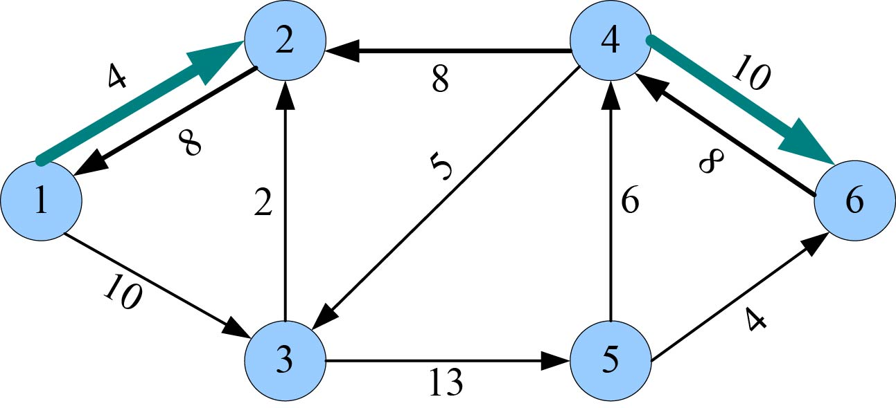

<b class="my_markdown">图7-72　残余网络**G** *</b>

（11）重复第（2）～（10）步，找到第2条可增广路（1—3—5—6），找到该路径上最小的边值为4，即可增量d=4。增流后的实流网络和残余网络，如图7-73和图7-74所示。

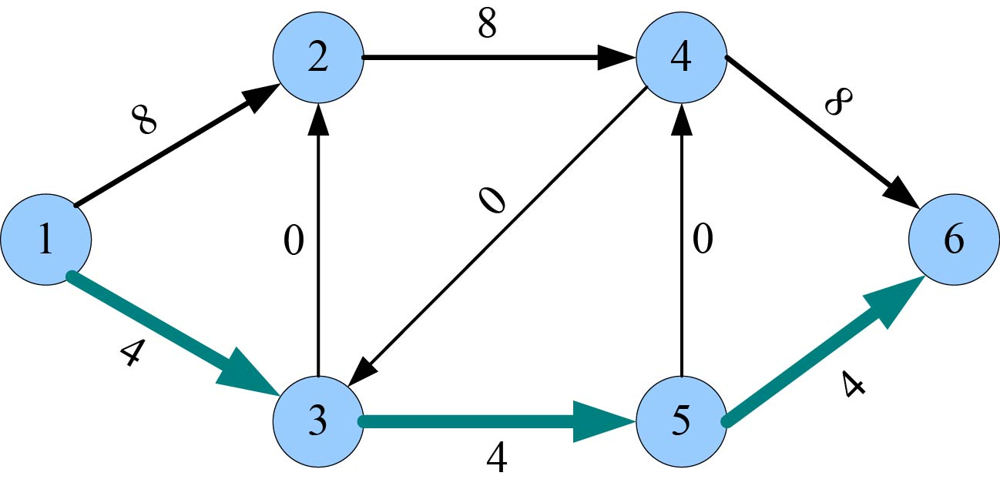

<b class="my_markdown">图7-73　实流网络**G** '</b>

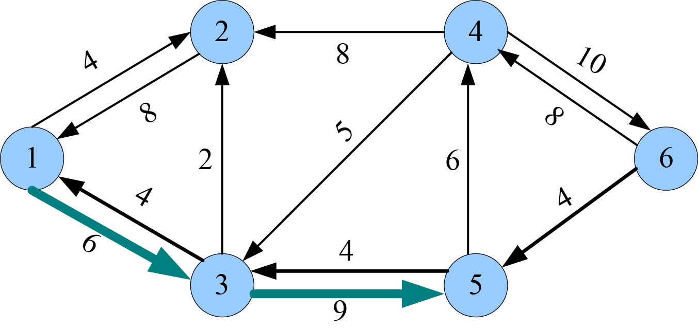

<b class="my_markdown">图7-74　残余网络**G** *</b>

（12）重复第（2）～（10）步，找到第3条可增广路（1—3—5—4—6），找到该路径上最小的边值为6，即可增量d=6。增流后的实流网络和残余网络，如图7-75和图7-76所示。

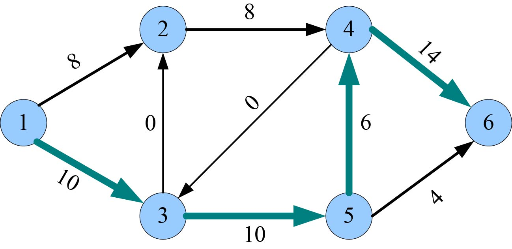

<b class="my_markdown">图7-75　实流网络**G** '</b>

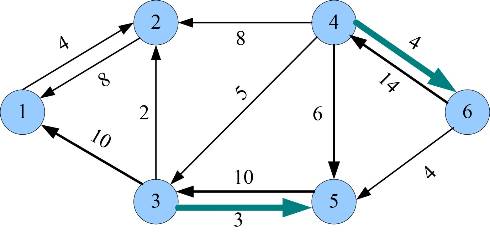

<b class="my_markdown">图7-76　残余网络**G** *</b>

（13）重复第（2）～（10）步，找不到可增广路，算法结束，最大流值为所有的增量d之和18，各边的实际流量如图7-75所示。

**思考：为什么要采用残余网络+实流网络？**

+ 为什么要用残余网络？为什么要在残余网络上找可增广路，直接在网络及可行流上面找可增广路可以吗？请看下面的实例，如图7-77所示。

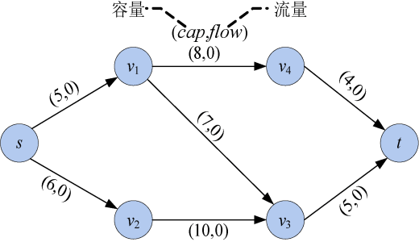

<b class="my_markdown">图7-77　网络**G**及可行流</b>

首先按照广度优先搜索策略，从源点开始，沿着有可增量（cap>flow）的边搜索。源点s访问邻接点v1、v2，v1访问邻接点v3、v4，v2没有未被访问的邻接点，v3访问邻接点t，到达源点，找到一条可增广路：s—v1—v3—t。沿着可增广路增流，增加的流量为可增广路上每条边的可增量（cap-flow）最小值，可增量d=5，增流后如图7-78所示。

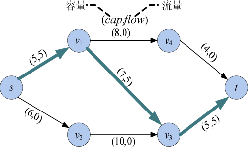

<b class="my_markdown">图7-78　网络**G**及可行流（增流后）</b>

继续按照广度优先搜索策略，从源点开始，沿着有可增量（cap>flow）的边搜索。源点s访问邻接点v2，无法再访问v1，因为s—v1的边已经没有可增量。v2访问邻接点v3，v3无法再访问t，因为v3—t的边已经没有可增量。v3没有未被访问的邻接点，无法到达汇点，找不到从源点到汇点的可增广路。

但是得到的解并不是最大流！

因此， **在网络** **G** **及可行流直接找可增广路，有可能得不到最大流。**

+ 为什么要用实流网络？

仍以图7-47为例，其对应的残余网络如图7-79所示。

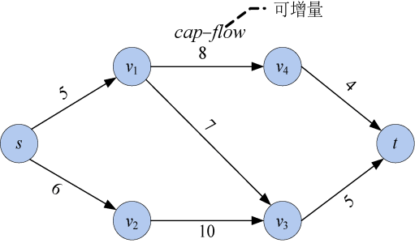

<b class="my_markdown">图7-79　残余网络**G** *</b>

首先按照广度优先搜索策略，从源点开始，沿着有向边搜索。源点s访问邻接点v1、v2，v1访问邻接点v3、v4，v2没有未被访问的邻接点，v3访问邻接点t，到达源点，找到一条可增广路：s—v1—v3—t。增加的流量为可增广路上每条边的最小值，可增量d=5，如图7-80所示。

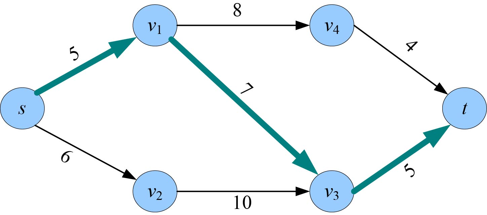

<b class="my_markdown">图7-80　残余网络**G** *</b>

在残余网络中，可增广路上的同向边减少流量d，反向边增加流量d，如图7-81所示。

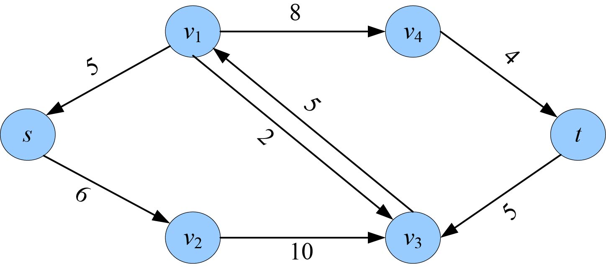

<b class="my_markdown">图7-81　残余网络**G** *</b>

继续按照广度优先搜索策略，从源点开始，沿着有向边搜索。源点s访问邻接点v2，无法再访问v1，因为s—v1没有邻接边。v2访问邻接点v3，v3无法再访问t，因为v3—t没有邻接边。v3访问邻接点v1，v1访问邻接点v4，v4再访问t，到达源点，找到一条可增广路：s—v2—v3—v1—v4—t。增加的流量为可增广路上每条边的最小值，可增量d=4，如图7-82所示。

<b class="my_markdown">图7-82　残余网络**G** *</b>

在残余网络中，可增广路上的同向边减少流量d，反向边增加流量d，如图7-83所示。

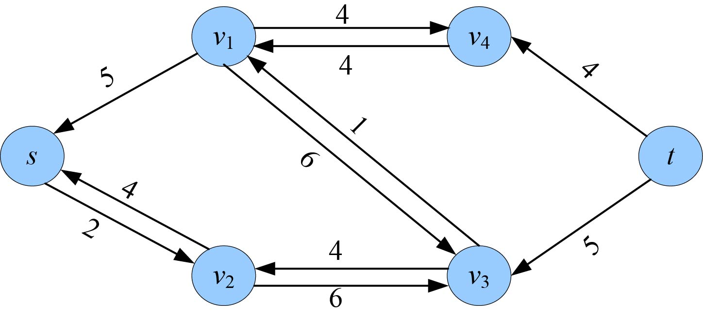

<b class="my_markdown">图7-83　残余网络**G** *</b>

继续搜索，找不到从源点到汇点的可增广路。已经得到最大流，最大流值为所有的增量之和，即5+4=9。

但是，从残余网络图7-83中无法判断哪些是实流边，哪些是可增量边。如果想知道实际的网络流量，就需要借助于实流网络。

因此，采用在残余网络中找可增广路，在实流网络中增流相结合的方式，求解最大流。

