### 7.3.7　算法优化拓展——重贴标签算法ISAP

最短增广路算法（SAP），采用广度优先的方法在残余网络中找去权值的最短增广路。从源点到汇点，像声音传播一样，总是找到最短的路径，如图7-84所示。

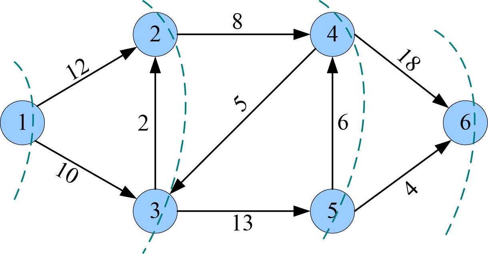
<center class="my_markdown"><b class="my_markdown">图7-84　残余网络**G**<sup class="my_markdown">*</sup></b></center>

但是，我们在寻找路径时却多搜索了很多结点，例如在图7-84中，第一次找到的可增广路是1—2—4—6，但在广度搜索时，3、5两个结点也被搜索到了。如何实现一直沿着最短路的方向走呢？

有人想到了一条妙计—— **贴标签** 。首先对所有的结点标记到汇点的最短距离，我们称之为高度。标高从汇点开始，用广度优先的方式，汇点的邻接点高度1，继续访问的结点高度是2，一直到源点结束，如图7-85所示。

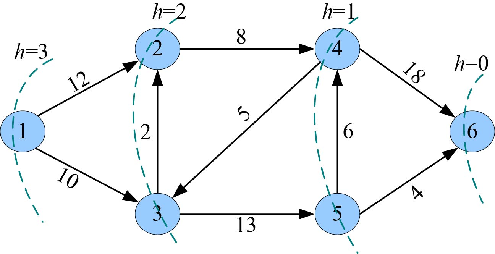
<center class="my_markdown"><b class="my_markdown">图7-85　残余网络**G**<sup class="my_markdown">*</sup></b></center>

贴好标签之后，就可以从源点开始，沿着高度h（u）=h（v）+1且有可行邻接边（cap>flow）的方向前进，例如：h（1）=3，h（2）=2，h（4）= 1，h（6）=0。这样就很快找到了汇点，然后沿着可增广路1—2—4—6增减流之后的残余网络，如图7-86所示。

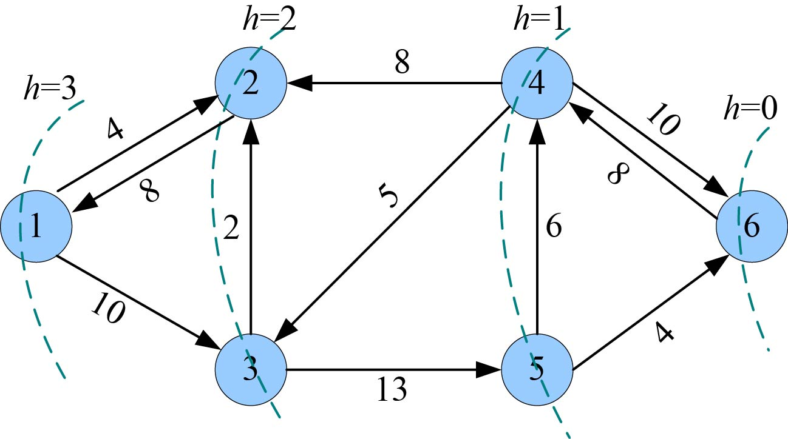
<center class="my_markdown"><b class="my_markdown">图7-86　残余网络G<sup class="my_markdown">*</sup></b></center>

我们再次从源点开始搜索，沿着高度h（u）= h（v）+1且有可行邻接边（cap>flow）的方向前进，h（1）=3，h（2）=2，走到这里无法走到4号结点，因为没有邻接边，3号结点不仅没有邻接边而且高度也不满足条件。也不能走到1号结点，因为h（1）=3。怎么办呢？

可以用 **重贴标签** 的办法 **：** 当前结点无法前进时，令当前结点的高度=所有邻接点高度的最小值+1；如果没有邻接边，则令当前结点的高度=结点数；退回一步；重新搜索。

重贴标签后，h（2）= h（1）+1=4，如图7-87所示。

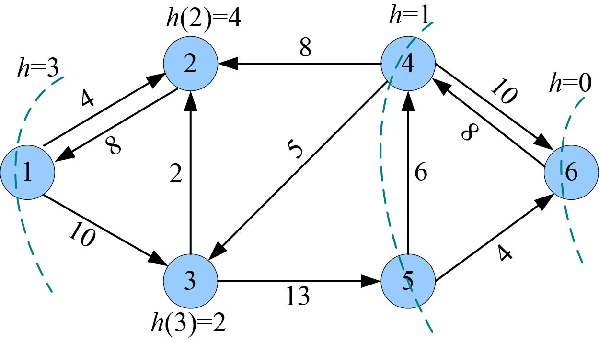
<center class="my_markdown"><b class="my_markdown">图7-87　残余网络**G**<sup class="my_markdown">*</sup></b></center>

退回一步到1号结点，重新搜索。1号结点已经无法到达2号（高度不满足条件h（u）= h（v）+1），那么考查结点1的下一个邻接点h（3）=2，h（5）=1，h（6）=0，又找到了一条可增广路1—3—5—6。增减流之后的残余网络，如图7-88所示。

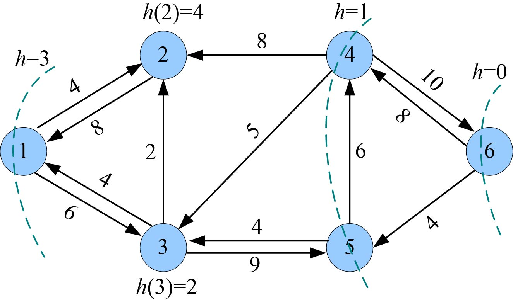
<center class="my_markdown"><b class="my_markdown">图7-88　残余网络**G**<sup class="my_markdown">*</sup></b></center>

我们再次从源点开始搜索，沿着高度h（u）=h（v）+1且有可行邻接边（cap>flow）的方向前进，h（1）=3，h（3）=2，h（5）=1，走到这里无法走到6号结点，因为没有邻接边，也不能走到3、4号结点，因为它们高度不满足条件。但是5—4明明有可增加流量，怎么办？

继续使用 **重贴标签** 的办法，令h（5）= h（4）+1=2，退回一步，重新搜索；退回到3号结点，因为h（3）=2，仍然无法前进， **重贴标签** ，令h（3）=h（5）+1=3；退回到1号结点，因为h（1）=3，仍然无法前进， **重贴标签** ，令h（1）= h（3）+1=4，本身是源点不用退回。

重贴标签后，如图7-89所示。

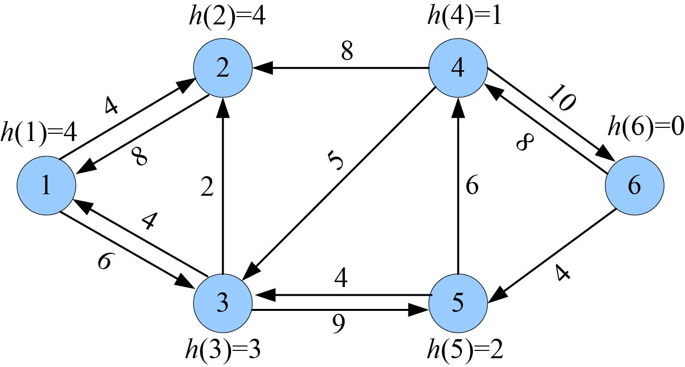
<center class="my_markdown"><b class="my_markdown">图7-89　残余网络**G**<sup class="my_markdown">*</sup></b></center>

再次从源点开始搜索，沿着高度h（u）=h（v）+1且有可行邻接边的方向前进，h（1）=4，h（3）=3，h（5）=2，h（4）=1，h（6）=0，又找到了一条可增广路1—3—5—4—6。增减流之后的残余网络，如图7-90所示。

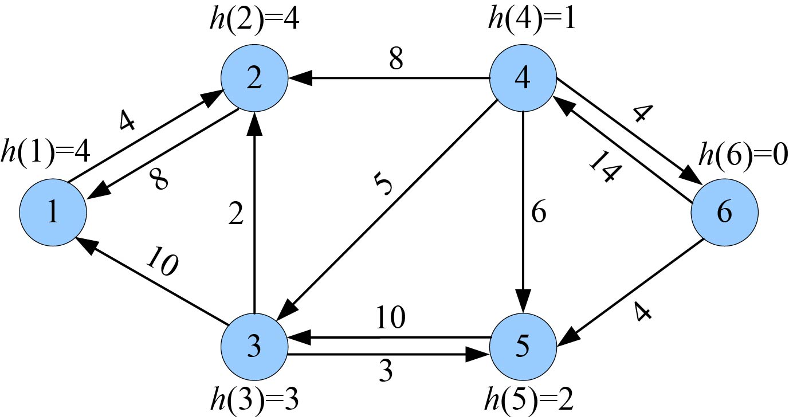
<center class="my_markdown"><b class="my_markdown">图7-90　残余网络**G**<sup class="my_markdown">*</sup></b></center>

再次从源点开始搜索，沿着高度h（u）=h（v）+1且有可行邻接边的方向前进，发现已经无法行进，到2号结点不满足高度要求，到3号结点没有可行邻接边。 **重贴标签** ，则h（1）= h（2）+1=5，本身是源点不用退回。再次从源点开始搜索，沿着高度h（u）=h（v）+1且有可行邻接边的方向前进，h（1）=5，h（2）=4，无法行进， **重贴标签** ，发现高度为4的结点只有一个，已经不存在可增广路，算法结束，已经得到了最大流。

#### 1．算法设计

（1）确定合适数据结构。采用邻接表存储网络。

（2）对网络结点贴标签，即标高操作。

（3）如果源点的高度结点数，则转向第（6）步；否则从源点开始，沿着高度h（u）= h（v）+1且有可行邻接边（cap>flow）的方向前进，如果到达汇点，则转向第（4）步；如果无法行进，则转向第（5）步。

（4）增流操作：沿着找到的可增广路同向边增流，反向边减流。注意：在原网络上操作。

（5）重贴标签：如果拥有当前结点高度的结点只有一个，则转向第（6）步；令当前结点的高度=所有邻接点高度的最小值+1；如果没有可行邻接边，则令当前结点的高度=结点数；退回一步；转向第（3）步。

（6）算法结束，已经找到最大流。

**注意** ：ISAP算法有一个很重要的优化，可以提前结束程序，很多时候提速非常明显（高达100倍以上）。但前结点u无法行进时，说明u、t之间的连通性消失，但如果u是最后一个和t距离d[u]的点，说明此时s、t也不连通了。这是因为，虽然u、t已经不连通，但毕竟我们走的是最短路，其他点此时到t的距离一定大于d[u]，因此其他点要到t，必然要经过一个和t距离为d[u]的点。因此在重贴标签之前判断当前高度是d[u]的结点个数如果是1，立即结束算法。

例如，u的高度是d[u]=3，当前无法行进，说明u当前无法到达t，因为我们走的是最短路，其他结点如果到t有路径，这些点到t的距离一定大于3，那么这条路径上一定走过一个距离为3的结点。因此，如果不存在其他距离为3的结点，必然没有路径，算法结束。

#### 2．完美图解

网络**G**如图7-91所示。

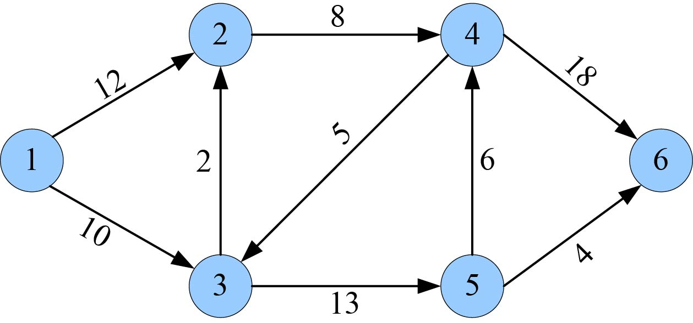
<center class="my_markdown"><b class="my_markdown">图7-91　网络**G**</b></center>

7.3.3节中的最短增广路算法采用了残余网络+实流网络分别操作的方法。因为残余网络中边的流量都是正数，分不清哪些是实流边，哪些是可增量边，还需要实流网络才能知道网络的实际流量。这里我们引入一种特殊的网络—— **混合网络** ，把残余网络+实流网络结合为一体，从每条边的流量可以看出来哪些边是实流边（flow>0），哪些边是实流边的反向边（flow<0）。

混合网络特殊之处在于它的正向边不是显示的可增量cap−flow，而是作为两个变量cap、flow，增流时cap不变，flow+=d；它的反向边不是显示的实际流flow，也用两个变量cap，flow，不过cap=0，flow=−flow；增流时cap不变，flow−=d。

如图7-92～图7-94所示。

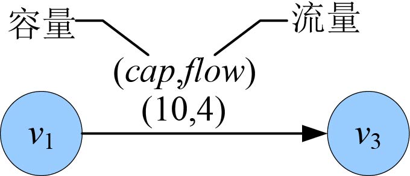
<center class="my_markdown"><b class="my_markdown">图7-92　网络**G**的边</b></center>


<center class="my_markdown"><b class="my_markdown">图7-93　残余网络对应的边</b></center>

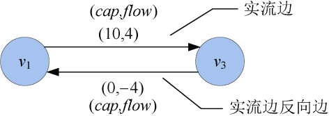
<center class="my_markdown"><b class="my_markdown">图7-94　混合网络对应的边</b></center>

图7-91中的网络**G**对应的混合网络如图7-95所示。

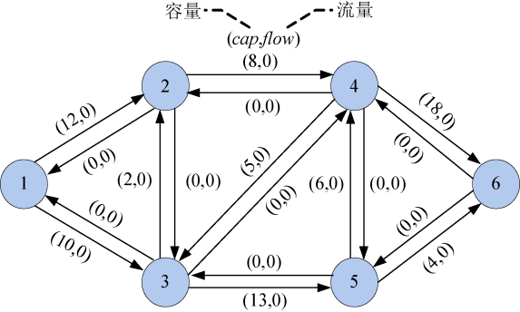
<center class="my_markdown"><b class="my_markdown">图7-95　混合网络</b></center>

（1）创建混合网络的邻接表

首先创建邻接表表头，初始化每个结点的第一个邻接边first为−1，如图7-96所示。

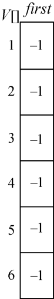
<center class="my_markdown"><b class="my_markdown">图7-96　邻接表表头</b></center>

然后创建各边邻接表。

+ 输入第一条边的结点和容量（u、v、cap）：1 3 10。

创建两条边（一对边），如图7-97和图7-98所示。

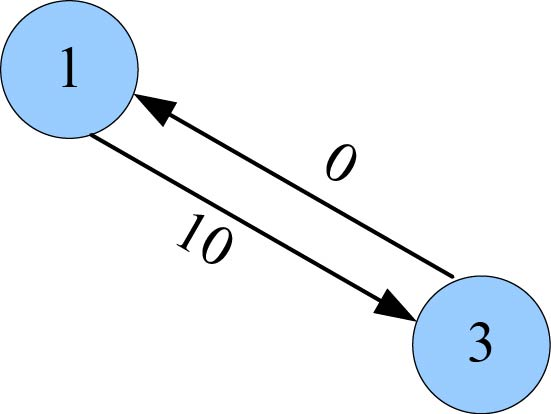
<center class="my_markdown"><b class="my_markdown">图7-97　混合网络中的边</b></center>


<center class="my_markdown"><b class="my_markdown">图7-98　邻接表中的边</b></center>

1号结点的邻接边是E[0]，修改1号结点的第一个邻接边first为0。

3号结点的邻接边是E[1]，修改3号结点的第一个邻接边first为1。

为了图示清楚，这里用箭头来指向表示，实际上并不是指针，只是记录了边的标号而已。如图7-99所示。

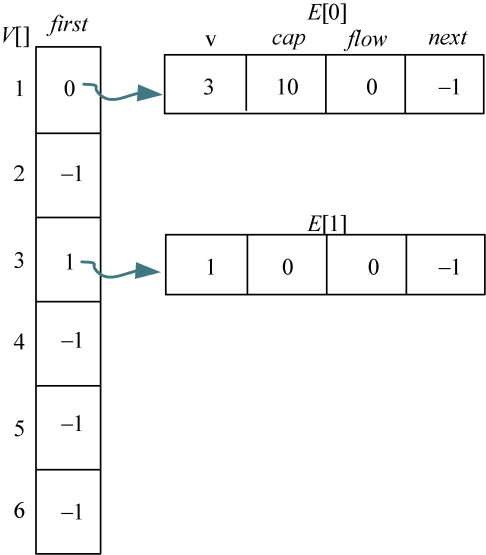
<center class="my_markdown"><b class="my_markdown">图7-99　邻接表创建过程</b></center>

+ 输入第2条边的结点和容量（u、v、cap）：1 2 12。

创建两条边（一对边），如图7-100和图7-101所示。

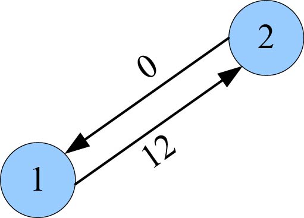
<center class="my_markdown"><b class="my_markdown">图7-100　混合网络中的边</b></center>

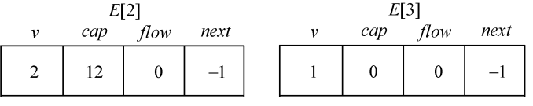
<center class="my_markdown"><b class="my_markdown">图7-101　邻接表中的边</b></center>

1号结点的邻接边除了E[0]，又增加了一个邻接边E[2]，把它放在E[0]的前面，先修改E[2]的下一条邻接边next为0，同时修改1号结点的第一个邻接边first为2。

2号结点的邻接边是E[3]，修改2号结点的第一个邻接边first为3。如图7-102所示。

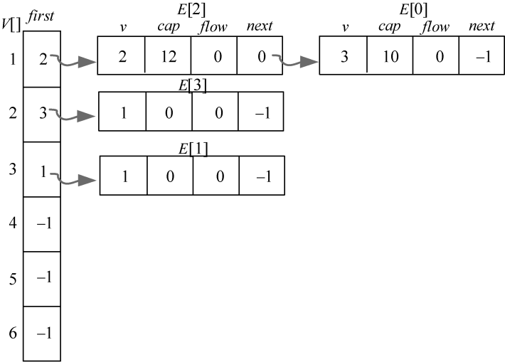
<center class="my_markdown"><b class="my_markdown">图7-102　邻接表创建过程</b></center>

+ 输入第3条边的结点和容量（u、v、cap）：2 4 8。

创建两条边（一对边），如图7-103和图7-104所示。

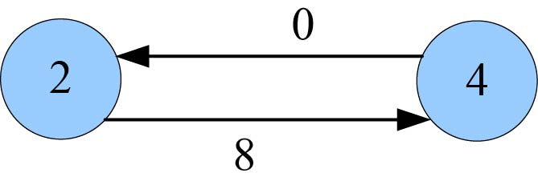
<center class="my_markdown"><b class="my_markdown">图7-103　混合网络中的边</b></center>

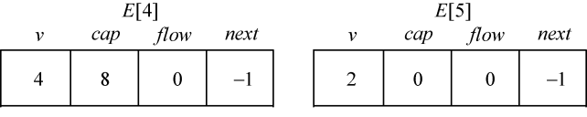
<center class="my_markdown"><b class="my_markdown">图7-104　邻接表中的边</b></center>

2号结点的邻接边除了E[3]，又增加了一个邻接边E[4]，把它放在E[3]的前面，修改E[4]的下一条邻接边next为3，同时修改2号结点的第一个邻接边first为4。

4号结点的邻接边是E[5]，修改4号结点的第一个邻接边first为5，如图7-105所示。

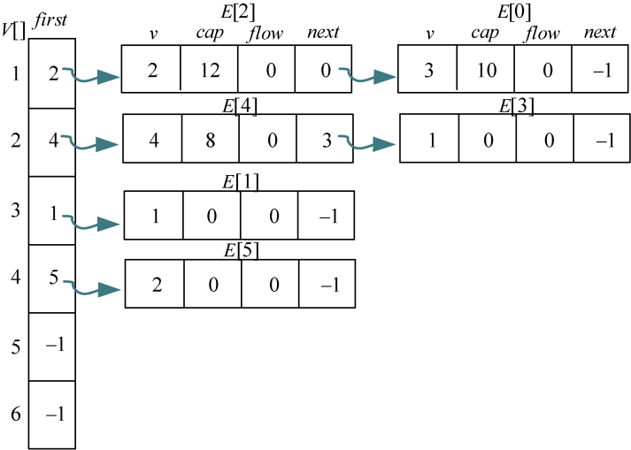
<center class="my_markdown"><b class="my_markdown">图7-105　邻接表创建过程</b></center>

+ 继续输入其他的边：

3 5 13

3 2 2

4 6 18

4 3 5

5 6 4

5 4 6

最终的完整邻接表，如图7-106所示。

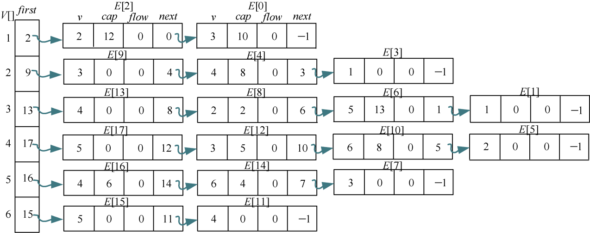
<center class="my_markdown"><b class="my_markdown">图7-106　完整的邻接表</b></center>

（2）初始化每个结点的高度

从汇点开始广度搜索，第一次搜索到的结点高度为1，继续下一次搜索到的结点高度为2，直到标记完所有结点为止。用h[]数组记录每个结点的高度，即到汇点的最短距离。同时用g[]数组记录距离为h[]的结点的个数，例如g[3]=1，表示距离为3的结点个数为1个，如图7-107～图7-109所示。

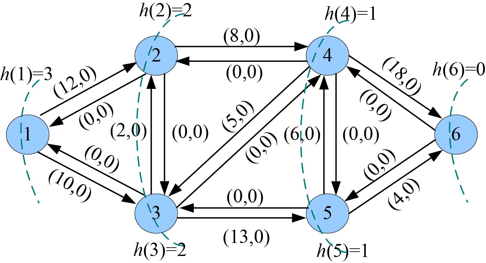
<center class="my_markdown"><b class="my_markdown">图7-107　混合网络（初始化高度）</b></center>

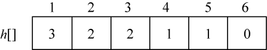
<center class="my_markdown"><b class="my_markdown">图7-108　高度数组</b></center>

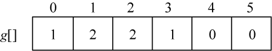
<center class="my_markdown"><b class="my_markdown">图7-109　距离为h的结点的个数数组</b></center>

如图7-107所示，高度为1的结点有2个，高度为2的结点有2个，高度为3的结点有1个。

（3）找可增广路

从源点开始，读取邻接表，沿着高度减1（即u—v：h（u）=h（v）+1）且有可行邻接边（cap>flow）的方向前进，找到一条可增广路径：1—2—4—6，增流值d为8。

（4）增流操作

沿着可增广路同向边增流flow=flow+d，反向边减流flow=flow−d，如图7-110所示。

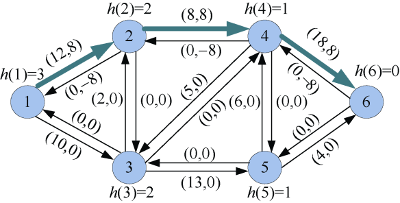
<center class="my_markdown"><b class="my_markdown">图7-110　混合网络</b></center>

（5）找可增广路

从源点开始，读取邻接表，沿着高度h（u）=h（v）+1且有可行邻接边（cap>flow）的方向前进，到达2号结点时，无法行进。

进行 **重贴标签** 操作，当前结点无法前进时，令当前结点的高度=所有邻接点高度的最小值+1；如果没有邻接边，则令当前结点的高度=结点数；退回一步；重新搜索。

重贴标签后，h（2）=h（1）+1=4，退回一步，又回到源点，继续搜索，又找到一条可增广路径：1—3—5—6，增流值d为4。

（6）增流操作

沿着可增广路同向边增流flow=flow+d，反向边减流flow=flow−d，如图7-111所示。

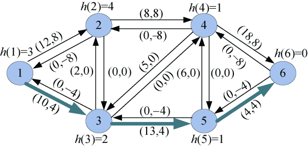
<center class="my_markdown"><b class="my_markdown">图7-111　混合网络</b></center>

（7）找可增广路

从源点开始，读取邻接表，沿着高度h（u）=h（v）+1且有可行邻接边的方向前进，h（1）=3，h（3）=2，h（5）=1，走到这里无法行进， **重贴标签** 。令h（5）= h（4） +1=2，退回一步，重新搜索。

退回到3号结点，因为h（3）=2，仍然无法前进， **重贴标签** ，令h（3）=h（5）+1=3；退回到1号结点，因为h（1）=3，仍然无法前进， **重贴标签** ，令h（1）= h（3）+1=4，本身是源点不用退回。

重贴标签后，如图7-112所示。

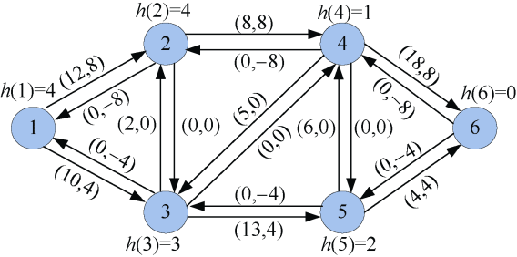
<center class="my_markdown"><b class="my_markdown">图7-112　混合网络</b></center>

继续搜索，又找到一条可增广路径：1—3—5—4—6，增流值d为6。

（8）增流操作

沿着可增广路同向边增流flow=flow+d，反向边减流flow=flow−d，如图7-113所示。

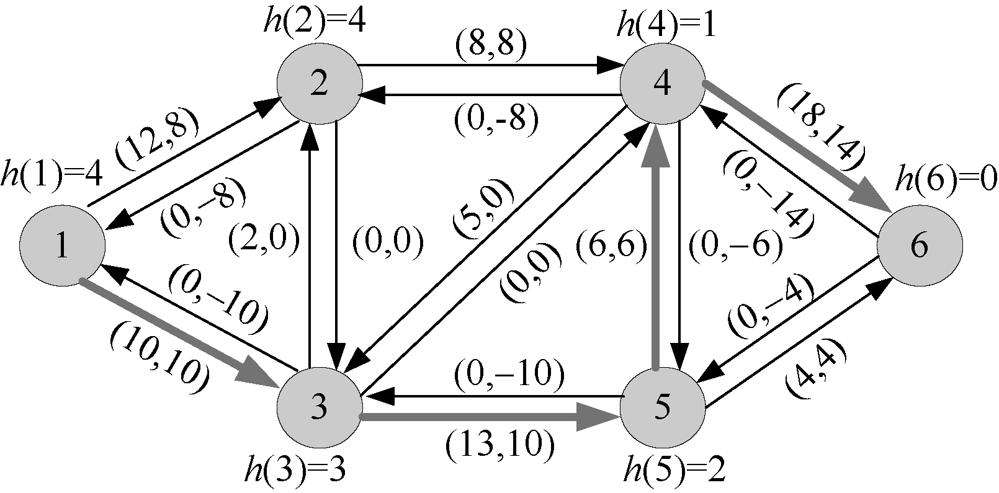
<center class="my_markdown"><b class="my_markdown">图7-113　混合网络</b></center>

（9）找可增广路

从源点开始，沿着高度h（u）=h（v）+1且有可行邻接边的方向前进，h（1）=4，h（2）=4，虽然h（3）=3，但已经没有可增流量，不可行。 **重贴标签** ，令h（5）=h（2）+ 1=5，本身是源点不用退回。继续搜索，h（1）=5，h（2）=4，到达2号结点无法行进， **重贴标签** ，发现高度为4的结点只有1个，说明应经无法到达汇点，算法结束，如图7-114所示。

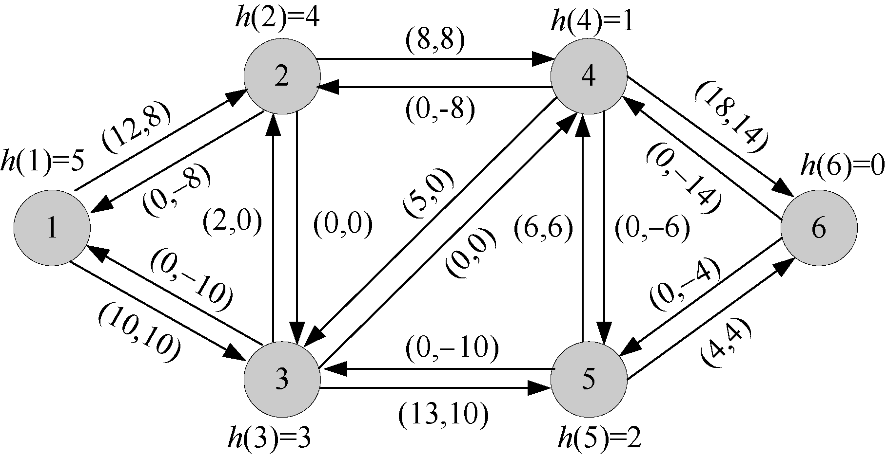
<center class="my_markdown"><b class="my_markdown">图7-114　混合网络</b></center>

（10）输出实流边。

在残余网络中，凡是流量大于0的都是实流边，如图7-115所示。

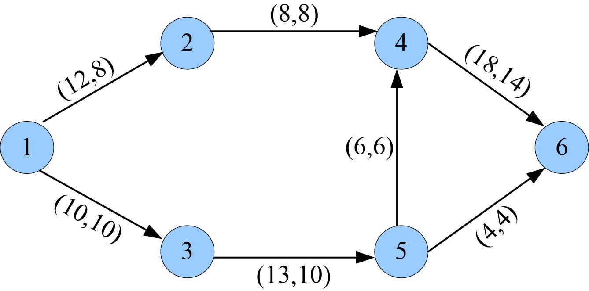
<center class="my_markdown"><b class="my_markdown">图7-115　实流边</b></center>

#### 3．实战演练

```c
//program 7-2-1 ISAP算法优化
#include <iostream>
#include <cstring>
#include <queue>
#include <algorithm>
using namespace std; 
const int inf = 0x3fffffff; 
const int N=100; 
const int M=10000; 
int top;
int h[N], pre[N], g[N];//h[]数组记录每个结点的高度，即到汇点的最短距离。
//g[]数组记录距离为h[]的结点的个数，例如g[3]=1，表示距离为3的结点个数为1个。
// pre[]记录当前结点的前驱边，pre[v]=i，表示结点v的前驱边为i，即搜索路径入边
struct Vertex                      //邻接表头结点
{
   int first;
}V[N];
struct Edge//边结构体
{
   int v, next;
   int cap, flow;
}E[M];
void init()
{
     memset(V, -1, sizeof(V));     //初始化邻接表头结点第一个邻接边为-1
     top = 0;                      //初始化边的下标为0
}
void add_edge(int u, int v, int c) //创建边
{ //输入数据格式：u v及边（u--v）的容量c
     E[top].v = v;
     E[top].cap = c;
     E[top].flow = 0;
     E[top].next = V[u].first;     //链接到邻接表中
     V[u].first = top++;
}
void add(int u,int v, int c)       //添加两条边
{
     add_edge(u,v,c);
     add_edge(v,u,0);
}
void set_h(int t,int n)//标高函数
{
     queue<int> Q;                 //创建一个队列，用于广度优先搜索
     memset(h, -1, sizeof(h));     //初始化高度函数为-1
     memset(g, 0, sizeof(g));
     h[t] = 0;                     //初始化汇点的高度为0
     Q.push(t);                    //入队
     while(!Q.empty())
     {
        int v = Q.front(); Q.pop();//队头元素出队
        ++g[h[v]];
        for(int i = V[v].first; ~i; i = E[i].next)//读结点v的邻接边标号
        {
             int u = E[i].v;
             if(h[u] == -1)
             {
                 h[u] = h[v] + 1;
                 Q.push(u); //入队
             }
        }
     }
     cout<<"初始化高度"<<endl;
     cout<<"h[ ]=";
     for(int i=1;i<=n;i++)
         cout<<"  "<<h[i];
     cout<<endl;
}
int Isap(int s, int t,int n)
{
     set_h(t,n);                 //标高函数
     int ans=0, u=s;
     int d;
     while(h[s]<n)
     {
          int i=V[u].first;
          if(u==s)
              d=inf;
          for(; ~i; i=E[i].next) //搜索当前结点的邻接边
          {
              int v=E[i].v;
              if(E[i].cap>E[i].flow && h[u]==h[v]+1)//沿有可增量和高度减1的方向搜索
              {
                     u=v;
                     pre[v]=i;
                     d=min(d, E[i].cap-E[i].flow);//最小增量
                     if(u==t)    //到达汇点，找到一条增广路径
                     {
                         cout<<endl;
                         cout<<"增广路径："<<t;
                         while(u!=s)//从汇点向前，沿增广路径一直搜索到源点
                         {
                               int j=pre[u]; //j为u的前驱边，即增广路上j为u的入边
                               E[j].flow+=d; //j边的流量+d
                               E[j^1].flow-=d; // j的反向边的流量-d，
                            /* j^1表示j和1的“与运算”，因为创建边时是成对创建的，
                               0号边的反向边是1号，二进制0和1的与运算正好是1号，
                               即2号边的反向边是3，二进制10和1的与运算正好是11，
                               即3号，因此当前边号和1的与运算可以得到当前边的反向边。
                               */
                                u=E[j^1].v; //向前搜索
                                cout<<"--"<<u;
                         }
                         cout<<"增流："<<d<<endl;
                         ans+=d;
                         d=inf;
                    }
                    break;//找到一条可行邻接边，退出for语句，继续向前走
               }
          }
          if(i==-1)       //当前结点的所有邻接边均搜索完毕，无法行进
          {
              if(--g[h[u]]==0) //如果该高度的结点只有1个，算法结束
                   break;
              int hmin=n-1;
              for(int j=V[u].first; ~j; j=E[j].next) //搜索u的所有邻接边
                  if(E[j].cap>E[j].flow) //有可增量
                      hmin=min(hmin, h[E[j].v]);     //取所有邻接点高度的最小值
              h[u]=hmin+1;               //重新标高：所有邻接点高度的最小值+1
              cout<<"重贴标签后高度"<<endl;
              cout<<"h[ ]=";
              for(int i=1;i<=n;i++)
                 cout<<"  "<<h[i];
              cout<<endl;
              ++g[h[u]];                 //重新标高后该高度的结点数+1
              if(u!=s)                   //如果当前结点不是源点
                  u=E[pre[u]^1].v;       //向前退回一步，重新搜索增广路
          }
     }
     return ans;
}
void printg(int n)                       //输出网络邻接表
{
    cout<<"----------网络邻接表如下：----------"<<endl;
    for(int i=1;i<=n;i++)
    {
         cout<<"v"<<i<<"  ["<<V[i].first;
         for(int j=V[i].first;~j;j=E[j].next)
              cout<<"]--["<<E[j].v<<"  "<<E[j].cap<<"  "<<E[j].flow<<"  "<<E[j].next;
         cout<<"]"<<endl;
    }
}
void printflow(int n)                    //输出实流边
{
    cout<<"----------实流边如下：----------"<<endl;
    for(int i=1;i<=n;i++)
       for(int j=V[i].first;~j;j=E[j].next)
            if(E[j].flow>0)
            {
                cout<<"v"<<i<<"--"<<"v"<<E[j].v<<"  "<<E[j].flow;
                cout<<endl;
            }
}
int main()
{
     int n, m;
     int u, v, w;
     cout<<"请输入结点个数n和边数m："<<endl;
     cin>>n>>m;
     init();
     cout<<"请输入两个结点u，v及边（u--v）的容量w："<<endl;
     for(int i=1;i<=m;i++)
     {
          cin>>u>>v>>w;
          add(u, v, w);   //添加两条边
     }
     cout<<endl; 
     printg(n);           //输出初始网络邻接表
     cout<<"网络的最大流值："<<Isap(1,n,n)<<endl; 
     cout<<endl; 
     printg(n);           //输出最终网络
     printflow(n);        //输出实流边
     return 0; 
}
```

**算法实现和测试**

（1）运行环境

Code::Blocks

（2）输入

```c
请输入结点个数n和边数m：
6 9
请输入两个结点u，v及边（u--v）的容量w：
1 3 10
1 2 12
2 4 8
3 5 13
3 2 2
4 6 18
4 3 5
5 6 4
5 4 6
```

（3）输出

```c
----------网络邻接表如下：----------
v1  [2]--[2   12   0   0]--[3   10   0   −1]
v2  [9]--[3   0   0   4]--[4   8   0   3]--[1   0   0   −1]
v3  [13]--[4  0  0  8]--[2  2  0  6]--[5   13   0   1]--[1   0   0   −1]
v4  [17]--[5  0  0  12]--[3  5  0  10]--[6   18   0   5]--[2   0   0   −1]
v5  [16]--[4   6   0   14]--[6   4   0   7]--[3   0   0   −1]
v6  [15]--[5   0   0   11]--[4   0   0   −1]
初始化高度
h[ ]=  3  2  2  1  1  0
增广路径：6--4--2--1增流：8
重贴标签后高度
h[ ]=  3  4  2  1  1  0
增广路径：6--5--3--1增流：4
重贴标签后高度
h[ ]=  3  4  2  1  2  0
重贴标签后高度
h[ ]=  3  4  3  1  2  0
重贴标签后高度
h[ ]=  4  4  3  1  2  0
增广路径：6--4--5--3--1增流：6
重贴标签后高度
h[ ]=  5  4  3  1  2  0
网络的最大流值:18
----------网络邻接表如下：----------
v1  [2]--[2   12   8   0]--[3   10   10   −1]
v2  [9]--[3   0   0   4]--[4   8   8   3]--[1   0   −8   −1]
v3  [13]--[4  0  0  8]--[2  2  0  6]--[5   13   10   1]--[1   0   −10   −1]
v4  [17]--[5  0  −6  12]--[3  5  0  10]--[6   18   14   5]--[2   0   −8   −1]
v5  [16]--[4  6  6  14]--[6  4  4   7]--[3   0   −10   −1]
v6  [15]--[5   0   −4   11]--[4   0   −14   −1]
----------实流边如下：----------
v1--v2   8
v1--v3   10
v2--v4   8
v3--v5   10
v4--v6   14
v5--v4   6
v5--v6   4
```

#### 4．算法复杂度分析

（1）时间复杂度：从算法描述中可以看出，找到一条可增广路的时间是O(V)，最多会执行O(VE)次，因为关键边的总数为O(VE)，因此总的时间复杂度为O(V<sup class="my_markdown">2</sup>E)，其中V为结点个数，E为边的数量。

（2）空间复杂度：空间复杂度为O(V)。

