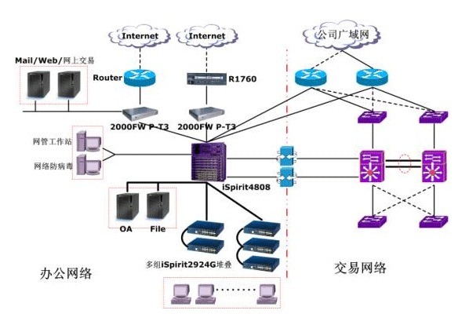
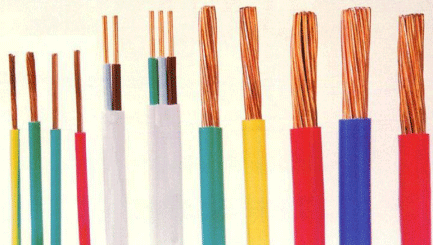

### 7.4　最小费用最大流——最小费用路算法

在实际应用中，不仅要考虑流量，还要考虑费用。例如在网络布线工程中有很多中电缆，电缆的粗细不同，流量和费用也不同。如果全部使用较粗的电缆，则造价太高；如果全部使用较细的电缆，则流量满足不了要求。我们希望建立一个费用最小、流量最大的网络，即最小费用最大流。

<b class="my_markdown">图7-116　网络布线及电缆</b>

