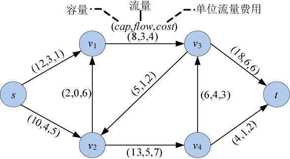
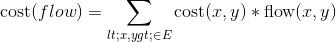

### 7.4.1　问题分析

在实际应用中，要同时考虑流量和费用，每条边除了给定容量之外，还定义了一个单位流量的费用，如图7-117所示。

<b class="my_markdown">图7-117　网络、可行流及费用</b>

对于网络上的一个流flow，其费用为：

网络流的费用=每条边的流量*单位流量费用。

在图7-117中，流的费用=3×1+4×5+3×4+0× 6+1×2+5×7+4×3+6×6+1×2=122。

我们希望费用最小，流量最大，因此需要求解最小费用最大流。

