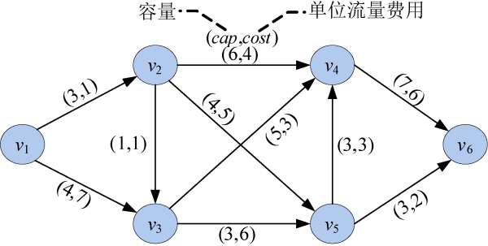
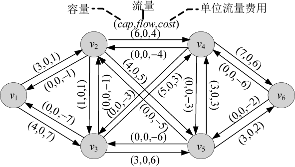
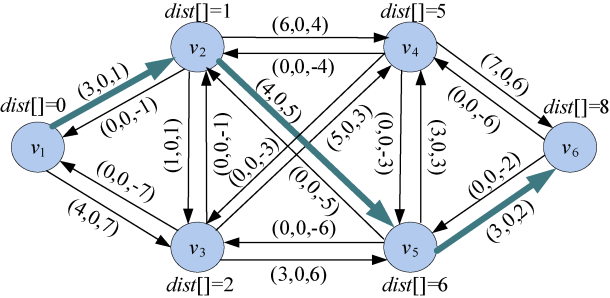
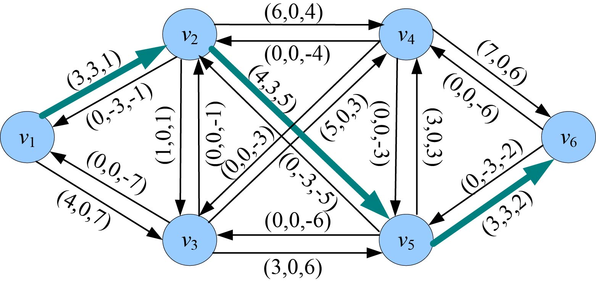
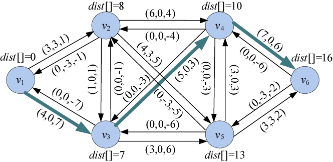
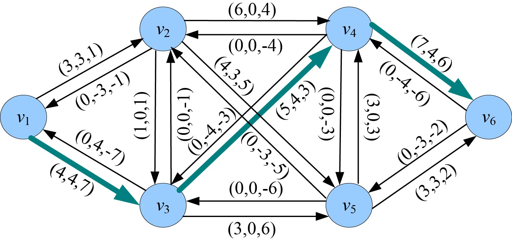
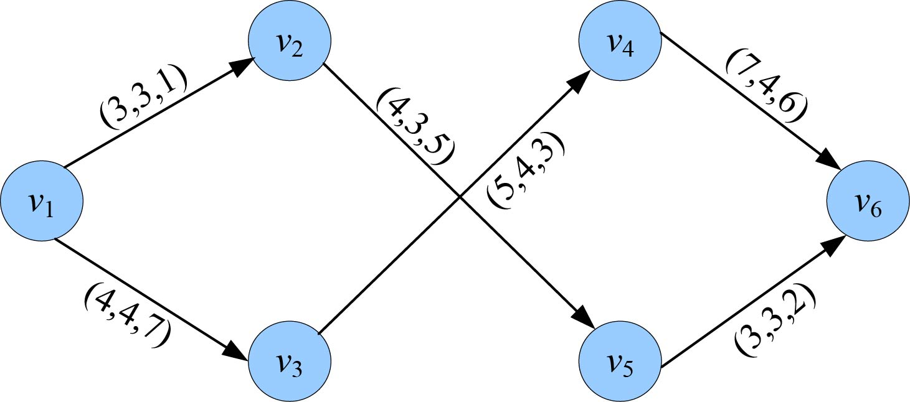

### 7.4.3　完美图解

现给定一个网络及其边上的容量和单位流量费用，如图7-118所示。求该网络的最小费用最大流。

因为使用残余网络，还需要用实流网络，为了简单起见，后面的算法统一使用混合网络。混合网络的详细描述见本书7.3.6节的完美图解。

（1）创建混合网络

先初始化为零流，零流对应的混合网络中，正向边的容量为cap，流量为0，费用为cost，反向边容量为0，流量为0，费用为−cost，图7-118对应的混合网络如图7-119所示。

<b class="my_markdown">图7-118　网络及费用</b>

<b class="my_markdown">图7-119　混合网络</b>

（2）找最小费用路

先初始化每个结点的距离为无穷大，然后令源点的距离dist[v1]=0。在混合网络中，从源点出发，沿可行边（E[i].cap>E[i].flow）广度搜索每个邻接点，如果当前距离dist[v]>dist[u]+ E[i].cost，则更新为最短距离：dist[v]=dist[u]+E[i].cost，并记录前驱。

根据前驱数组，找到一条最短费用路，增广路径：1—2—5—6，混合网络如图7-120所示。

<b class="my_markdown">图7-120　混合网络</b>

（3）沿着增广路径正向增流d，反向减流d

从汇点逆向找最小可增流量d=min(d, E[i].cap−E[i].flow)，增流量d=3，产生的费用为mincost+=dist[v6]*d=8×3=24，如图7-121所示。

<b class="my_markdown">图7-121　混合网络（增流后）</b>

（4）找最小费用路

先初始化每个结点的距离为无穷大，然后令源点的距离dist[v1]=0。在混合网络中，从源点出发，沿可行边（E[i].cap>E[i].flow）广度搜索每个邻接点，如果当前距离dist[v]>dist[u]+ E[i].cost，则更新为最短距离：dist[v]=dist[u]+E[i].cost，并记录前驱。

根据前驱数组，找到一条最短费用路，增广路径：1—3—4—6，混合网络如图7-122所示。

<b class="my_markdown">图7-122　混合网络</b>

（5）沿着增广路径正向增流d，反向减流d

从汇点逆向找最小可增流量d=min(d, E[i].cap−E[i].flow)，增流量d=4，产生的费用为mincost=24+dist[v6]*d=24+16×4=88，如图7-123所示。

<b class="my_markdown">图7-123　混合网络（增流后）</b>

（6）找最小费用路

先初始化每个结点的距离为无穷大，然后令源点的距离dist[v1]=0。在混合网络中，从源点出发，沿可行边（E[i].cap>E[i].flow）广度搜索每个邻接点，发现从源点出发已没有可行边，结束，得到的网络流就是最小费用最大流。把混合网络中flow>0的边输出，就是我们要的实流网络，如图7-124所示。

<b class="my_markdown">图7-124　实流网络（最小费用最大流）</b>

