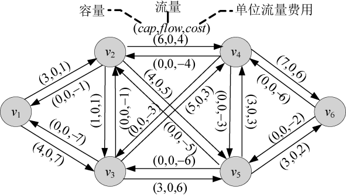
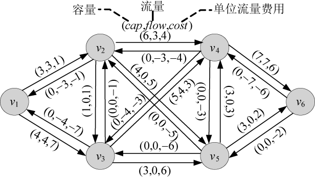
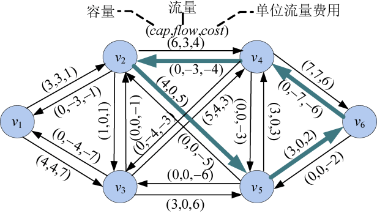
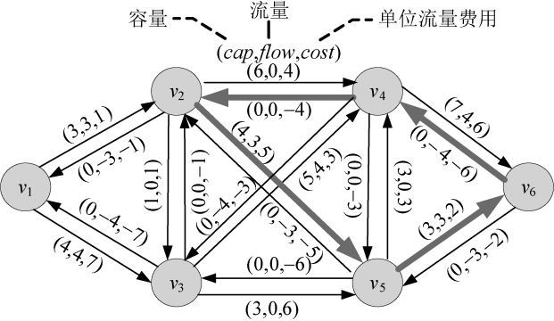
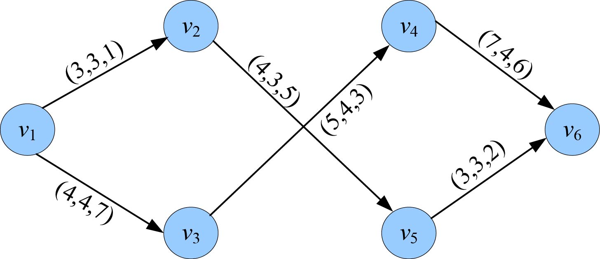

### 7.4.7　算法优化拓展——消圈算法

#### 1．算法设计

消圈算法的思想：首先找网络中的最大流，然后消除最大流对应的混合网络中所有的负费用圈。

消圈算法找最小费用最大流包括3个过程：

（1）找给定网络的最大流。

（2）在最大流对应的的混合网络中找负费用圈。

（3）消负费用圈：负费用圈同方向的边流量加d，反方向的边流量减d。d为负费用圈的所有边的最小可增量cap−flow。

**算法的核心是在残余网络中找负费用圈。**

#### 2．完美图解

如图7-125所示的混合网络：


<center class="my_markdown"><b class="my_markdown">图7-125　混合网络</b></center>

（1）求最大流

可以使用以前讲过的最大流求解算法找到图7-125中的最大流。例如运行7.3.6节的program 7-2-1，输入如下。

```c
请输入结点个数n和边数m：
6 9
请输入两个结点u，v及边（u--v）的容量w：
1 3 4
1 2 3
2 5 4
2 4 6
2 3 1
3 5 3
3 4 5
4 6 7
5 6 3
5 4 3
```

运行后得到最大流对应的混合网络，如图7-126所示。


<center class="my_markdown"><b class="my_markdown">图7-126　混合网络（最大流）</b></center>

（2）在最大流对应的混合网络中找负费用圈

在最大流的混合网络中，沿着cap>flow的边找负费用圈，就是各边费用之和为负的圈。首先找到一个负费用圈2—5—6—4—2，它们的边费用之和为5+2+（−6）+（−4）=−3，如图7-127所示。


<center class="my_markdown"><b class="my_markdown">图7-127　混合网络（负费用圈）</b></center>

（3）负费用圈同方向的边流量加d，反方向的边流量减d

沿找到的负费用圈增流，其增量为组成负费用圈的所有边的最小可增量cap−flow。

负费用圈说明费用较高，可以对费用为负的边减流，因为该残余网络为特殊的残余网络，负费用的边流量也是负值，减流实际上需要加上增流量d。为了维持平衡性，负费用圈同方向的边流量加d，反方向的边流量减d。d为负费用圈上各边的cap−flow最小值。负费用圈2—5—6—4—2上的增流量d=3，增流减流后如图7-128所示。


<center class="my_markdown"><b class="my_markdown">图7-128　混合网络（增流减流后）</b></center>

（4）在混合网络中继续找负费用圈

在混合网络中，沿着cap>flow的边找负费用圈，已经找不到负费用圈，算法结束。把混合网络中flow>0的边输出，就是我们要的实流网络，找到的最小费用最大流如图7-129所示。


<center class="my_markdown"><b class="my_markdown">图7-129　实流网络（最小费用最大流）</b></center>

#### 3．算法复杂度分析

（1）时间复杂度：因此求最大流算法的时间复杂度为O(V<sup class="my_markdown">2</sup>E)，其中V为结点个数，E为边的数量。如果每次消去负费用圈至少使费用下降1个单位，最多执行ECM次找负费用圈和增减流操作，其中C为每条边费用上界，M为每条边容量上界。该算法的时间复杂度为O(V<sup class="my_markdown">2</sup>E<sup class="my_markdown">2</sup>CM)。

（2）空间复杂度：空间复杂度为O(V)。

