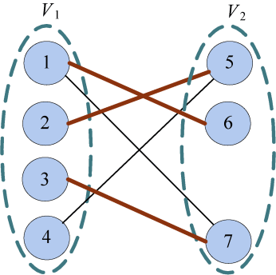
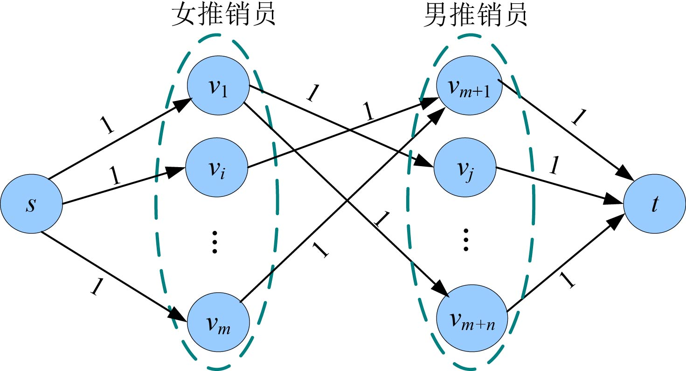

### 7.5.1　问题分析

在解决这个问题之前，我们先了解几个概念。

**二分图：** 又称作二部图，是图论中的一种特殊模型。设**G**=（V，E）是一个无向图，如果结点集V可分割为两个互不相交的子集（V1，V2），并且图中的每条边（i，j）所关联的两个结点i和j分别属于这两个不同的结点集（i∈V1，j∈V2），则称图**G**为一个二分图。

**匹配：** 在图论中，一个 **匹配** （matching）是一个边的集合，其中任意两条边都没有公共结点。例如，图7-131中加粗的边就是一个匹配：{（1，6），（2，5），（3，7）}。

<b class="my_markdown">图7-131　二分图匹配</b>

**最大匹配：** 一个图所有匹配中，边数最多的匹配，称为这个图的 **最大匹配** 。

最佳的推销员配对方案问题要求两个推销员男女搭配工作，相当于女推销员和男推销员分成了两个不相交的集合，可以配合工作的男女推销员有连线，求最大配对数，实际上就是是简单的 **二分图最大匹配** 问题。怎样得到二分图的最大匹配呢？可以借助最大流算法，通过下面的变换，把二分图转化成网络，求最大流即可。

将二分图左边添加一个 **源点** ，右边添加一个 **汇点** ，将左边的点全部与源点相连，右边的点和汇点相连，所有边的容量均为1。前面为女推销员编号，后面为男推销员编号，有连线的表示两个人可以配合。女推销员和女推销员之间不可以连线，同样，男推销员和男推销员之间不可以连线。构建的网络，如图7-132所示。

<b class="my_markdown">图7-132　配对方案网络</b>

然后只需求解网络最大流即可。

